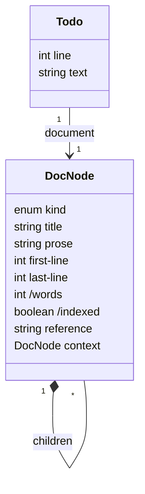

---
analysis_lock:
  type: use-case-analysis
  sections:
    "1":
      own: "ce0576e9a556dcc93cf90e5e04ffbc80cd74d1f896ce34d614bae263f795adf4"
      composite: "0825c37da62ad696b38d737639604110099c54451e2f00a580d34617712cd597"
      approved: "2026-09-22"
---
# find-and-read-documentation — Analysis

## Context
* [find-and-read-documentation](USE-CASE.md) - the use case this analyses
* [Examples](examples/EXAMPLES.md) - the corpus §1's model is read off

## 1 The Data Model

> The minimal types and attributes the spine needs, and nothing else. Type names come from the analysis type
> catalog; where the analysis declares a primary key it is that type's, not this use case's to change. An
> attribute this use case does not vary is declared `INVARIANT` — and is worth a word saying why it is here.
>
> **Read this off the examples**, whose state is a populated instance of the model being drafted here: each
> distinct kind of thing in them is a candidate type and each column a candidate attribute. An attribute they
> do not carry is one being invented — keep it if the spine needs it, and say in its description that the
> examples do not show it, because that is either a gap in them or an attribute the model does not need.

### 1.1 `DocNode`

> One addressable element of a registered document: the document root itself, or a section, context,
> rationale, or appendix within it. `registered.md`'s table is one instance per row.
>
> The diagram marks a derived attribute with a leading `/`, UML's own convention for one — `words` and
> `indexed` are computed rather than independent; `reference` is not, on the architect's call: a derived
> primary key smells bad, so it is repeated in full on every node's fixture rather than read off `parent`.
> The containment itself is drawn as composition (the filled diamond), named `children` from the container's
> side rather than `parent` from the child's — `parent` is still the attribute a node itself carries, below.
>
> A node may have a context child of its own, and that earns `context` a place below. A node may equally have
> a rationale or an appendix child of its own — the same fact, structurally — but this use case's behaviour
> never varies on either: nothing here aggregates them up a chain, or does anything with one that isn't already
> covered by `indexed` and an explicit reference (extension 7a). So they are not modelled as attributes, on
> the same reasoning §2 will use to keep a dimension out that nothing varies on.

| Attribute | Type | Key | Description |
|---|---|---|---|
| `kind` | enum | — | `document` \| `context` \| `section` \| `rationale` \| `appendix` |
| `parent` | foreign | — | **link-to**: `DocNode` — the node immediately containing this one; not-set for a document root. A direct fact, not derived |
| `title` | string | — | the node's own heading text |
| `prose` | string | — | this node's own verbatim source text, headings and everything nested beneath it included — what `report` returns |
| `first-line` | int | — | the first line of its span in the source document |
| `last-line` | int | — | the last line of its span in the source document |
| `words` | int | — | word count **derived from**: • `DocNode.prose` — this node's own, less whatever falls inside a descendant whose `indexed` is no |
| `indexed` | boolean | — | whether this node's own words contribute to what a search can match **derived from**: • `DocNode.kind` — this node's own, and each ancestor's reached by walking `parent`: no wherever one of them is `rationale` or `appendix`; yes otherwise |
| `context` | foreign | — | **link-to**: `DocNode` (kind: context) — this node's own context, if it has one (a node has at most one). A direct fact, not derived, the same as `parent` |
| `reference` | string | primary | the address a search reports and a fetch is made against — e.g. `policies/eviction-policy§2.1`. A document root's own carries no `§`, e.g. `policies/eviction-policy`. A section with no number of its own gets a computed one instead — never its title, which two such sections could share — e.g. `a-document-with-contexts§2.2.0`. `Rationale`/`Appendix` are the only kinds ever addressed by a word rather than a number. Not derived from `parent` — a derived primary key is unsound, so this is repeated in full on every node rather than read off its ancestry |

### 1.2 `Todo`

> An outstanding marker `register.txt` reports. Identified by the pair (`document`, `line`) — the template has
> no notation for a composite key, so this is recorded here rather than by marking two attributes `primary`.

| Attribute | Type | Key | Description |
|---|---|---|---|
| `document` | foreign | — | **link-to**: `DocNode` (kind: document) — which document it's in; part of this type's identity, alongside `line` |
| `line` | int | — | the line it sits on; part of this type's identity, alongside `document` |
| `text` | string | — | the marker's own text |
