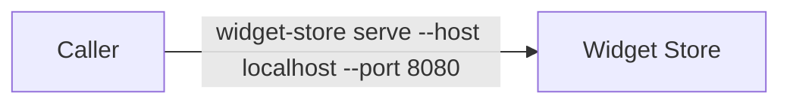
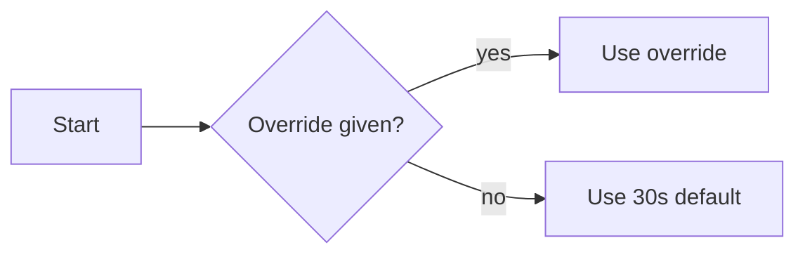
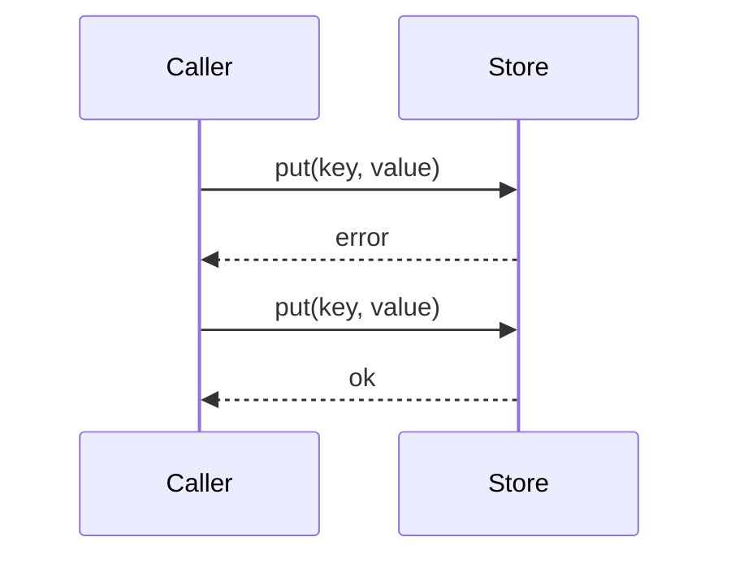

# Widget Store Reference

## Context
* [Widget Overview](doc-a.md) - the shorter companion document in this corpus

## 1 Overview

The widget store holds widgets and hands them back by key. It is the reference document for callers, and it
carries an appendix and a rationale so that both regions are present in one registered document.

## 2 Configuration

Configuration is read once at startup.

### 2.1 Basic Options

The host, the port and the timeout. A caller that sets nothing at all still gets a working store.

*fig.* 2.1.a — Minimal Configuration



### 2.2 Advanced Options

Connection pooling keeps a fixed number of clients open across calls.

``` 2.2.a
widget-store serve --pool-size 10 --retries 3 --evict lru
```

//TODO: document the eviction policy properly (WVR-000)

### 2.3 Defaults

Every option has a default, and the defaults are chosen to work on a developer's own machine.



//TODO: confirm the default timeout is still thirty seconds

## 3 Usage

Callers put and get by key.

### 3.1 Common Patterns

Put-with-retry is the pattern most callers actually use.

*fig.* 3.1.a — Put With Retry



# Appendix

## 1 Sample Configuration

A complete configuration file with every option set explicitly.

## 2 Sample Session

A put followed by a get, with the responses shown.

## 3 Glossary

Key, widget, eviction, pool.

# Rationale

## 1 Why Configuration Has Two Tiers

Splitting basic from advanced options keeps the common case short without hiding the uncommon one.

### 1.1 The Basic Tier

Three options a caller can hold in their head.

### 1.2 The Advanced Tier

Everything else, reached only when the basic tier is not enough.

## 2 Why The Timeout Default Is Still Open

Thirty seconds was chosen for a local store and has never been rechecked against a remote one.
