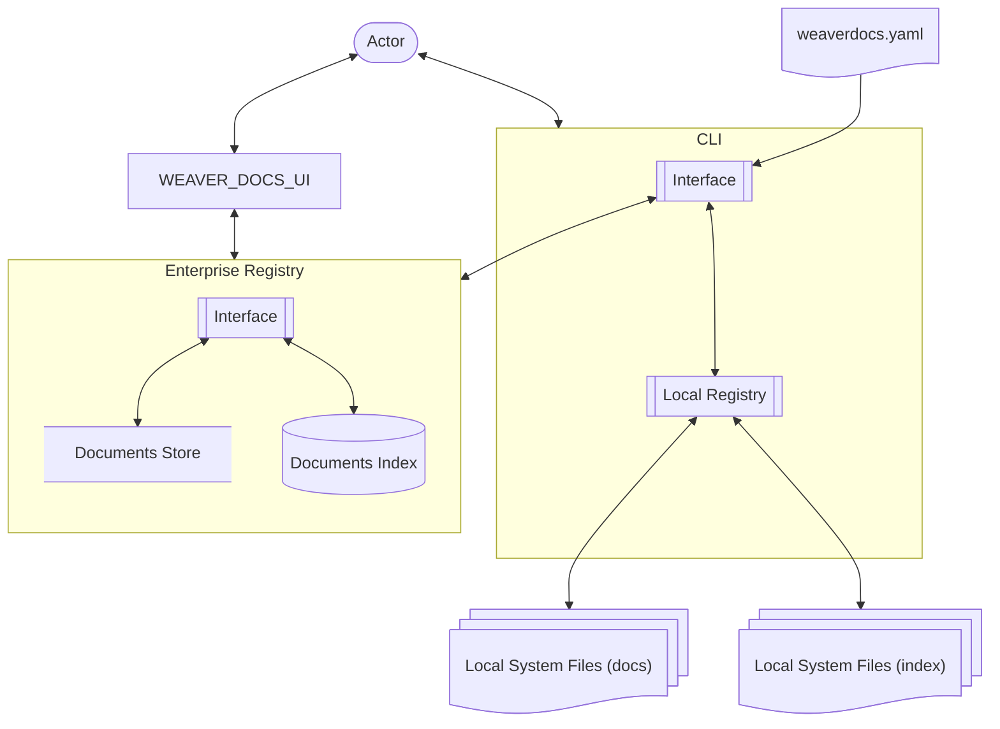
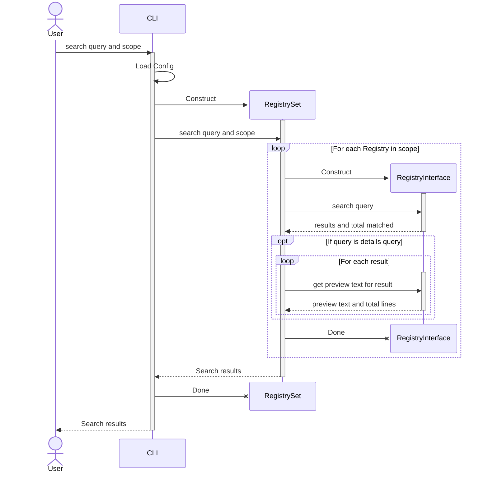
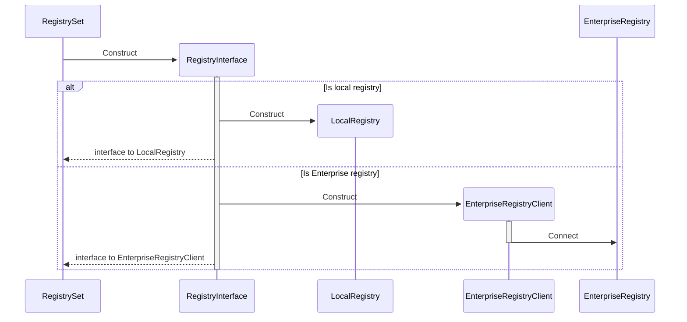

# WeaverDocs Architecture

## Context

* [Find and read documentation](../../analysis/use-cases/find-and-read-documentation/USE-CASE.md) - The use case for registering, finding a reading documentations
* [Search the registry](../../analysis/use-cases/find-and-read-documentation/operations/4-search-the-registry.md) - The condition space of that use case's search step; §2.3 and §2.4 answer to it
* [Number document sections](../../analysis/use-cases/number-document-sections/USE-CASE.md) - The use case for auto-numbering document sections
* [Architect persona](../../analysis/user-personas/architect.md) - The architect user persona
* [Agent persona](../../design/design-assistant) - The agent user persona

## 1. Architectural Overview

*fig.* 1.a WeaverDocs architecture overview


### 1.1 weaverdocs.yaml
A yaml file providing configuration for the weaverdocs CLI
Found by walking back up the `cwd` path or from the users home directory.

* Points at local weaverdocs registries
* Points at enterprise weaverdocs registries

### 1.2 WeaverDocs CLI
A local command tool to access weaverdocs functionality on the local file system

#### 1.2.1 Interface
The interface boundary of the weaverdocs CLI

#### 1.2.2 Local Registry
The functional boundary wrapping a weaverdocs local file system registry.
Provides a subset of the interface offered by the Enterprise registry.

### 1.3 Local System Files (docs)
The documents in the local file system registry

### 1.4 Local System Files (index)
The sections and words index of the documents in the local file system registry in a .index/ per directory

### 1.5 WeaverDocs UI
A UI for searching and working with the WeaverDocs Enterprise registry.

* Likely React/TS WPA from AWS S3 bucket

### 1.6 Enterprise Registry
The WeaverDocs Enterprise registry

* Likely AWS

#### 1.6.1 Documents Store
The enterprise documents store

* Likely AWS S3 bucket
#### 1.6.2 Documents Index
The enterprise documents index

* Maybe mongoDB on AWS.


*fig.* 1.b A sample weaverdocs file system setup 
```
/.../
    users/
        user-dir/
            .weaverdocs.yaml
    weaver-engineering/
        .weaverdoc.yaml
        docs/
            .git/
            .index/
                some-doc.words.json
                some-doc.sections.json
                some-other-doc.words.json
                some-other-doc.sections.json
            some-doc.md
            some-other-docs.md
        agentPlugins/
            agent-plugins-docs/
                .git/
                .index/
                    agent-plugins-docs.words.json
                    agent-plugins-docs.sections.json
                agent-plugins-docs.md
            agent-plugins/
                .git/
                agent-plugins-code.ts    
        theLoom/
            the-loom-docs/
                .git/
                .index/
                    loom-docs.words.json
                    loom-docs.sections.json
                loom-docs.md
            the-loom/
                .git/
                loom-code.ts    

```

## 2. WeaverDocs CLI Operations
A high-level overview of the operations available through the WeaverDocs CLI

### 2.1. Auto-number A Document
A tool to auto-number documents following the weaver-engineering documentation standards.

* Renumbers the sections and subsections of a markdown document in the local filesystem (edit in place)

### 2.2. Register A Document Or Path In The Local Registry
Register a markdown document in the local file system registry

* Register the path and all markdown documents it contains in the local file system registry
  * maintains contents of `.index/` for the path.

### 2.3. Search For A Registered Document
Search the available WeaverDocs registries for a relevant document or document section.

* Identifies the scope of WeaverDoc registries in which to search
* Searches each registry for docs matching the search query.
* Reports documents and document sections matching the given search query ranked by relevance
  * Reports only top results
  * Reports document path `reference`, title, relevance score and word count
  * Reports section path `reference`, title, relevance score and word count per section
  * Reports how many matched in all, not only how many were reported
  * Optionally presents preview of first lines

A capped answer carrying only what survived the cap cannot say how much it withheld, so the caller cannot tell
a query that found three things from one that found thirty and reported three. The count is a fact only the
registry holds.

*fig.* 2.3.a Searching for a registered document or section


*fig.* 2.3.b Construct the RegistryInterface


### 2.4. Report The Content Of A Registered Document Or Section
Report verbatim the contents of a registered document of document section.

* Given a `reference` reports all or part of the prose at that reference
* For section `refrence`s reports the section path to the `reference` with their nested `Context`
* Optionally specify the lines to report `start-line = 5` `end-line = 10` (both optional) 
  So to get 5 lines of preview text `get {reference} end-line=5`
* Reports how many lines there are at the `reference`, not only how many were reported

The same reason as §2.3: asked for five lines and given five, nothing in the answer says whether a sixth
exists, so a preview cannot name what it did not show. Both operations answer to one rule — **a bounded answer
must disclose what the bound cost.**