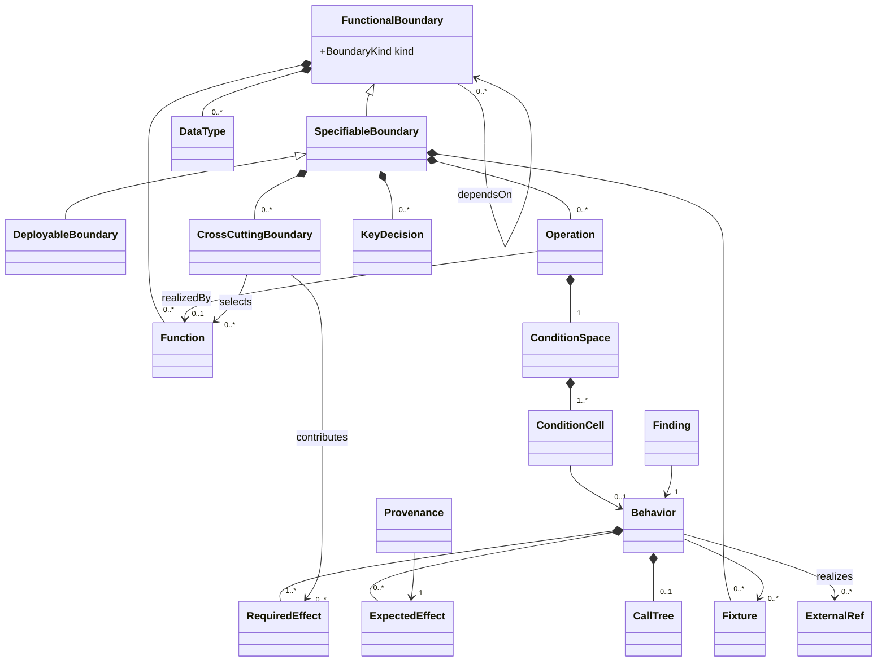

# Data Model

## Context
* [Boundary Model](boundary-model.md) - the composite boundary spine and its three levels
* [Function And Call Graph](function-and-call-graph.md) - the function catalog and the call graph derived from it
* [Data Dictionary](data-dictionary.md) - the shapes that cross a boundary
* [Condition Model](condition-model.md) - the condition space an operation must be defined over
* [Behavior Model](behavior-model.md) - what the boundary must do, and what the design actually does
* [Reconciliation Model](reconciliation-model.md) - provenance, invalidation, findings, and the maturity gates
* [Deployable Model](deployable-model.md) - what a Deployable boundary carries that a Specifiable one does not
* [Decision Model](decision-model.md) - open design questions and the key decisions that close them
* [Serialization](../serialization/SERIALIZATION.md) - how this model is written to and read from documents, which §1 deliberately leaves out
* [Design A Specifiable Boundary](../workflow/WORKFLOW.md) - the check configuration that declares the
  maturity levels themselves (§5.2 below defers to it)
* [Glossary](../../../glossary.md) - one-line definitions of every term this model introduces
* @docs/design-the-feature-process.md - the process this model is intended to support, and which this work may revise

## 1 What This Model Is

This is the data model of the **design assistant service**: a stateful service, initially delivered as a CLI,
that maintains an architect's in-progress design of a functional boundary and mechanically verifies it.

The model records **facts about a boundary** — what it is, what it must do, what the design says it does, and
whether those agree. It is deliberately independent of serialization. The design assistant serializes it as
design documentation and frontmatter, and that fact shapes the process (documents are the unit an architect
reads, reviews, and diffs), but no entity here is defined by where it lands in a file.

The model exists to make one claim decidable by machine:

> The design of this boundary is complete, reconciled to its required behaviors and NFRs, and detailed enough
> to be implemented 100% agentically.

Everything in this model is either a term in that claim or a mechanism for keeping the claim honest as the
design evolves.

**What this document describes is the schema the *default* check set requires.** The set is configurable: a
design is assessed against the checks its own configuration names — stated inline, or inherited from the
design containing it, or by pointer to its Product's or the organisation's
([Serialization](../serialization/SERIALIZATION.md) §3). A design directory that does not say what it is
checked against cannot be assessed at all, which is a **failure rather than a default**.

The dependency runs the way round that is easy to read backwards. **A check defines the positions it
requires**, so the schema is the union of what the configured checks need — not a closed schema with
verification hung off it. Adding a check extends what a design records; removing one removes those positions
from what the design can claim, which is a legitimate configuration rather than a gap.

That is what makes the model extensible where it matters: an additional NFR to assess, or any other design
attribute a project wants covered, is added by **defining a check**, not by editing this model.

### 1.1 Applying It To A Design It Did Not Author

The model is not restricted to designs written through it. **Any design written as markdown prose, at any state
of maturity, can be brought under it**, and doing so needs no import concept: the model is populated with
whatever that design has actually defined, and it lands at whatever checkpoint its own content supports rather
than one an importer asserted.

Getting there — reading documents, judging what their prose contributes, eliciting what it leaves unsaid,
writing the result down — is **serialization's concern and outside this model** (§1). The model's only stake in
it is a finding: a document within the design's scope whose contents have **not been assessed for their
contribution to the design** is an `unparsed-document` ([Reconciliation Model](reconciliation-model.md) §3),
blocking `M0`. The model cannot assert anything about a boundary while part of what defines it has not been
looked at.

Note what that finding is *not* about. It is not the absence of frontmatter: a document may be assessed and
found to contribute nothing, and correctly carry none. Nor is it documents being underived, since the design
derives documents of its own — a behavior's expected results among them — and writes them with their
frontmatter already in place. The condition is unassessed content, and how serialization tells an assessed
document apart from an untouched one is its business, not the model's.

Once populated, determining the next unit of work proceeds normally, and reports whatever is genuinely absent
rather than whatever the design's authors would have expected. A design can be complete, internally consistent,
carefully reviewed, and have no resilience NFRs whatsoever — and that case needs no special handling either.
The rules in scope are unassessed ([Boundary Model](boundary-model.md) §7.3), so assessment tags the functions
each governs; cross-cutting dimensions accrete into the affected condition spaces
([Condition Model](condition-model.md) §2.2); the cells that adds are uncovered; behaviors are derived for them
and their effects traced; and the design completes at a higher checkpoint than it started.

## 2 The Six Layers

Each layer holds a different kind of fact. They are kept separate because the verification claim is an
assertion *between* layers, not within one.

| Layer | Question it answers | Defined in |
|---|---|---|
| 0 Identity & provenance | how is anything addressed, and where did it come from | §5 here, [Reconciliation Model](reconciliation-model.md) |
| 1 Structure | what the boundary *is* | [Boundary Model](boundary-model.md), [Function And Call Graph](function-and-call-graph.md) |
| 2 Data | what shapes cross the boundaries | [Data Dictionary](data-dictionary.md) |
| 3 Requirement | what the boundary *must* do | [Condition Model](condition-model.md), [Behavior Model](behavior-model.md) |
| 4 Derivation | what the design *actually* does | [Behavior Model](behavior-model.md) |
| 5 Reconciliation | do 3 and 4 agree, and is that agreement still current | [Reconciliation Model](reconciliation-model.md) |

The split between layers 3 and 4 is load-bearing. A **required effect** originates outside the design — a use
case, or a rule carried by a cross-cutting boundary. An **expected effect** is derived by tracing the design.
They are separate entities that are compared, never one field edited until it agrees with itself.

## 3 The Verification Claim

Stated over the model's own terms, for a boundary `B`:

1. **Covered** — every operation on `B`'s perimeter has a condition space, and every valid cell in that space
   has a behavior.
2. **Derived** — every behavior has an expected effect derived by tracing `B`'s own design, and a call tree
   recording the walk that produced it.
3. **Matched** — for every behavior, its expected effects satisfy its required effects.
4. **Sound** — no open finding stands against any element: no undeclared exception, no unexpected external
   side effect, no call tree node absent from its caller's declared calls, no orphan, and no behavior left
   standing at a cell its condition space no longer supports.
5. **Fresh** — every derived element's provenance checksums still match the content they were derived from.
6. **Approved** — every behavior carries a human review that has not been invalidated.
7. **Sufficient** — `B` has reached the maturity level its kind requires (§5.2): `M4 Reconciled` for a
   Specifiable boundary, `M5 Deployable` for a Deployable one.

Claims 1–5 are fully mechanical. Claim 6 is mechanical to *check* and never mechanical to *grant*. Claim 7 is
the conjunction of the gates in [Reconciliation Model](reconciliation-model.md) §5.

**The claim is made against a stated check set** (§1). "Complete, reconciled and sound" is decidable relative
to the checks a design is configured with, and is not a well-formed question without them — two designs both
at `M4` under different configurations are not asserting the same thing. Naming the set is what makes the
claim falsifiable, not what weakens it: the alternative is an absolute-sounding claim whose real content
nobody can recover.

The claim is made **per design target**, and a design target's traces stop at the design targets it contains
([Boundary Model](boundary-model.md) §3). Claims 2–5 are therefore bounded: they are about this design's own
walk, taking contained design targets at their declared behavior. What keeps that honest is the mock
consistency check ([Behavior Model](behavior-model.md) §3.1) — a fixture standing in for a design target must
agree with what that target's own design produces.

There is a third status besides *complete* and *failing*: a design **blocked** on a change request against
another design target ([Reconciliation Model](reconciliation-model.md) §5.1) is not complete, cannot advance,
and is not in error.

## 4 Level Placement

The root type of both a Library and a Service is `FunctionalBoundary`. A Library is Specifiable and stops
there; a Service is Deployable. A Library is not a degenerate Service — the runtime manifest, the full
five-vector interface perimeter, and the SLIs are not absent-but-implied on a Library, they are meaningless
on it.

| Attaches at | What attaches |
|---|---|
| `FunctionalBoundary` | identity, purpose, boundary kind, containment, dependency references, its functions with their signatures, descriptions, calls and emitted metrics, its interfaces, the data types it defines |
| `SpecifiableBoundary` | a **design target**: build manifest, operations, condition spaces, behaviors, required effects, cross-cutting boundaries, call trees, expected effects, fixtures, reconciliation, key decisions, open design questions, change requests — plus the function catalog and data dictionary as views scoped to its own design |
| `DeployableBoundary` | runtime manifest extending the build manifest, the five-vector interface perimeter, endpoints, service archetype, SLIs — each naming the operation whose delivery it measures |

The split is **content** versus **requirements**, not structure versus substance. A `FunctionalBoundary` holds
real content: shared logic inside a service has functions, signatures, descriptions, an interface its consumers
depend on, and the data types it defines. What it does not have is anything stating what is *required* of it —
no operations, no condition space, no behaviors — because those come from the design target that contains it.

A `SpecifiableBoundary` adds exactly what follows from being designed in its own right
([Boundary Model](boundary-model.md) §3): it owns its requirements, is mockable, bounds a trace, bounds
authority, and owns its NFR consideration. It does not own the function and type *definitions* beneath it —
those belong to the boundaries structuring them, which is why a function's address nests through those
boundaries (§5.1). What the design target owns is the catalog and dictionary as scoped views, and the design
authority over everything in that scope.

Two placements are easy to get backwards. **Cross-cutting boundaries** are design-target attributes, since NFR
consideration is part of specification; a Library declares its own, and a rule's reach stops at any contained
design target (Boundary Model §7.4). **Metrics** are defined by the functions that emit them
([Function And Call Graph](function-and-call-graph.md) §6) while **SLIs** are Deployable: measurement is
something code does, so any function may emit one, while judging whether the numbers are acceptable is a
statement about delivery only a deployed process makes ([Deployable Model](deployable-model.md) §5.2). An SLI
is **scoped to an operation** — a consumer depends on an operation, so that is what has a service level — and
holds it as a reference rather than nesting beneath it, which keeps the SLI at `DeployableBoundary` where it
belongs rather than inside an entity a Library also has ([Deployable Model](deployable-model.md) §5.2).

The model's floor is a `SpecifiableBoundary` with an identity and nothing else. Purpose, operations, behaviors,
functions and the rest accrete from there. Nothing higher in the table requires anything lower to exist; the
maturity checkpoints (§5.2) report how far a design has got, not whether it is valid.

## 5 Conventions

### 5.1 Addressing

Every element has an **address**: a path of typed segments, derived from composite containment.

```
bnd/order-service
bnd/order-service/bnd/ordering
bnd/order-service/bnd/ordering/fn/validate-order
bnd/order-service/op/create-order
bnd/order-service/op/create-order/cell/1.2.3
bnd/order-service/type/order
bnd/order-service/iface/order-api
bnd/order-service/xc/security
bnd/order-service/ep/post-v1-orders
```

Segment kinds: `ns` namespace · `bnd` boundary · `op` operation · `cell` condition cell ·
`dim` condition dimension · `fn` function · `iface` interface · `type` data type ·
`xc` cross-cutting boundary · `ep` endpoint · `fx` fixture · `kd` key decision · `odq` open design question.

There is no flat project-wide number registry. An address is derived, so moving or renaming an element
re-addresses it and every reference to it — which is only acceptable because re-addressing is performed
mechanically by the design assistant and never by hand. Re-addressing is explicitly *not* a semantic change:
it must not invalidate provenance or clear review state ([Reconciliation Model](reconciliation-model.md) §4.3).

An address nests through the boundaries that **structure** an element, not through the design target that
governs it: `bnd/order-service/bnd/pricing/fn/apply-discount` says the function belongs to the `pricing`
boundary, whether or not `pricing` has been promoted to a design target of its own. One useful consequence —
promoting a contained boundary in place changes its type, not its position, so addresses beneath it are
**stable** across promotion ([Boundary Model](boundary-model.md) §3.1).

### 5.1.1 Namespaces

An address may be prefixed with `ns/<namespace>/`, naming an independently published design:

```
ns/money-lib/bnd/money/type/currency-amount
```

An **unprefixed** address resolves by walking **outward**: from the referencing boundary, through each boundary
containing it, and **onward through containing design targets**, taking the nearest definition, up to the root
of the current namespace. A promoted domain nested inside a service therefore names a type the service defines
without any prefix at all — the domain's own perimeter does not stop the walk.

A design target bounds **authority** and **tracing**, not **naming** ([Boundary Model](boundary-model.md) §3).
Reading a definition from a containing design is not changing it, and a shape defined once at the service and
used by three domains inside it should be named once, not restated per domain.

A **prefixed** address resolves in the named namespace's own address space instead. The prefix is needed
exactly when the cascade cannot reach the target — because it is in a different published design, not because
it is in a different design target.

The prefix exists because **a function may use any data type it can address**, including one from a library it
does not otherwise use — a signature naming `ns/money-lib/.../currency-amount` does not make the library a
dependency of anything, it just names a shape defined elsewhere. Without a namespace, such a reference could
only be expressed relative to some consumer's tree, which would make a library's own types un-nameable except
through whoever happened to use them.

A namespaced design's internal addresses are rooted at its own boundary and are the same for every consumer.
That is what makes a published library's addresses stable, and it is why extracting a contained design target
out into a standalone library re-roots its addresses into its own namespace — the one form of promotion that
genuinely does change addresses.

### 5.2 Maturity

Maturity levels are **checkpoints**, not phases and not entry points. Every attribute in this model records
the checkpoint at which it becomes required, which is what lets the model hold a design that is **valid but
incomplete** rather than rejecting one that has only just started.

**The levels themselves are declared by the design's own check configuration, not fixed by this model.** A
`MaturityLevel` carries a `slug`, a `name`, a statement of what reaching it **asserts**, and a `rank` that
makes the levels sequential ([Design A Specifiable Boundary](../workflow/WORKFLOW.md) §4). Where the line
falls between "requirement settled" and "solution structured" is a judgement a project may reasonably draw
elsewhere — or into four levels, or seven — so the configuration states it rather than this document owning
it. `Finding.blocks` ([Reconciliation Model](reconciliation-model.md) §3) references a level the design's
configuration declares, not a value from a closed enum here.

**Maturity is not an attribute of anything in this model.** No entity carries it, and nothing in a design
claims it. It is computed, and it is computed **outside the model** — by the process that asks what the next
unit of work is, which reports it as part of its answer. The model's contribution is the gates
([Reconciliation Model](reconciliation-model.md) §5): what would have to hold for a level to have been
reached. Whether it currently holds is not a fact about a boundary.

What that process reports is keyed by **address** rather than by boundary. Addresses are a convention of this
model that every design has (§5.1), while a boundary is a modelled concern — and the process is not entitled to
a schema, so it names the thing every model has. Anything addressed can therefore carry a maturity, and nothing
in the process layer has to know what kind of element it named.

`M0 Identified` through `M5 Deployable`, below, are **the default configuration's own levels** (§1) — what we
currently think the right set of checkpoints is — not this document's fixed list:

| Level | Reached when |
|---|---|
| `M0 Identified` | the boundary has an identity, a purpose, a kind, and named operations |
| `M1 Behavioral` | every operation has a condition space, every valid cell has a behavior with required effects, and every NFR rule in scope is applied or explicitly exempted |
| `M2 Structured` | functions are catalogued, assigned to a boundary and an interface, with conforming signatures; every shape crossing a boundary is in the data dictionary |
| `M3 Traced` | every behavior has a fixture set, a trace, a call tree and derived expected effects; the call graph reconciles; every emitted metric is defined |
| `M4 Reconciled` | required and expected effects match for every behavior; no open blocking findings; provenance fresh; review complete; nothing blocked on a change request |
| `M5 Deployable` | runtime manifest, endpoints across every populated perimeter vector, archetype, and — for every operation flagged `critical` — an SLI for every dimension the archetype requires |

This table is a summary of the default configuration. [Reconciliation Model](reconciliation-model.md) §5
states each gate precisely and is authoritative where the two differ, over whatever configuration a design
actually names.

**A gate is the conjunction of two things, not one: every check registered at that level and below having
completed, and none of them reporting a finding that blocks it.** Absence of findings alone is not enough — a
check that never ran because something it required did not complete reports no findings trivially, and a
design must not be able to climb a level whose checks were never asked. What "completed" means for a check is
the workflow's own concept ([Design A Specifiable Boundary](../workflow/WORKFLOW.md) §2.3–§2.4); this model
states the other half, in [Reconciliation Model](reconciliation-model.md) §5. The finding kinds named in
either document are the default set rather than the possible set (§1): a check registered at a level resets a
design to that level when it finds something, while a **global** check finds real work without touching
maturity at all. So what a checkpoint demands of a particular design follows from that design's check
configuration, and these levels are the frame the checks are registered into rather than a fixed list of
requirements.

**Three things are not configurable, and are model facts rather than the configuration's:**

1. Levels are **sequential**, and a design climbs them — `M3` is not a question a design without an `M1`
   condition space can answer.
2. A gate is the two-part conjunction stated above, in every configuration, whatever the levels are named or
   how many there are.
3. A `SpecifiableBoundary` is complete at `M4`; a `DeployableBoundary` at `M5` — a fact about what the two
   boundary **kinds** are, not about how any configuration defines its levels.

**Design starts before `M0`.** `M0` is simply the first checkpoint — the first point at which enough is
settled to assert anything about the boundary. The work of arriving there is real design work: eliciting what
the boundary is for, what it is responsible for, and what it can be asked to do. A boundary below `M0` is a
legitimate in-progress state the model holds, not an error to be corrected.

`M1` is not an entry point either. It is reached by doing further work, and requires a condition space for
every operation, a behavior for every valid cell, and an NFR assessment for every rule in scope.

**A checkpoint says when an attribute becomes required, not when it may first appear.** Anything knowable
earlier can be recorded earlier — a boundary's build manifest is often settled before `M0` because the
architect starts from an existing stack. Populating an attribute ahead of its checkpoint is never premature;
it removes a later unit of work, and the checkpoint simply stops being the thing that discovers it is
missing.

What matters about `M1` is what it does **not** require. No functions, no interfaces, no data dictionary, no
fixtures, no trace, no call graph. It is the level at which a design is complete as a *statement of what is
required*, with nothing about how that is satisfied decided at all — which is what keeps requirement and
solution separable, and what lets the architect settle a boundary's obligations before designing anything.

Fixtures are not required until `M3`, because the dependency-state dimensions they stand in for are not known
until a call tree exists — and reconciliation is not meaningfully possible before them.

A design **blocked** on a change request against another design target
([Reconciliation Model](reconciliation-model.md) §5.1) sits below the level that request blocks, and is not
failing — and is not the same as a check having failed to complete, even though both leave a level
unreached (point 2, above).

### 5.3 Provenance

Every element that was **derived** rather than **authored** carries provenance: the addresses it was derived
from, a checksum of each source's content at the moment of derivation, and when. This is one uniform mechanism
across the model, not a per-artifact convention — which is what allows invalidation to be a single rule over
the graph. See [Reconciliation Model](reconciliation-model.md) §2.

### 5.4 References Out

Products, Features, Use Cases and Personas are **referenced, never parsed**. They are the justification for a
boundary's required behaviors, not part of the boundary. The model holds an `ExternalRef` — an address and a
checksum — and nothing else about them. Parse scope is the boundary's own directory.

A change to a referenced document is detectable (the checksum moves) without the referenced document ever
being part of this model, which is exactly the property required: an architect's edit to a use case must
invalidate the behaviors that realize it, without the design assistant claiming ownership of use cases.

### 5.5 How This Model Is Written

**Every attribute has a stated type, in both the class diagram and the attribute table, and the two must
agree.** A mismatch between a diagram and its table is a finding against these documents, not a stylistic
inconsistency — they are two renderings of one definition, and a reader has no way to tell which is right when
they differ.

A diagram may show a *subset* of an entity's attributes, since a diagram earns its place by showing structure
rather than by being exhaustive. Every attribute it does show must carry its type and match the table.

The base types used throughout:

| Type | Means |
|---|---|
| `Slug` | a stable identifier segment, unique within its parent scope |
| `Name` | a short human-readable label |
| `Prose` | human-readable text, a phrase to a few sentences |
| `Address` | a model address (§5.1), optionally namespaced (§5.1.1) |
| `<Entity>Ref` | a reference to another element, held as an `Address` |
| `ExternalRef` | an `Address` plus a `Checksum`, for a document outside the model (§5.4) |
| `Checksum` | a content hash with addresses normalized ([Reconciliation Model](reconciliation-model.md) §4.3) |
| `Timestamp` | an absolute date and time |
| `Identity` | a person or agent |
| `Text` | a short literal string that is not human prose — a route, a protocol name |
| `Literal` | a concrete value of whatever type the context defines |
| `Int`, `Bool` | as usual |
| `<Type>[]` | an unordered collection (§5.6) |

**Composite types shared across documents** are defined once, in the document that owns the concern, and used
freely elsewhere. Where to find each:

| Type | Defined in |
|---|---|
| `Provenance`, `Source`, `Finding`, `Acknowledgement`, `Review` | [Reconciliation Model](reconciliation-model.md) §2, §3, §6 |
| `Sourcing` | [Decision Model](decision-model.md) §5 |
| `Signature`, `Parameter`, `Description`, `ExceptionDeclaration`, `Metric` | [Function And Call Graph](function-and-call-graph.md) §2, §6 |
| `Predicate`, `ValidityRule`, `Field`, `PresenceDependency` | [Data Dictionary](data-dictionary.md) §3, §4 |
| `ConditionSpace`, `ConditionDimension`, `ConditionValue`, `ConditionCell`, `NfrRule` | [Condition Model](condition-model.md) |
| `Effect`, `Trace`, `CallTreeNode`, `Fixture` | [Behavior Model](behavior-model.md) |
| `RuntimeManifest`, `InterfacePerimeter`, `Endpoint`, `SLI` | [Deployable Model](deployable-model.md) |

**`MaturityLevel` is deliberately not in that table.** It is declared by a check configuration
([Design A Specifiable Boundary](../workflow/WORKFLOW.md) §4), which is read as configuration before parsing
begins and is never a claim ([Serialization](../serialization/SERIALIZATION.md) §3). So it is never folded into
the model, and a check derives a level rather than reading one — which makes it a type of the process that
assesses a design, not of the design (§5.2).

Anything else named in a type position is an enumeration, defined where it is first used. An attribute whose
`Required by` column reads `derived` is computed from other attributes and never authored; one reading a
checkpoint is authored and required to reach it; one reading `—` is optional at every checkpoint.

### 5.6 Collections

**Every collection in this model is unordered, and order is never implied by sequence.** Wherever the order of
something is significant, that order is itself an attribute: a parameter has a `position`, a call tree node its
order among its siblings ([Behavior Model](behavior-model.md) §4), a condition dimension its rank, an enum
value its ordinal. A collection is a set of entries, and reordering it changes nothing.

This is a rule about how the model is written, not a claim about what happens to be in it. A future collection
whose order matters records that order in its entries, exactly as these do; it does not become an ordered
collection.

What must therefore be decidable about every collection is **which entries are the same entry**. Every entry
type has an identity, by these defaults:

| Entry type | Identified by |
|---|---|
| one carrying an `address`, and every `<Entity>Ref` | that address |
| one carrying a `slug` or a `name` | that slug or name |
| anything else | all of its attributes together |

A type none of these fits declares its own identity where it is defined; whatever the identity does not cover
is payload. Two entries agreeing on the identity and differing on payload are one entry disagreeing with itself,
which is a contradiction to be reported rather than two entries to be kept.

Identity matters because the model is **assembled from independently-authored contributions** rather than
written in one place ([Serialization](../serialization/SERIALIZATION.md) §2): without it, one entry stated
twice is indistinguishable from two entries. Serializing order is what makes that assembly safe, since a
collection whose meaning survives reordering cannot be corrupted by the order its contributions were read in.

## 6 The Model At A Glance



Multiplicities and attributes are stated properly in each concern's own document; this diagram is the map, not
the specification.

## 7 Reading Order

For a first read, follow the layers: [Boundary Model](boundary-model.md) →
[Function And Call Graph](function-and-call-graph.md) → [Data Dictionary](data-dictionary.md) →
[Condition Model](condition-model.md) → [Behavior Model](behavior-model.md) →
[Reconciliation Model](reconciliation-model.md) → [Deployable Model](deployable-model.md).
[Decision Model](decision-model.md) is cross-cutting and can be read at any point.

# Rationale

**Why adoption needs no mechanism of its own.** A model that treated an existing design as a special case
would need an import concept: a way to assert what an incoming design means, decided in one pass with no
architect in the loop, and separate from everything used thereafter. It needs none, because an unassessed
document is a finding like any other and drives a unit of work like any other. Whether that document arrived
with the design or appeared this morning makes no difference to the model — which is the same reason the
finding is not confined to adoption.

**Why the finding is unassessed content rather than absent frontmatter.** Absent frontmatter is a
serialization-level symptom with two incompatible causes: nobody has looked at the document, or somebody
looked and correctly concluded it contributes nothing. Only the first is work. Naming the finding after the
symptom would make the model demand frontmatter on documents that should not have it, and would put the model
in the business of distinguishing the two — which is serialization's problem and depends on how it chooses to
record an assessment that found nothing.

**Why the model is described as the configured check set's schema rather than as the authority.** An earlier
framing said the model records facts about a boundary and that everything in it is either a term in the
verification claim or a mechanism for keeping that claim honest. Read cold, that is a closed schema with
verification hung off it, and readers took it that way — which is a property of the prose rather than of the
readers, since these documents are deliberately persuasive. The real dependency is the inverse: a check
defines the positions it requires, so the schema is the union of what the configured checks need, and the
maturity gates are a frame checks are registered into rather than a fixed list. The distinction is not
cosmetic, because it decides where someone goes to add coverage of an NFR nothing currently assesses — to a
check definition, cheaply, or to this model, expensively. Nothing about any entity, attribute, relationship
or finding changed when this was corrected; only what the document claims to be.

**Why the model is stated independently of serialization.** The design assistant reads and writes markdown and
frontmatter, and it would have been possible to define the model as "the schema of those documents." That
inverts the dependency: the documents would then be the source of truth about what a boundary *is*, and every
question about the model would become a question about file layout. Stating the facts first means the
serialization can change — and it will, at least once, when the frontmatter schema is settled — without any
claim in §3 changing.

**Why required and expected effects are separate entities.** A single "Then" field that gets edited until it
looks right cannot distinguish "the design produces what the use case demanded" from "someone wrote down what
the design produces." Keeping the demand and the derivation as distinct records makes the match a comparison
between two independently-sourced facts, and makes a mismatch a first-class finding rather than an edit
nobody notices.

**Why maturity is modelled rather than left implicit.** A design spends most of its life incomplete, starting
from a boundary that is barely more than a name — no operations, no behaviors, no functions, no data
dictionary, no fixtures. A model that treats those as required attributes would either reject that state as
invalid or silently accept a design with no way to say what is missing. Naming the checkpoints makes
"incomplete" a reportable position rather than an error, and gives every mechanical gate a single place to
declare what it needs.

**Why they are checkpoints rather than phases.** A phase implies work happens *within* it and that you are
always in exactly one. Neither holds here: design work happens between checkpoints, several parts of a design
sit at different points at once, and a design can fall back when something upstream is invalidated. A
checkpoint only ever asserts what is true now, which is the only claim the model can actually make.

**Why maturity is not an attribute, when the checkpoints themselves are modelled.** Two diagrams in these
documents used to carry a `maturity` attribute on a boundary, at two different levels, and no attribute table
anywhere declared it — so nothing ever said it was computed, and the only reading available to a builder was
stored state. It cannot be stored, and the decisive case is not an edit to the design at all: a
`stale-reference` blocks `M4`, and an `ExternalRef`'s checksum moves when a document **outside** the design's
scope changes ([Reconciliation Model](reconciliation-model.md) §3, §5.4). A recorded maturity would therefore
become wrong while every claim in the design stayed exactly as it was, and no invalidation walk over this model
could reach it. Marking it `derived` would have been enough to stop it being written and not enough to put it in
the right place: what computes it is the process that assesses a design, so that is where it is reported, and
this model keeps only the gates that say what reaching a level would require.

**Why the process reports maturity against addresses rather than boundaries.** The question it answers — what is
the next unit of work — is asked of a directory, not of a schema, and the schema is open by construction (§1).
Naming a boundary in the answer would push a modelled concern into a process that is not entitled to one, and
would be wrong for the first configuration whose checks assess something other than boundaries. An address is
the one thing every design has whatever its checks require, so keying on it costs nothing and generalises
without the process layer ever knowing what it named.

**Why the levels are the configuration's own list rather than this document's.** The same reasoning that moved
the finding kinds out of a closed table applies to what they gate. Fixing `M0`–`M5` here, with their
assertions settled by this document, would mean a project that draws the line between "requirement settled"
and "solution structured" differently has to fork this model rather than write a configuration — exactly the
expensive path the check-set inversion (§1) exists to avoid. What has to stay a model fact regardless — levels
are sequential, and a `SpecifiableBoundary` and a `DeployableBoundary` complete at different ones — follows
from what a boundary and its kinds *are*, not from any level's own name or assertion.

**Why addressing is path-derived rather than a flat `NNN` registry.** A flat registry needs an allocation
authority, and the number itself carries no information — `IC-004` says nothing about where the component sits.
A derived path is self-describing and needs no allocator. The cost is that a move re-addresses everything
downstream, which is only tolerable because the design assistant performs the move mechanically; a model
maintained by hand would have to make the opposite trade.

**Why order is serialized rather than declared per collection.** The obvious alternative lets a collection say
that its order is significant, and merges such collections whole rather than entry-wise. It works, and it puts
a silent failure mode permanently within reach: misjudge one collection and the assembled order is decided by
which document happened to be read first, with every individual entry correct and nothing to detect the
mistake. Requiring order to be an attribute removes the category instead of managing it — there is no ordered
collection to misjudge, reordering is never meaningful, and the fold is order-independent unconditionally
rather than because each case was classified correctly. The model already did this everywhere order mattered;
this only stops the exception from being available.

**Why identity is declared at all, when order is not.** The two are not symmetric. Order can be pushed into the
entries, because an entry can carry its own position. Identity cannot: whether two entries are the same entry
is a fact *about the pair*, not about either one, so no attribute can encode it and some rule has to say what
it is. Defaults carry almost every case, which is why this costs a table rather than an annotation per
collection.

**Why external documents are held as a ref plus a checksum, and never parsed.** The design assistant must
detect that a use case changed, because that invalidates the behaviors realizing it. It must not own use
cases, which belong to Analysis and are edited by the architect on their own terms. A checksum gives exactly
the first property with none of the second: enough to invalidate, not enough to interpret.

**Why the six layers are not collapsed into fewer.** An earlier framing put structure and requirement in one
picture, which reads naturally but hides the thing being verified — the comparison between what is demanded
and what is derived becomes an internal detail of a single layer rather than the model's central claim.
Separating them costs one more document and makes §3 statable in the model's own terms.
