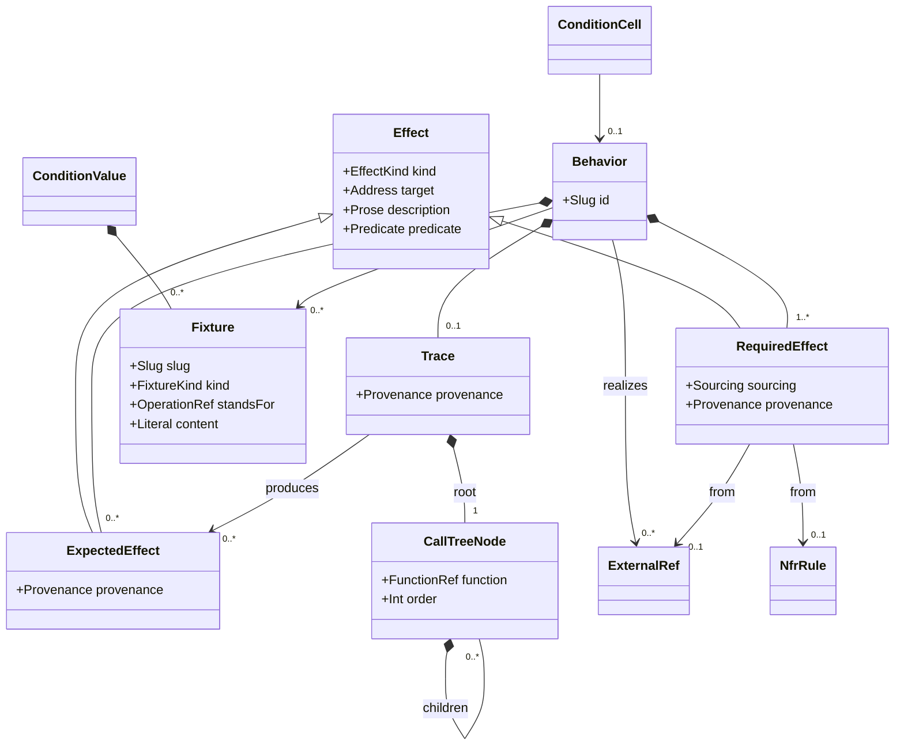

# Behavior Model

## Context
* [Data Model](DATA-MODEL.md) - the layers, the verification claim, and the addressing and maturity conventions
* [Condition Model](condition-model.md) - the cells behaviors attach to, and the NFR rules that contribute required effects
* [Function And Call Graph](function-and-call-graph.md) - the descriptions a trace walks
* [Reconciliation Model](reconciliation-model.md) - how a match is recorded, invalidated and reviewed; `Provenance` is defined there (§2)

## 1 Behavior

A `Behavior` is what the boundary does at one leaf cell of one operation's condition space. Its address is the
cell's: `bnd/order-service/op/create-order/cell/1.2.3`.

| Attribute | Type | Required by | Meaning |
|---|---|---|---|
| `cell` | `ConditionCellRef` | `M1` | the leaf condition cell this behavior occupies |
| `realizes` | `ExternalRef[]` | — | the use case steps this behavior satisfies, where any exist |
| `requiredEffects` | `RequiredEffect[]` | `M1` | what must happen (§2) |
| `fixtures` | `Fixture[]` | derived | the fixture set for this cell, from its ancestors' values (§3) |
| `trace` | `Trace` | `M3` | the derivation: call tree and expected effects (§4) |
| `expectedEffects` | `ExpectedEffect[]` | `M3` | what the design actually produces (§2) |
| `review` | `Review` | `M4` | the match record, provenance and review state ([Reconciliation Model](reconciliation-model.md)) |

Its **Given** and **When** are not stored: they are the cell's own selected dimension values, filtered by
projection ([Condition Model](condition-model.md) §3). A behavior therefore cannot describe an entry condition
its cell does not, which is what keeps coverage and description from drifting apart.

Behaviors exist only at leaves. A non-leaf cell's outcome is not determined by its own partial condition —
that is what having children means.

## 2 Effects

An `Effect` is one observable consequence. The same shape is used for what is required and for what is
derived, because matching them is a comparison and a comparison needs one vocabulary.

| `kind` | `target` | Example |
|---|---|---|
| `returns` | the operation | a created order, with id and status |
| `raises` | the operation | `CustomerNotFound` |
| `dependency-interaction` | a dependency boundary's operation | the order is written to the order store |
| `state-change` | a dependency boundary | the order store now holds an order in `pending` |
| `stream-output` | `stdout` / `stderr` | a structured log line at `warn` |
| `exit-code` | the process | `0` |
| `emits-metric` | a metric | `orders_created_total` incremented ([Function And Call Graph](function-and-call-graph.md) §6) |

`predicate` states the effect in checkable terms. It may be absent at `M1`, when a required effect is often
first captured as prose during elicitation, and is required by `M4`, because an effect with no predicate
cannot be matched — only read.

### 2.1 Required Effects

A `RequiredEffect` originates **outside the design's own solution**, and reaches the model one of two ways.

**Authored**, carrying a `Sourcing` ([Decision Model](decision-model.md) §5) that records how it got here:

* `document` — stated by a document **outside this design's scope**, held as an `ExternalRef`: a use case, a
  standard, a contract;
* `elicited` — stated by a document **inside this design's scope**: the architect asserted it, and either
  supplied the document or had the design process write it for them;
* `inferred` — an agent inferred it, recorded the basis, and the architect approved it.

**Generated**, carrying `Provenance` ([Reconciliation Model](reconciliation-model.md) §2): an `NfrRule` applied
by a cross-cutting boundary contributes required effects into the cells it reaches
([Condition Model](condition-model.md) §5). These are derived, so a change to the rule invalidates them by the
ordinary rule.

**Every required effect is documented.** An elicited effect is not an undocumented one — a requirement that
lives only in a conversation is not durable, and cannot be reviewed, checksummed or invalidated. What varies is
where the document sits and who may change it.

**The distinction that matters is change authority.** An `elicited` effect and its documentation can be changed
on the architect's say-so, because both are inside the design they are changing. A `document` effect cannot:
its source is owned elsewhere, so correcting it means change control against the owning document — which for a
use case means going back to Analysis. This is the same authority rule design targets follow among themselves
([Boundary Model](boundary-model.md) §3.2), applied to the requirement side.

**A use case need not exist.** The architect's own assertion, documented in the design, is a first-class
source — which is what makes a boundary and its behaviors a legal starting point with no Analysis behind it at
all. `realizes` is populated wherever use cases do exist, and is required by nothing.

What no source permits is the *solution* changing a required effect. Nothing derived from the design may edit
one; that is the separation the whole comparison rests on (§2.3).

### 2.2 Expected Effects

An `ExpectedEffect` is **derived** by tracing (§4). It carries provenance: every function description the
trace walked, with a checksum of each. It is never authored directly — an expected effect that someone wrote
down is a claim about the design, not a reading of it, and the whole comparison is worthless if the two can
be confused.

### 2.3 Matching

Two checks, in opposite directions, and both are needed:

* **Satisfaction** — every required effect has a corresponding expected effect. This is a subset relation, not
  equality: the design is allowed to do more than the use case demanded, and a use case is only ever part of
  the story for a shared operation.
* **Anticipation** — every expected `dependency-interaction` and `state-change` is anticipated by some
  required effect. One that is not is an **unexpected external side effect**, and "everything required is
  present too" does not excuse it.

A satisfaction failure is a design defect: the design does not do what was demanded. An anticipation failure
is not necessarily a defect at all — the design may be right and the use case incomplete — which is why it
resolves to a human judgement rather than an automatic correction
([Reconciliation Model](reconciliation-model.md) §3).

## 3 Fixtures

A `Fixture` is the concrete state that makes a condition value real enough to trace against and, later, to
test against.

| Attribute | Type | Required by | Meaning |
|---|---|---|---|
| `slug` | `Slug` | `M3` | stable identifier |
| `forValue` | `ConditionValueRef` | `M3` | the `ConditionValue` this fixture realizes |
| `kind` | `FixtureKind` | `M3` | `seed` (state a dependency is preloaded with), `stub` (a canned response), or `mock` (a stub plus an expectation) |
| `standsFor` | `OperationRef` | `M3` for `stub`/`mock` | the operation of the design target or depended-on boundary whose result this fixture declares |
| `content` | `Literal` | `M3` | the concrete data or response |

A fixture attaches to a **condition value**, not to a cell. A cell's fixture set is then the union of the
fixtures on every value selected from the root down to it. A dependency-state value like
`product: no-longer-available` needs one fixture, defined once, and every cell selecting it gets it — rather
than the same canned response being restated in every leaf of a subtree.

Fixtures are required from `M3` and not before. Their dominant kind stands in for `dependency-state`
dimensions, which do not exist until a call tree does ([Condition Model](condition-model.md) §2.2) — and
without them there is no concrete state to trace, so reconciliation is not meaningfully possible either.

### 3.1 Mock Consistency

A `stub` or `mock` declares the result of an execution that crosses a boundary. That is a **claim about what
the other side does**, and where the other side is itself designed — a contained design target
([Boundary Model](boundary-model.md) §3), not an unmodelled external dependency — the claim is checkable.

For every such fixture: there must exist a behavior of the operation it `standsFor` whose expected effects
match what the fixture declares. Where none does, the fixture implies behavior the mocked design does not
produce, and that is a `mock-inconsistency` finding
([Reconciliation Model](reconciliation-model.md) §3).

This is what makes trace termination sound rather than convenient. A trace stops at a contained design target
because that target's declared behavior is authoritative; a mock that contradicts it would let the containing
design derive expected effects from something the mocked design never agreed to. The two halves of the
argument have to hold together: the boundary is mockable *because* its design is authoritative, so a mock is
valid only *while* it agrees with that design.

The fixture's provenance names the mocked operation and its behavior, so a change on the other side
invalidates the fixture — and therefore every behavior traced against it — by the ordinary invalidation rule
([Reconciliation Model](reconciliation-model.md) §4). A mock stands in for a design target; it does not
insulate anything from it.

Where the fixture stands for an unmodelled `dependsOn` boundary there is nothing to reconcile against, and the
fixture is simply authored. The check applies where the other side exists in the model, and not otherwise.

## 4 Trace

A `Trace` is the derivation record: the walk that produced a behavior's expected effects.

Tracing starts at the operation's realizing function ([Boundary Model](boundary-model.md) §6.1), with the
cell's entry condition and its fixture set, and follows each call into the called function's own description,
recursively — **within this design target**. It produces:

* a **call tree** — the concrete sequence of function invocations this entry condition actually causes, as a tree
  of `CallTreeNode`s each naming a function address and its order among its siblings;
* the **expected effects** the walk yields;
* **provenance** — the address and checksum of every function description walked, and of the fixtures used.

The call tree is the *concrete walk for this entry condition*, not the abstract call graph. Two behaviors of the
same operation have different call trees whenever their entry conditions take different branches, and that
difference is the point: invalidation is scoped by which behaviors actually reached a changed function, not by
which ones could have ([Reconciliation Model](reconciliation-model.md) §4.2).

### 4.1 Where A Trace Stops

A trace terminates at three kinds of node, and walks through everything else:

| Stops at | Takes |
|---|---|
| a contained **design target**'s operation ([Boundary Model](boundary-model.md) §3) | that operation's own behavior for the entry condition, via the fixture standing in for it (§3.1) |
| a **dependency** boundary's shim | the fixture for the depended-on boundary's state |
| a function with no further calls | its own effects |

It walks straight through non-design-target contained boundaries — shared logic, unpromoted business domains —
because those have no independent design to defer to; they are part of this design target and their functions
are in its own catalog.

The consequence for invalidation is the one that matters: changing a function inside a contained design target
reaches nothing outside it, unless the change alters one of that target's own operation behaviors — at which
point it reaches outward through the fixtures standing in for it, not through call trees that were never
recorded. Design targets are therefore the unit that bounds reconciliation blast radius, and promotion
([Boundary Model](boundary-model.md) §3.1) is the tool for controlling it.

### 4.2 Why There Is No Separate Bound Pseudocode

An earlier form of this process carried an intermediate artifact between the requirement and the design: a
use case's Technical Interpretation, written as solution-independent pseudocode, then *bound* by substituting
each abstract call for the real function address chosen to satisfy it. The bound result was what got traced.

That intermediate is not needed once the requirement is stated as required effects. There is nothing left to
bind: the requirement is no longer pseudocode that must be mapped onto the design, and the design's own
function descriptions are directly traceable. The trace's provenance records exactly what the bound
pseudocode's checksums recorded — every function description the derivation depended on — without a derived
artifact in between that has to be maintained and re-substituted whenever either side moves.

This is a consequence of re-centring the spec on the functional boundary rather than on the use case, and it
is a change to the process as currently written.

## 5 Call Tree Reconciliation

Every `CallTreeNode`'s function must appear in the `calls` declared by its parent node's function
([Function And Call Graph](function-and-call-graph.md) §4). A node that does not is one of two things:

* a **documentation error** — the `calls` list is stale or mistyped, and is corrected directly;
* a **genuine gap** — the call was never actually decided, which returns to the decision that owns it
  ([Decision Model](decision-model.md)).

The model records which, because the two have different consequences for provenance: correcting a stale list
changes no description and invalidates nothing, while making a new decision changes a function and invalidates
everything downstream of it.

# Rationale

**Why required and expected effects share one shape.** Matching is the model's central operation, and a
comparison between a prose demand and a structured derivation is not a comparison — it is a person reading two
things and forming an opinion. Giving both sides the same kind/target/predicate shape makes the match
mechanical, and makes the absence of a predicate a reportable gap rather than a silent downgrade to human
judgement.

**Why the reverse (anticipation) check cannot be shortcut.** The satisfaction check can be made cheap: if
nothing the derivation depended on has changed, the previous result stands. Anticipation cannot, because what
it looks for is an effect nobody has recorded anywhere — there is no prior record to compare a checksum
against. It has to be re-derived from the walk each time the walk is re-run.

**Why an unexpected side effect resolves to human judgement rather than a correction.** A dependency
interaction the requirement never mentioned looks identical from the design's side whether it is a bug in the
design or a gap in the use case's understanding. Only someone looking at what the effect actually is can tell.
This is the one finding in the model whose resolution can legitimately send work back out of design and into
analysis, and automating it would mean the model silently picking one of two opposite corrections.

**Why a mock is reconciled against the design it stands for.** A mock declares the result of an execution
crossing a boundary, which is a claim about what the other side does — and a claim nobody checks is just an
assumption written down. Where the other side is designed, the claim is checkable, and leaving it unchecked
would undermine the thing that makes trace termination legitimate: the containing design would derive expected
effects, and eventually approved behaviors, from a result the mocked design never produces. Checking it costs
one comparison against a behavior that already exists.

**Why a trace stops at contained design targets but not at other contained boundaries.** The two are different
kinds of thing. A design target has its own agreed behaviors, so deferring to them is deferring to something
real. A shared-logic boundary has no independent agreement to defer to — its obligations come from the design
walking through it — so stopping there would mean stopping at nothing, and the containing design could no
longer derive its own effects at all.

**Why fixtures attach to condition values rather than to cells.** A dependency-state value appears in every
cell of the subtree beneath it — often dozens. Attaching the fixture to the cell would mean restating the same
canned response once per leaf, with no mechanism keeping the copies identical, and would make changing that
state a bulk edit. Attaching it to the value means it is defined exactly once, in the same place the value it
realizes is defined, and a cell's fixture set is derived by walking its own ancestry.

**Why the call tree is the concrete walk rather than a reference into the call graph.** Invalidation needs to
know which behaviors actually reached a changed function under their own entry condition. The abstract graph
answers "could reach", which over-invalidates — every sibling behavior of the same operation would be cleared
whenever any branch changed, and a project-wide review pass would be triggered constantly by changes that
provably cannot affect most of what it re-examines.

**Why bound pseudocode is dropped rather than retained for continuity.** It existed to solve a problem the
re-centred model no longer has: reconciling a solution-independent restatement of a use case against a
solution that names real addresses. With the requirement expressed as effects, the two sides never need to be
textually reconciled at all — only the effects are compared, and the trace's provenance covers the freshness
question the bound pseudocode's checksums were carrying. Keeping it would mean maintaining a derived artifact
whose only remaining job is to hold checksums that the trace already holds.

**Why behaviors do not store their own Given and When.** They are exactly the cell's selected dimension
values, and storing them again creates a second copy that can disagree with the condition space — which is
precisely the disagreement that makes a coverage claim meaningless. Rendering them by projection costs
nothing and makes the drift impossible rather than merely detectable.
