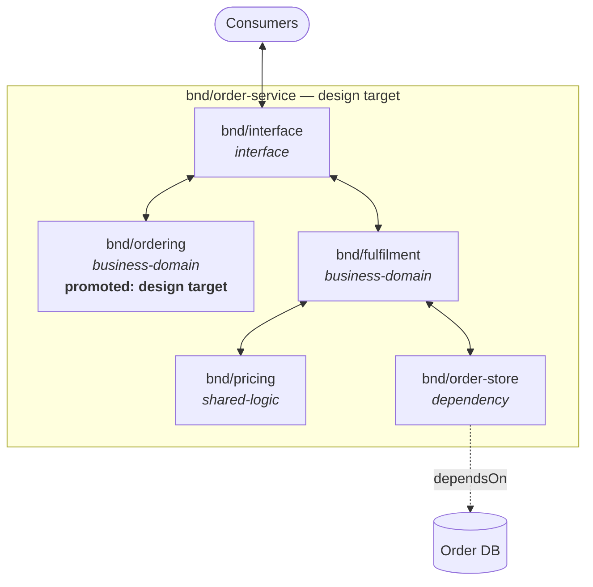

# Boundary Model

## Context
* [Data Model](DATA-MODEL.md) - the layers, the verification claim, and the addressing and maturity conventions
* [Function And Call Graph](function-and-call-graph.md) - the functions that realize a design target's operations
* [Condition Model](condition-model.md) - the NFR rules a cross-cutting boundary applies
* [Behavior Model](behavior-model.md) - where a trace stops, and how a mock is reconciled against what it stands for
* [Decision Model](decision-model.md) - the change requests a design raises against another design
* [Deployable Model](deployable-model.md) - what a Deployable design target adds

## 1 FunctionalBoundary

`FunctionalBoundary` is the root type of the model and a **composite**: a boundary contains boundaries, to
arbitrary depth, and the same type describes every level.

At this level a boundary holds **content but no requirements**. It says what exists, how it nests, and what
logic and shapes belong to it; it says nothing about what is *required* of it.

| Attribute | Type | Required by | Meaning |
|---|---|---|---|
| `slug` | `Slug` | `M0` | stable identifier, unique among its parent's contained boundaries |
| `name` | `Name` | `M0` | human-readable name |
| `purpose` | `Prose` | `M0` | what this boundary is responsible for, in a sentence or two |
| `kind` | `BoundaryKind` | `M0` when contained | the boundary's role within its parent (§4); unset on an uncontained boundary |
| `contains` | `FunctionalBoundary[]` | — | contained boundaries, inside this boundary's perimeter (§5) |
| `dependsOn` | `BoundaryRef[]` | — | boundaries this one depends on, outside its perimeter (§5) |
| `functions` | `Function[]` | `M2` | the functions belonging to this boundary, with their signatures, descriptions and calls ([Function And Call Graph](function-and-call-graph.md)) |
| `interfaces` | `Interface[]` | `M2` | groupings of its perimeter functions, which its consumers depend on |
| `dataTypes` | `DataType[]` | `M2` | the data types this boundary defines ([Data Dictionary](data-dictionary.md)) |

A boundary that is only a `FunctionalBoundary` — shared logic inside a service, say — holds real content: its
own functions, their signatures and descriptions, the interface its consumers depend on, and the types it
defines. What it is not is a **design target** (§3). It has no operations, no condition space and no behaviors;
what it must *do* follows from the required behaviors of its consumers, and it is designed as part of whatever
design target contains it.

The distinction is content versus requirements. Functions and types belong to the boundary that structures
them — which is why an address nests through that boundary ([Data Model](DATA-MODEL.md) §5.1) — while the
design target that contains them owns the catalog, the dictionary and the design authority over both.

## 2 The Three Levels

```mermaid
classDiagram
    direction TB

    class FunctionalBoundary {
        +Slug slug
        +Name name
        +Prose purpose
        +BoundaryKind kind
        +FunctionalBoundary[] contains
        +BoundaryRef[] dependsOn
        +Function[] functions
        +Interface[] interfaces
        +DataType[] dataTypes
    }
    class SpecifiableBoundary {
        +MaturityLevel maturity
        +BuildManifest buildManifest
        +Operation[] operations
        +CrossCuttingBoundary[] crossCutting
        +Bool mockable
        +FunctionRef[] catalog
        +DataTypeRef[] dictionary
    }
    class DeployableBoundary {
        +RuntimeManifest manifest
        +InterfacePerimeter perimeter
        +Endpoint[] endpoints
        +ServiceArchetype archetype
        +SLI[] slis
    }

    FunctionalBoundary <|-- SpecifiableBoundary
    SpecifiableBoundary <|-- DeployableBoundary

    FunctionalBoundary *-- "0..*" FunctionalBoundary : contains
    FunctionalBoundary --> "0..*" FunctionalBoundary : dependsOn
    SpecifiableBoundary *-- "0..*" Operation
    SpecifiableBoundary *-- "0..*" CrossCuttingBoundary
    CrossCuttingBoundary --> "0..*" NfrRule : applies
```

**`FunctionalBoundary`** — a grouping inside somebody else's design, holding its own functions, interfaces and
data types but no statement of what is required of it.

**`SpecifiableBoundary`** — a **design target** (§3): something designed in its own right, with its own
operations, behaviors and NFR consideration, and a catalog and dictionary scoped to its design. A **Library**
is one.

**`DeployableBoundary`** — a design target that is additionally built, packaged, run and observed as a
process. A **Service** is one.

You never begin a design from a bare `FunctionalBoundary`. The root of any design is a design target, because
being designed is what makes something a design target — so a design begins as a `SpecifiableBoundary` with
little more than a name, and everything else accretes from there. Named operations are its first checkpoint
([Data Model](DATA-MODEL.md) §5.2), not a precondition for starting.

A Library is not a degenerate Service. The Deployable attributes are not absent-but-implied on a Library; they
have no referent on something never deployed as a process — no configuration vector, no signal, no health
probe, no container image, no SLI. A Library does declare its own cross-cutting boundaries (§7), because being
resilient, or being the thing that decides what is trusted, is a guarantee a library makes about itself. Its
functions emit metrics too ([Function And Call Graph](function-and-call-graph.md) §6) — what it cannot do is
say whether those numbers are acceptable, which is an SLI and belongs to whatever deploys it.

### 2.1 Containment Across Levels

* A `SpecifiableBoundary` may contain `FunctionalBoundary` and `SpecifiableBoundary`.
* A `DeployableBoundary` may contain any of the three, including another `DeployableBoundary` — a database
  service composed of a server, a write-ahead log, a writer and a reader is one boundary containing several,
  each independently deployed.
* A `SpecifiableBoundary` may **not** contain a `DeployableBoundary`. Something never deployed cannot have a
  deployed thing inside its own perimeter; the relationship being described there is `dependsOn`.

### 2.2 What Containment Carries

Containment bundles several consequences, and they do not all survive a contained design target's perimeter.
The design model itself does not cross that perimeter: it defers to the contained target's own assured
behaviors, reached through a mock ([Behavior Model](behavior-model.md) §3.1).

| Containment carries | Across a plain `FunctionalBoundary` | Across a contained design target |
|---|---|---|
| address nesting | yes | yes |
| outward name resolution ([Data Model](DATA-MODEL.md) §5.1.1) | yes | yes |
| NFR rule scope, inherited outward (§7.2) | yes | yes |
| shipped, built and deployed together | yes | yes |
| maturity aggregation — container is the minimum ([Reconciliation Model](reconciliation-model.md) §5) | yes | yes |
| **design authority** | yes — the container designs it | **no** — it designs itself (§3.2) |
| **trace traversal** | yes — traces walk through | **no** — traces stop at its operations (§3) |
| **cross-cutting selection** | yes — selectors reach in | **no** — selection stops at its perimeter (§7.4) |

So across a design target, containment is about **address space, delivery, and what cascades inward as
scope** — not about who designs what. The bottom three rows are exactly the properties that make a design
target a design target, and each one stops precisely at its perimeter.

## 3 Design Targets

A `SpecifiableBoundary` is a **design target**. Four properties follow, and they are the reason the level
exists:

* **It owns its requirements.** It has its own operations, condition spaces and behaviors, rather than
  inheriting obligations from whoever calls it. It does not own the function and type definitions beneath it —
  those belong to the boundaries structuring them (§1) — but it owns the catalog and dictionary spanning them,
  and the design authority over both.
* **It is mockable.** Its operations' declared behaviors are sufficient for a consumer to be designed against
  it without tracing inside it.
* **It bounds a trace.** A trace from a containing design target stops at a contained design target's
  operation and takes that operation's own behavior, rather than walking into its functions
  ([Behavior Model](behavior-model.md) §4). Changing a function *inside* a contained design target therefore
  invalidates nothing outside it unless one of its operation behaviors changes.
* **It bounds authority.** No design may change another design target's operations or behaviors (§3.2).
* **It defines what it is built as.** Language, build system, dependency constraints and how consumers obtain
  it — inherited from a containing design target where there is one, declared where there is not (§3.3).

A design target bounds authority and tracing. It does **not** bound naming: an unprefixed address resolves
outward through containing design targets ([Data Model](DATA-MODEL.md) §5.1.1), so a promoted domain names a
type its parent service defines without prefix or restatement. Reading a containing design's definition is not
changing it.

Mockability and trace-bounding are the same property seen from two sides, and they carry an obligation: a mock
standing in for a design target is a claim about what that target does, and the claim is checkable against the
target's own design ([Behavior Model](behavior-model.md) §3.1).

### 3.1 Promotion

A contained `FunctionalBoundary` is **promoted** to a `SpecifiableBoundary` when it earns its own design. Two
situations warrant it:

* **Repetition across consumers.** A boundary reached by several consumers would otherwise have its behaviors
  restated once per consumer — duplicating its requirements and swamping human review with repetition of the
  same obligations. A business domain behind several routes to market is the common case.
* **Complexity.** A boundary intricate enough to need designing on its own terms rather than as incidental
  detail of its callers. Any kind of boundary can reach this — a business domain, shared logic, or a
  dependency whose interaction turns out to be a design problem in itself.

Promotion is not free, and the cost is planning toil rather than modelling awkwardness: a new design target
needs its own design work, its own ticket, its own review, and its own NFR assessment (§7.3). It is worth
paying where it removes duplicated requirements, and not otherwise.

Promotion is a **mechanical operation**, with defined effects:

1. The boundary's functions come into the new target's catalog scope and leave the containing target's. The
   functions do not move: they belonged to this boundary before and still do (§1). Only which design target's
   catalog spans them changes.
2. The functions its consumers call become its operations, and the behaviors those consumers required of them
   become its own required behaviors.
3. Every cross-cutting boundary of the containing target whose selector reached into the promoted boundary is
   **split** (§7.5), so nothing loses an NFR obligation at the moment of promotion.
4. Fixtures standing in for the new target come into existence, where before there were none — the containing
   design's traces used to walk straight through it ([Behavior Model](behavior-model.md) §4.1).
5. Artefacts move on disk: a design's artefacts are scoped to a directory and its subdirectories, so the
   promoted target's artefacts leave the containing design's scope for their own.

**Addresses do not change.** An address nests through the boundaries that structure an element, not through
the design target governing it ([Data Model](DATA-MODEL.md) §5.1), and promotion changes the boundary's type,
not its position in the containment tree. `bnd/order-service/bnd/pricing/fn/apply-discount` is the same before
and after. Only the serialization location moves, which is exactly what a model stated independently of
serialization should say.

The exception is **extraction** — taking a contained design target out of its container entirely and
publishing it as a standalone Library. That is a different operation: containment becomes `dependsOn`, and the
addresses re-root into the Library's own namespace ([Data Model](DATA-MODEL.md) §5.1.1), because a published
Library's addresses must be the same for every consumer rather than relative to whoever first contained it.

**Relocation** is the same operation with a different destination: the target moves under a *different*
container rather than out of containment altogether — a business domain leaving its service for a library of
business domains. Containment is severed and re-established elsewhere, the original container gains a
`dependsOn` if it still uses it, and the addresses re-path through the new containment, into the new
container's namespace where that differs.

The three are worth separating because only promotion leaves addresses alone. Promotion changes a boundary's
**type** in place; extraction and relocation change its **position**, and position is what an address is
derived from ([Data Model](DATA-MODEL.md) §5.1). Whether the destination is a namespace of its own or another
container decides where the addresses land, not whether they move.

**Promotion should cost no human review.** The containing design's traces must be re-run, because they now
stop at the promoted target instead of walking into it — but they should regenerate to the *same* expected
effects, since the design itself has not changed, only where the trace terminates. Every affected behavior
therefore lands in the "regeneration matches a prior approval, restore it" path
([Reconciliation Model](reconciliation-model.md) §6.2), and no behavior reaches a human.

This is a property worth checking rather than assuming: a promotion that produces a wave of
`redesign-required` findings has changed something it should not have, and the finding to investigate is the
promotion, not the behaviors it disturbed.

### 3.2 Authority And Change Requests

A design target's operations and behaviors may only be changed by its own design. Another design has no
authority over them — if a boundary was complex enough to earn its own design, then changing what it promises
is design work on *that* boundary, not a side effect of work on a neighbour.

When a design finds it needs a change to another design target, it raises a `ChangeRequest`
([Decision Model](decision-model.md) §5) against that target, carrying an `ExternalRef` to the ticket raised
for it, and **blocks** on it. It does not make the change.

The consequence is a legitimate terminal state that is neither complete nor failing: **blocked on change
requests** — no further design evolution is possible here, the design is not finished, and nothing is wrong.
Work moves to the next available unit elsewhere and returns when the ticket resolves.

### 3.3 Build Manifest

A design target is something that gets **built**, so it has to say what it is built as. A `BuildManifest`
records that, and it sits here rather than with deployment because a Library is built and published without
ever being deployed.

A manifest is a set of `ManifestSetting`s, each with an enumerated `kind`, grouped by dimension for reading.
The enumeration is closed, for the same reason the interface perimeter's is
([Deployable Model](deployable-model.md) §3): an open question about "the build setup" gets whatever the
architect already had in mind, while a finite list of named settings gets an answer per item.

| Dimension | `SettingKind`s | Type |
|---|---|---|
| `language` | `language`, `language-version` | `Text` |
| `build-system` | `build-tool`, `package-manager` | `Text` |
| `topology` | `architecture-pattern`, `directory-layout`, `module-structure`, `repository-path` | `Text` |
| `dependency-constraints` | `approved-dependencies`, `banned-dependencies`, `style-and-lint-rules` | `Text[]` |
| `test-stack` | `test-runner`, `assertion-library`, `mocking-tooling` | `Text` |
| `distribution` | `artifact-form`, `registry`, `coordinates` | `Text` |

| `ManifestSetting` | Type | Meaning |
|---|---|---|
| `kind` | `SettingKind` | which setting this is |
| `value` | `Text` or `Text[]` | what it is set to |
| `exempt` | `Bool` | this setting has no referent for this design target |
| `exemptionReason` | `Prose` | why, when exempt |
| `inheritedFrom` | `BoundaryRef` | the containing design target it came from, where not declared here (§3.3.1) |

`distribution` is the **access vector**: the answer to "how does a consumer get at this". `artifact-form` takes
a published package, an in-process import, a source dependency or a container image. For a Library it is the
whole consumption story; for a Service it coexists with the interface perimeter
([Deployable Model](deployable-model.md) §3), which says how a *running process* is reached rather than how the
artifact is obtained.

Every setting is **stated, inherited, or exempted**, and there is no fourth state. A setting that is none of
those is an `unassessed-manifest-setting` finding ([Reconciliation Model](reconciliation-model.md) §3).
Exemption is a real answer and often the right one — a Library has no container build stages, a single-package
repository has no module structure worth stating — but it is an answer, recorded, rather than a blank.

Required by `M2`. Signatures and the data dictionary are expressed against a type system, and the dependency
constraints bound what a function is permitted to call, so both become answerable questions exactly when the
catalog does.

Nothing stops it being settled earlier — often it is known before `M0`, because the architect starts from an
existing stack. Declaring it then is not premature; it simply removes a later unit of work
([Data Model](DATA-MODEL.md) §5.2).

#### 3.3.1 Inheritance

A contained design target **inherits** its containing design target's manifest and may not contradict it. You
cannot change language midway through a service, and a contained Library compiled into a different runtime is
not contained at all — it is a `dependsOn` (§5.2).

Inheritance is per setting: a setting not declared here carries `inheritedFrom`. A contained target may
**tighten** what it inherits — narrowing the approved dependency matrix, banning
something more — and may not loosen it. This is the same accumulate-never-exempt shape NFR rules follow
(§7.3), and for the same reason: a part cannot relieve itself of a constraint the whole is under.
A contradiction is a finding, not a local override.

An **uncontained** design target has nothing to inherit from and must declare its own. That is the standalone
Library case, and it is why the manifest sits at this level at all.

It follows that **extraction** (§3.1) must materialise the inherited manifest onto the extracted Library
before it leaves: it is losing the parent it was inheriting from, and would otherwise be an uncontained design
target with no manifest at all.

## 4 Boundary Kinds

There are four **functional** boundary kinds. They separate a boundary's functions into domains, and every
contained boundary has exactly one.

| Kind | Holds |
|---|---|
| `interface` | the translation and validation layer for the parent's own perimeter — inbound adapters, schema validation, auth guards, signal and config handlers |
| `business-domain` | domain logic: the work the boundary exists to do |
| `shared-logic` | logic used by more than one business domain, belonging to none of them |
| `dependency` | thin shims over boundaries outside the parent's perimeter (§5.2) |

Kind is orthogonal to whether a boundary is a design target: a business domain may be promoted or not, and is
the same kind either way.

## 5 Containment And Dependency

### 5.1 `contains`

Composition. The contained boundary is **inside** the container's perimeter: designed, versioned, built and
deployed as part of it, with its addresses nested beneath the container's. Deleting the container deletes it.

### 5.2 `dependsOn`

Reference. The depended-on boundary is **outside** the perimeter: a datastore, an event bus, another team's
service, a third-party API. It is not owned by this design, may not be modelled in detail at all, and its
address is not nested.

Only a `dependency`-kind boundary may hold `dependsOn`. That is the rule making external interaction
locatable: every outward crossing goes through a shim, and every shim sits on a boundary whose kind says so.

A dependency boundary's functions are **thin shims** — one-for-one translations. The invariant, checked at
`M2`, is that each shim function maps to exactly one operation of the depended-on boundary. A shim that has
acquired logic of its own is a finding, because an external interaction is then partly described somewhere the
model treats as a pass-through.

`bnd/ordering` is promoted, so the service's traces stop at its operations and its internals are its own
design. `bnd/pricing` and `bnd/fulfilment` are not, so they are designed as part of the service and its traces
walk straight through them.

## 6 Operation

An `Operation` is a point on a design target's perimeter at which it can be invoked from outside itself. It
exists at `SpecifiableBoundary`, because an operation is a thing designed against — a non-design-target
boundary's perimeter functions are simply functions with `perimeter` visibility
([Function And Call Graph](function-and-call-graph.md) §1.1).

| Attribute | Type | Required by | Meaning |
|---|---|---|---|
| `slug` | `Slug` | `M0` | stable identifier, unique on the boundary |
| `purpose` | `Prose` | `M0` | what invoking this operation is for |
| `signature` | `Signature` | `M1` | the contract: parameters, return, declared exceptions |
| `conditionSpace` | `ConditionSpace` | `M1` | the entry conditions this operation must be defined over ([Condition Model](condition-model.md)) |
| `realizedBy` | `FunctionRef` | `M2` | the `Function` that implements it |
| `exposedBy` | `EndpointRef[]` | `M5` | the `Endpoint`s exposing it, on a Deployable target ([Deployable Model](deployable-model.md)) |

An **Operation is not an Endpoint**. An operation is the abstract invocable point; an endpoint is a
protocol-bound exposure of one. One operation may be exposed by several endpoints — the same `create-order`
over REST and gRPC — and a Library's operations are exposed by no endpoints at all.

### 6.1 Realization

At `M2`, `realizedBy` names a function contained by this target, transitively, and not inside a contained
design target. Where the target contains an `interface`-kind boundary, the realizing function must be on it.
The operation's signature and the realizing function's signature must conform; a mismatch is a finding.

## 7 Cross-Cutting Boundaries

A cross-cutting boundary is **rules applied to functions, extending the conditions those functions must
survive for the design to remain sound**. It is an overlay, not part of the containment tree, and it belongs
to a design target (§3) — NFR consideration is part of specification.

| Kind | NFR concern |
|---|---|
| `security` | untrusted input cannot reach domain state; permissions validated before resources are consumed |
| `resilience` | a failing upstream or slow downstream cannot starve this boundary of resources |
| `concurrency` | thread handoffs, locks and async queues, without deadlock or race |
| `state-transaction` | data correctness under concurrent write, failure, or crash |

### 7.1 Rules And Associations Are Separate

An **`NfrRule`** is a standalone, addressable definition of what a constraint requires
([Condition Model](condition-model.md) §5). It is not owned by any one cross-cutting boundary; several may
apply the same rule.

A **`CrossCuttingBoundary`** is a named **association** of a rule set with a set of functions:

| Attribute | Type | Required by | Meaning |
|---|---|---|---|
| `slug` | `Slug` | `M0` | stable identifier, unique on the design target; may be dotted for grouping |
| `kind` | `CrossCuttingKind` | `M0` | one of the four above; every rule it applies must be of the same kind |
| `applies` | `NfrRuleRef[]` | `M1` | the `NfrRule`s it imposes |
| `selects` | `FunctionRef[]` | `M2` | the functions it imposes them on, within this design target's own scope (§7.4) |

A rule constrains **everything crossing the functions its boundary selects**, without distinguishing kinds of
data. That uniform applicability is a known limitation, adequate for rules that are genuinely uniform and not
for one that singles out a kind of data — see [Data Dictionary](data-dictionary.md) §5.1 for what closing it
would take.

Because the association is named, a design target may declare **several cross-cutting boundaries of the same
kind**: a service with `public.auth` and `public.2fa-auth` has two security boundaries, deliberately distinct,
applying different rule sets to different function sets. That is a design statement, not a duplication.

Slugs may be dotted for grouping (`public.auth`, `public.2fa-auth`); `/` is reserved as the address separator.

### 7.2 Rules Are Inherited, Selections Are Not

A design exists within a **scope** of NFR rules it did not define. The scope resolves by walking outward from
the design's own directory to the Product that owns it, and reading the pointer to the Product's NFR rule
definitions.

Rules inherit; selections never do. A design target inherits the *definitions* of `auth` and `2fa-auth` from
its Product and must then decide, locally and explicitly, which of its own functions those rules apply to. A
design target may also define rules of its own, which are in scope for anything it contains.

Where the walk finds no Product, or a Product with no NFR rule pointer, the architect is asked to supply the
pointer or to declare that there are none. That declaration is itself a recorded fact, reconcilable from the
Product's side.

The Product's own NFR rule catalog, and the Product-level review that reads every design's assessments
together to find inconsistencies or declarations no longer true, are **outside this model's scope** — this
model holds the design's side of that relationship: the scope reference, and the assessments below.

### 7.3 Assessment Or Exemption

For every rule in scope, a design target must either:

* **apply** it — declare a cross-cutting boundary applying that rule and selecting the functions it governs; or
* **exempt** itself — declare explicitly that no function in this design is on that boundary.

Neither is optional and there is no third state. A rule in scope with no assessment is an
`unassessed-nfr-rule` finding ([Reconciliation Model](reconciliation-model.md) §3).

This is what makes a Product adding a rule propagate mechanically: every design in scope acquires an
unassessed rule, which surfaces as a unit of work — assess these functions, or declare there is nothing here —
rather than relying on anyone remembering to revisit designs that were finished.

An exemption is a claim, not a silence, so it is reviewable and falsifiable: the Product can read every
design's exemptions together and identify ones that are no longer true.

### 7.4 No Reach-Through Across A Design Target

A selector reaches down through contained non-design-target boundaries and **stops at any contained
`SpecifiableBoundary`**. A design target's functions are selected only by its own cross-cutting boundaries.

This is the same property as mockability (§3): the internals of something treated as a black box cannot be
constrained from outside it. It is also what keeps NFR consideration coherent — a promoted domain reasons
about one auth boundary, its own, rather than about its own plus an inherited one imposed from a design it
cannot see.

Nothing is lost, because §7.3 makes the promoted target assess the same in-scope rules itself, and §7.5
carries its existing obligations across at the moment of promotion.

### 7.5 Promotion Splits Selection

When a boundary is promoted (§3.1), every cross-cutting boundary of the containing target whose selector
reached into it is split:

* the containing target's boundary keeps the selected functions that remain outside the promoted target;
* a new cross-cutting boundary is created **on the promoted target**, of the same kind, applying the same
  rules, selecting the functions that moved inside.

The split is mechanical and preserves the effective constraint on every function exactly. A function on the
auth boundary before promotion is on an auth boundary after it — a different association, on a different
design target, applying the same rule.

# Rationale

**Why `SpecifiableBoundary` means "design target" rather than "has a function catalog".** Every property the
level needs to carry — owning requirements, being mockable, bounding a trace, bounding authority, owning NFR
consideration — follows from being designed in its own right, and none of them follows from merely having
functions. Shared logic inside a service has functions and needs none of those properties: its obligations
come from its consumers and it is designed as part of the thing containing it. Defining the level by
design-target status makes one concept do all of that work instead of four coincidentally-aligned ones.

**Why the build manifest sits at the design target rather than with deployment.** An earlier draft folded
language, build system, dependency constraints and test stack into the `RuntimeManifest` at `DeployableBoundary`.
That left a Library — which is compiled, packaged, published and consumed — unable to say what language it is
written in or how anyone obtains it, which is most of what an implementing agent needs from it. The split that
works is built versus run: everything about producing an artifact belongs to whatever is designed, and only
what presupposes a running process belongs to deployment.

**Why the manifest enumerates settings rather than describing dimensions.** The first draft gave each
dimension a prose description — "architecture and directory pattern, module or workspace structure, path
relative to the repository root" — which bundles four separate facts into one cell and asks for them as a
single open question. That is the same failure the interface perimeter had
([Deployable Model](deployable-model.md) §3): prose invites recognition, and what comes back is whatever was
already in mind. Naming each setting makes elicitation a finite walk, and makes a missing answer detectable
rather than merely absent. Exemption carries its weight here too — a Library genuinely has no container build
stages, and recording that is different from leaving the cell empty.

**Why an uncontained design target is the case that forces it.** A contained target could have inherited all
of this from its container and needed no attribute of its own. A standalone Library has no container, so
without a manifest at this level there is nowhere for its language to live — and a model where the answer
depends on whether something happens to be nested is a model that will be wrong for the first library anyone
publishes. Inheritance then falls out as the ordinary case rather than the mechanism.

**Why promotion exists rather than making every boundary a design target.** Design targets are not free: each
needs its own requirements, its own review, its own NFR assessment, and its own ticket when it changes.
Applying that to every shared-logic grouping would multiply planning toil for no benefit, since a boundary
with one consumer and no independent requirements has nothing to say that its consumer does not already say.
Promotion makes the cost deliberate and pays it only where duplicated requirements would otherwise be
restated per consumer.

**Why trace termination and mockability are treated as one property.** A mock is only sound if what it
declares is genuinely what the mocked thing does; a trace may only stop at a boundary if what lies beyond it
is separately guaranteed. Both are the statement "this boundary's declared behavior is authoritative and
sufficient." Deriving them from one property rather than asserting them separately is what makes the mock
consistency check ([Behavior Model](behavior-model.md) §3.1) obligatory rather than optional.

**Why a design may not change another design target, and raises a ticket instead.** Authority follows
ownership: if a boundary earned its own design, then what it promises is that design's to decide, and a
neighbour altering it would be making a decision it has no standing to make and that the owning design's own
review would never see. Raising a change request and blocking makes the dependency visible and schedulable.
It also gives the model an honest terminal state — blocked, incomplete, not failing — instead of forcing a
design either to overreach or to pretend it is finished.

**Why cross-cutting rules are separated from the associations that apply them.** The same rule genuinely
applies in several places: a service's auth rule and a promoted domain's auth rule are the same requirement
imposed on two function sets. Fusing rule and association would mean copying the rule's content per place it
applies, with nothing keeping the copies in step, and would make a Product-level review of "what does auth
require" impossible because there would be no single thing to read. Naming the association separately also
makes `public.auth` and `public.2fa-auth` expressible, which a one-boundary-per-kind model cannot say at all.

**Why NFR rules inherit but selections do not.** A rule's content is a Product-level statement — what auth
requires does not vary by design — while which functions are on the boundary is exactly the local judgement
the design is being asked to make. Inheriting selections would mean a Product deciding the internals of
designs it cannot see; re-declaring rules per design would mean a Product-wide change requiring an edit in
every design and no way to tell which had been done.

**Why an exemption must be declared rather than inferred from absence.** A design with no auth boundary and a
design that has decided none of its functions need one are indistinguishable if silence is permitted, and the
difference is the whole point of the assessment. Making the exemption an explicit, recorded claim also makes
it falsifiable later: a Product review can find exemptions that have stopped being true, which is impossible
against an absence.

**Why reach-through stops at a design target rather than continuing with an accumulation rule.** An earlier
draft had selectors accumulate across every containing level, with contradictions raised as findings. That
contradicts mockability — it constrains the internals of something the containing design is not allowed to
look inside — and it produces the incoherence of a promoted domain reasoning about two auth boundaries, one
of which it cannot read. Stopping at the perimeter, and requiring the promoted target to assess in-scope rules
itself, gives the same coverage with each design reasoning only about its own scope.

**Why the no-review-cost property is stated rather than left to follow from the general rules.** It does
follow: invalidation makes the containing design's traces stale, regeneration re-runs them, and a match
against a prior approval restores it without human involvement. But that chain has to be reassembled from
three sections to see it, and the conclusion it reaches — that a restructuring which moves artefacts between
directories and rewrites every address beneath them costs no review at all — is surprising enough that a
reader who has not reassembled it will assume the opposite. Stating it also turns it into a check: it gives
promotion an expected outcome to be wrong against, so a bad implementation announces itself as a wave of
`redesign-required` rather than as plausible-looking review work.

**Why functions and types belong to the structuring boundary rather than to the design target.** A draft of
this model put them on `SpecifiableBoundary`, which read as though a `FunctionalBoundary` were a bare tag. The
addressing scheme had already decided otherwise — `bnd/order-service/bnd/pricing/fn/apply-discount` nests
through `pricing`, which it would not if the service owned the function — and the two readings produce
different answers for whether promotion re-addresses anything. Separating content from requirements resolves
it: a shared-logic boundary genuinely has functions and types and genuinely has no requirements of its own,
and there was never a reason those two facts had to travel together. It also makes in-place promotion cheap,
because nothing needs to move.

**Why promotion splits selections rather than leaving the promoted target to redeclare them.** Promotion is a
restructuring, not a redesign: the functions did not change and neither did their obligations. Leaving the new
target to rediscover which of its functions were on the auth boundary would introduce a window in which they
provably were and are now claimed not to be, and would make a mechanical operation depend on someone
remembering to redo an assessment that was already correct.
