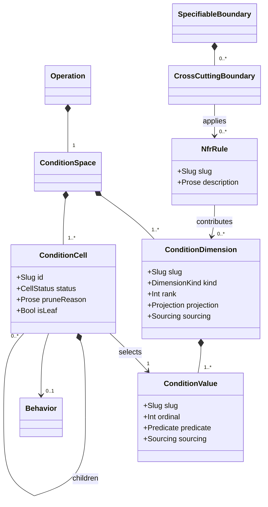

# Condition Model

## Context
* [Data Model](DATA-MODEL.md) - the layers, the verification claim, and the addressing and maturity conventions
* [Boundary Model](boundary-model.md) - the operations a condition space belongs to, and the cross-cutting boundaries that generate into it
* [Data Dictionary](data-dictionary.md) - the types dimensions are derived from and the rules that prune them
* [Behavior Model](behavior-model.md) - the behavior that occupies each valid cell

## 1 Condition Space

Every `Operation` has exactly one `ConditionSpace`: the set of entry conditions the operation must be defined
over. It is the model's answer to "what does *complete* mean" — coverage is asserted against this space, so
anything the space does not contain is, by definition, not required.

An entry condition is **not a state**. It is a state *and* a way of being invoked: the world the operation is
called against, together with which variant of the call this is. Both are needed to determine an outcome, and
neither determines one alone.

| Attribute | Type | Required by | Meaning |
|---|---|---|---|
| `operation` | `OperationRef` | `M1` | the operation this space belongs to |
| `dimensions` | `ConditionDimension[]` | `M1` | the ranked dimensions spanning the space (§2) |
| `cells` | `ConditionCell[]` | `M1` | the tree of condition cells the dimensions generate, after pruning (§4) |

The space is a **matrix expressed as a tree**. The dimensions are ranked, and the tree nests them in rank
order: rank 1 at the top, its values as the first level of cells, each of those branching into rank 2, and so
on. A cell is one concrete combination of dimension values.

## 2 Condition Dimension

A `ConditionDimension` is one axis of variation that affects what the operation does.

| Attribute | Type | Required by | Meaning |
|---|---|---|---|
| `slug` | `Slug` | `M1` | stable identifier, unique in the space |
| `kind` | `DimensionKind` | `M1` | `payload`, `dependency-state`, `parameter`, or `cross-cutting` |
| `rank` | `Int` | `M1` | position in the nesting order; unique in the space |
| `projection` | `Projection` | `M1` | `given` or `when` (§3) |
| `source` | `Address` | `M1` | what the axis is structurally over: a data type field, a depended-on boundary, or an NFR rule |
| `sourcing` | `Sourcing` | when authored | how the fact that these are the behavior-affecting variations entered the model, and who may change it (§2.3) |
| `values` | `ConditionValue[]` | `M1` | the discrete values this dimension takes (§2.1) |

| Kind | Varies over | Derived from |
|---|---|---|
| `payload` | the salient properties of the input | a field of the operation's input type, bucketed into behavior-affecting ranges |
| `dependency-state` | the state of a depended-on boundary | a dependency interaction found in the call tree |
| `parameter` | the operational knobs of the invocation | a parameter of the operation's signature, and its validity rules |
| `cross-cutting` | the conditions an NFR rule cares about | an `NfrRule` (§5) |

### 2.1 Condition Values

| Attribute | Type | Required by | Meaning |
|---|---|---|---|
| `slug` | `Slug` | `M1` | stable identifier, unique in its dimension |
| `ordinal` | `Int` | `M1` | its position in the dimension, and its digit in a cell id (§4.1) |
| `predicate` | `Predicate` | `M1` | what it means in terms the model can check |
| `sourcing` | `Sourcing` | when authored | how this bucketing entered the model, and who may change it (§2.3) |
| `fixtures` | `Fixture[]` | `M3` | the fixtures that expose this value ([Behavior Model](behavior-model.md) §3) |

A value's `predicate` is a comparison against a field, a state of a depended-on boundary, or a condition
contributed by an NFR rule.

The ordinal is what makes cell ids stable and readable (§4.1). A dimension's values must be exhaustive and
mutually exclusive over the thing they partition: `order-value` is `< 1000` and `>= 1000`, not `< 1000` and
`> 1000`.

**`fixtures` is the authored direction of a many-to-many relationship.** One fixture exposes several values
across several dimensions, and one value is exposed by several fixtures, so the value claims its fixtures and
the fixture holds no pointer back ([Behavior Model](behavior-model.md) §3).

### 2.2 Accretion

The condition space **grows as the design matures**, and this is normal rather than a defect:

| Reached | What is added | Authored or derived |
|---|---|---|
| `M1` | `payload` and `parameter` dimensions, over the operation's signature and its input types | **authored** — they carry `Sourcing` (§2.3) |
| `M2`–`M3` | `cross-cutting` dimensions, as an NFR rule's selector resolves against real functions | **derived** — generated by an `NfrRule`, carrying `Provenance` |
| `M3` | `dependency-state` dimensions, once the call tree reveals which dependencies the operation actually reaches, and under which conditions | **derived** — from a dependency interaction in the call tree, carrying `Provenance` |

The third column decides which mechanism keeps a dimension honest, and the split is not cosmetic. A derived
dimension is covered by the existing invalidation rule: a change to the rule or the call tree that generated
it makes it stale, and `stale-provenance` reports that
([Reconciliation Model](reconciliation-model.md) §2, §4.1). An authored one is not derived from anything, so
nothing can go stale about it, and what has to be recorded instead is who decided it (§2.3).

**A derived dimension can still have authored values.** A `dependency-state` dimension arrives from the call
tree, but bucketing that dependency's states into `available` and `no-longer-available` is a judgement about
which states make a difference. So `ConditionValue.sourcing` stands in its own right rather than being
inherited from its dimension — which is also what puts the recorded basis on the part that is pure judgement.

Dependency-state dimensions genuinely cannot exist earlier: which dependencies an operation touches is a
consequence of the design, not an input to it. This is why the model starts with the payload dimensions alone
and expands, rather than demanding a complete space up front.

Adding a dimension adds cells, and every added cell is uncovered until a behavior occupies it. Accretion is
therefore an **invalidating event**: coverage previously asserted against a smaller space is not coverage of
the larger one ([Reconciliation Model](reconciliation-model.md) §4).

### 2.3 Sourcing

`source` and `sourcing` answer different questions, and an authored dimension needs both. `source` is what
the axis is structurally **over** — which field, which depended-on boundary, which rule. `sourcing` is how
the fact that **these are the behavior-affecting variations** entered the model, and therefore who may change
it.

The gap that leaves is widest for `payload` dimensions, where the bucketing is the entire judgement: a field
of the operation's input type "bucketed into behavior-affecting ranges" (§2) records which field and nothing
about why those ranges. `parameter` dimensions had less still — they appeared out of the signature with no
recorded cause for existing at all. A list cannot distinguish "these are the variations, and they were
considered" from "these are the ones somebody happened to write down", and only the first supports a coverage
claim.

The kinds are the ordinary ones ([Decision Model](decision-model.md) §5):

* `document` — analysis defined the variations. Held as an `ExternalRef` with a checksum, so an edit to the
  use case invalidates the dimension and re-judges the coverage built on it, exactly as it already does for
  required effects.
* `elicited` — the architect asserted them, documented inside the design.
* `inferred` — an agent derived them, recorded the basis, and the architect approved.

**Analysis should define them, and cannot block design.** The dimensions and values a service must behave
over ought to come from the analysis a boundary's behaviors feed in from. Where the feed-in does not define
them it falls to the architect's assertion, and doing that analysis is then the architect's job. Either way
there is a document anchoring the claim — a pointer to analysis with provenance, or a statement of the
variations in scope. This is what makes [Decision Model](decision-model.md) §5.1's claim, that presenting a
behavior for approval means presenting the provenance of each of its Given conditions, true rather than
aspirational.

**An authored dimension or value carrying no sourcing is a finding**: `unsourced-condition-dimension`
([Reconciliation Model](reconciliation-model.md) §3). The field alone would not be enough. Findings are
computed from model state and the next unit of work is derived over them, so a question nobody has answered is
only detectable if the model can express its absence — workflow guidance can *ask* the question, and only the
model can report that it is still outstanding.

It blocks **the checkpoint at which that dimension or value becomes required**, which is the rule
`conflicting-claim` already follows ([Reconciliation Model](reconciliation-model.md) §5): a `payload` or
`parameter` dimension and its values at `M1`; a `dependency-state` dimension's own values at `M3`, since the
dimension cannot exist before the call tree does; a `cross-cutting` dimension's values whenever its rule's
selector resolves, `M2`–`M3`. That also keeps the accretion story intact — a dimension arriving later is not
retrospectively unsourced at a checkpoint it predates.

## 3 Given And When

The Given/When split is a **projection over dimensions**, not a second structure.

* **Given** — the state of the world the operation is invoked against. `payload` and `dependency-state`
  dimensions project here, as do `cross-cutting` dimensions describing environmental conditions (a slow
  downstream, a concurrent writer).
* **When** — the invocation itself. `parameter` dimensions project here, as do `cross-cutting` dimensions
  describing how the call is made (an absent auth token).

A dimension declares its own `projection`; the kind supplies the default. Rendering a behavior's Given and
When is then a matter of filtering the cell's dimension values by projection, with nothing to keep in step.

### 3.1 Why Invocation Variants Share The State's Space

`parameter` dimensions are genuinely a different kind of thing from the rest. They are not conditions of the
*state* — `payment-type = card` versus `payment-type = crypto` is not a fact about the world, it is a choice of
which way to use the operation. Treating them as separate structures — a given tree of states, multiplied by a
when-set of invocation variants — is the obvious alternative and is how the source material framed it.

They share one space for two reasons.

* **Behaviors attach to the product either way.** An outcome is determined by state *and* variant together, so
  a behavior sits at a leaf of the product no matter how the two are held. Modelling them separately means
  forming the product anyway, from two structures rather than one.
* **The interesting constraints span the split.** "Crypto payments do not support manual capture" and
  "high-value transactions require automatic capture" each relate a parameter to a payload value. In one space
  these are ordinary validity rules that prune the tree ([Data Dictionary](data-dictionary.md) §4). Across two
  structures they belong to neither, and the product would be formed and then pruned by rules that live
  outside both halves.

The cost is that the tree interleaves two kinds of question, and that cost is real. It is paid down two ways:
Given and When remain cleanly separable at presentation time, because the split is a projection rather than a
structure; and the ranking convention below keeps the interleaving principled rather than arbitrary.

### 3.2 Ranking Convention

Where nothing else dictates the order, **`given` dimensions rank above `when` dimensions**. The tree reads as
"in these states, these are the shapes of invocation that can be performed" — world first, variant second.

The order follows the direction of determination. State constrains which invocations are meaningful: an
account without a credit agreement cannot ask for deferred capture, a user not enrolled in 2FA cannot be
challenged for it. The reverse never holds — no choice of parameters makes a customer exist. In a tree whose
nesting means "given the ancestor, what varies beneath it", the determining dimensions belong above the
determined ones.

Ordering this way also makes pruning do more work. When the customer does not exist the operation fails
whatever payment method was chosen, so that subtree collapses to a leaf and no invocation variant is
enumerated beneath it at all. Ranked the other way the same collapse is discovered separately under every
variant — the tree grows by the number of variants and says the same thing that many times.

Nothing is lost by not leading with the variants. The set of ways an operation can be invoked is readable
straight off the `when` dimensions and their validity rules; it does not need the tree's top level to display
it.

## 4 Condition Cells

| Attribute | Type | Required by | Meaning |
|---|---|---|---|
| `id` | `Slug` | derived | dotted-decimal, from value ordinals (§4.1) |
| `selects` | `ConditionValueRef` | `M1` | the value of this cell's own dimension |
| `parent` | `ConditionCellRef` | `M1` | position in the tree |
| `children` | `ConditionCell[]` | `M1` | the cells permuting this one |
| `status` | `CellStatus` | `M1` | `valid` or `pruned` |
| `pruneReason` | `Prose` | when pruned | why this branch does not exist (§4.2) |
| `isLeaf` | `Bool` | derived | true when the cell has no `valid` children |

A **leaf** cell is a complete entry condition: every dimension above it in the tree has a value, and no dimension
below it distinguishes anything further. Leaves are what behaviors attach to
([Behavior Model](behavior-model.md) §1). Non-leaf cells carry the partial condition their subtree shares, and
have no behavior of their own — their outcome is not determined until a child resolves it.

### 4.1 Cell Ids

A cell's id is the ordinals of the values selected from the root down to it, joined by dots: `1.2.3` selects
value 1 of the rank-1 dimension, value 2 of the rank-2 dimension, value 3 of the rank-3 dimension.

The id is **derived, not assigned**. Two consequences follow, and both are deliberate:

* Pruning a *sibling* does not renumber anything — ids come from ordinals, not from position among surviving
  siblings.
* Re-ranking dimensions, or renumbering a dimension's values, re-addresses every cell beneath the change.
  That is a mechanical re-addressing operation, subject to the same rule as any other: it is not a semantic
  change and must not invalidate provenance or clear review ([Data Model](DATA-MODEL.md) §5.1).

**Not being a semantic change does not make it free.** Re-ranking preserves every full combination of values,
so it invalidates nothing — but it rebuilds the tree, and which cells are leaves and what each partial
condition contains both follow from the tree. So the behaviors beneath the change must be **re-checked for
validity** ([Behavior Model](behavior-model.md) §1.1), which is a different question from whether their
derivations are still fresh. Where nothing about a behavior's own condition moved, the re-check finds nothing
and costs no review; what it must not do is assume that, because a behavior left standing at a cell the
re-ranked space no longer supports is exactly what `invalid-behavior` exists to catch.

### 4.2 Pruning

Not every combination the dimensions generate is a real entry condition. A cell is pruned when:

* a **validity rule** on the input type makes the combination impossible — crypto payments cannot have manual
  capture, so that branch does not exist ([Data Dictionary](data-dictionary.md) §4);
* a dimension is **irrelevant** under an ancestor's value — product state does not distinguish anything when
  the customer does not exist, so the whole subtree collapses to its parent, which becomes a leaf. A field's
  presence dependency is the declared source of this ([Data Dictionary](data-dictionary.md) §3.1);
* the architect **excludes** it explicitly, with a recorded reason.

Pruning is what makes the space reviewable. An unpruned space is the full product of every dimension's every
value, most of which is mutually-exclusive nonsense, and no architect can review it. A pruned space is the set
of entry conditions that can actually occur.

The first two forms are mechanical and re-derivable, and they are not interchangeable: a validity rule
**narrows** the tree by removing a branch, while irrelevance **shortens** it by collapsing a subtree into a
leaf. Data Dictionary §3.1 is where that distinction is defined.

The third is a judgement and is recorded as such — an exclusion with no reason is itself a finding, because it
is indistinguishable from a cell nobody got to.

## 5 NFR Rules

An `NfrRule` is a **standalone, addressable definition** of what a constraint requires. It is not owned by any
cross-cutting boundary; a boundary *applies* it ([Boundary Model](boundary-model.md) §7.1), and several may
apply the same one.

Rules are **inherited**: a design target's scope is the rules defined by the Product that owns it, plus any it
defines for itself, plus any defined by a design target containing it. Which functions a rule governs is never
inherited — that is the local judgement each design target makes and must record, either by applying the rule
or by explicitly exempting itself from it (Boundary Model §7.3).

| Attribute | Type | Required by | Meaning |
|---|---|---|---|
| `slug` | `Slug` | `M1` | stable identifier |
| `kind` | `CrossCuttingKind` | `M1` | `security`, `resilience`, `concurrency` or `state-transaction` |
| `description` | `Prose` | `M1` | the constraint in prose, for the architect |
| `contributesDimensions` | `ConditionDimension[]` | `M1` | the `cross-cutting` dimensions it adds, with their values |
| `contributesRequiredEffects` | `RequiredEffect[]` | `M1` | the required effects it adds, and the cells they apply to |

A rule has no selector of its own. What it governs comes entirely from the cross-cutting boundaries applying
it, which is what allows the same rule to constrain different function sets on different design targets
without being restated.

It is a **generator**: it emits into the condition spaces of the operations that reach the functions selected
by whichever cross-cutting boundary applies it here.

A resilience rule contributes a `downstream-latency` dimension with values `within-budget` and
`exceeds-budget`, and, for every cell selecting `exceeds-budget`, a required effect that the operation aborts
at the budget and returns unavailable. A security rule contributes an `auth-context` dimension and, for cells
selecting `absent`, a required effect that execution halts at the interface boundary without reaching domain
logic.

The result is that NFR coverage is not a separate discipline. An NFR condition is a cell, its requirement is a
required effect, and both are covered, derived, matched and reviewed by exactly the mechanism functional
behavior uses.

### 5.1 Reach

A rule emits into an operation's space when the operation's call tree reaches a function selected by a
cross-cutting boundary applying that rule. Reach is therefore only computable from `M3`, which is why
cross-cutting dimensions accrete rather than being present from the start (§2.2) — and why changing a call
tree can add cells to an operation nobody was editing.

Reach stops at contained design targets, because call trees do (Boundary Model §7.4,
[Behavior Model](behavior-model.md) §4.1). A promoted domain's operations get cross-cutting dimensions from
its *own* cross-cutting boundaries only. It assesses the same in-scope rules itself (Boundary Model §7.3), so
nothing goes uncovered — the rules reach it, the containing design's selections do not.

# Rationale

**Why the given tree and the business condition matrix are one structure.** The source notes describe them
separately — a matrix of ranked dimensions with dotted-decimal cell ids, and a nested "given tree" that
collapses invalid branches — but every operation described on one applies to the other, and the ids are the
same ids. They were two vocabularies for one thing, and keeping both would mean maintaining a correspondence
that nothing checks. The tree is simply the matrix nested in rank order, and pruning is what the notes called
collapsing.

**Why the when-set is folded into the same space rather than multiplied against it.** The source notes model
entry conditions as the product of a given tree of states and a separately-derived when-set of valid parameter
combinations, and the distinction behind that is real: a parameter is not a fact about the world, it is a
choice of how to use the operation. Two things still argue for one space. An outcome depends on state and
variant together, so behaviors sit at leaves of the product however the halves are held — separating them
means forming the product anyway. And the constraints worth having span the split: relating a capture mode to
a payment method, or a capture mode to an order value, is an ordinary validity rule in one space and homeless
across two. The price is a tree that interleaves two kinds of question, mitigated by keeping Given and When a
projection rather than a structure (§3.1) and by a ranking convention that keeps the interleaving
principled (§3.2).

**Why the space is allowed to grow rather than being required complete at `M1`.** Which dependencies an
operation touches is a consequence of the design. Requiring dependency-state dimensions up front would either
force the architect to guess the design before making it, or push the whole condition model to `M3` and remove
the possibility of settling a boundary's required behavior before designing anything — which is exactly what
`M1` is for. Modelling accretion explicitly, and treating it as an invalidating event, keeps early coverage
meaningful without pretending it is final.

**Why cell ids come from value ordinals rather than being allocated.** An allocated id needs an allocator and
survives changes that should have invalidated it; worse, it makes the id say nothing. A derived id encodes the
entry condition, so `1.2.3` is readable against the dimension table without a lookup, and a cell that no longer
corresponds to a real combination cannot keep its number. The cost — re-ranking re-addresses everything below
it — is the same cost path-derived addressing already accepts everywhere else in this model, and is paid the
same way, mechanically.

**Why an explicit exclusion must carry a reason while a rule-derived prune need not.** A rule-derived prune is
re-derivable: the rule is in the model, and the same rule will prune the same branch again. An architect's
exclusion is not re-derivable from anything, so without a recorded reason it is indistinguishable from an
unexplored branch — and the difference between "we decided this cannot happen" and "nobody has looked at this
yet" is exactly what the coverage claim depends on.

**Why dimensions and values carry sourcing as well as a structural source.** `source` was doing two jobs and
only one of them well: it says which field, boundary or rule an axis is over, and it was also the only thing
recorded about where the axis came from. For a `payload` dimension the second is the interesting one and was
missing entirely — the bucketing into behavior-affecting ranges is the whole judgement, and nothing recorded
its basis; a `parameter` dimension appeared out of the signature with no recorded cause for existing at all.
The decision model meanwhile already asserted that presenting a behavior for approval means presenting the
provenance of each of its Given conditions, so the model was promising a provenance this document had no
field to hold.

**Why the absence of sourcing is a finding rather than a convention.** A field nobody is obliged to fill is
indistinguishable from a field nobody filled. Findings are what the next unit of work is derived over, so a
dimension with no recorded basis has to be expressible as an open finding or it is invisible — and workflow
guidance cannot close that gap, because guidance can ask a question and cannot report that it went unanswered.

**Why values carry sourcing independently of their dimension.** Inheriting it would be tidier and would lose
the judgement. A `dependency-state` dimension is derived from the call tree, while bucketing that
dependency's states into the ones that make a difference is a decision somebody made — so the value is where
the recorded basis has to sit if it is to sit on the part that was actually judged.

**Why NFR rules generate into the condition space instead of being verified separately.** The interesting NFR
failures are interactions: this payload, against this dependency state, with this timeout, under this auth
context. A parallel NFR verification cannot see those, because each side holds half the state. Generating
dimensions into the one space makes the interaction a cell, which means it is enumerated, pruned, covered and
reviewed without the coverage checker needing any concept of an NFR at all.

**Why reach is computed from the call tree rather than declared per operation.** An operation's exposure to a
cross-cutting concern follows from what it actually calls, and a declared list is a second place for that fact
which goes stale the first time a call is added. Computing reach means adding a call to a shared function
correctly, and automatically, brings a new NFR condition into every operation that reaches it — which is the
behavior the model wants, even though it means an operation's space can change without that operation being
touched.
