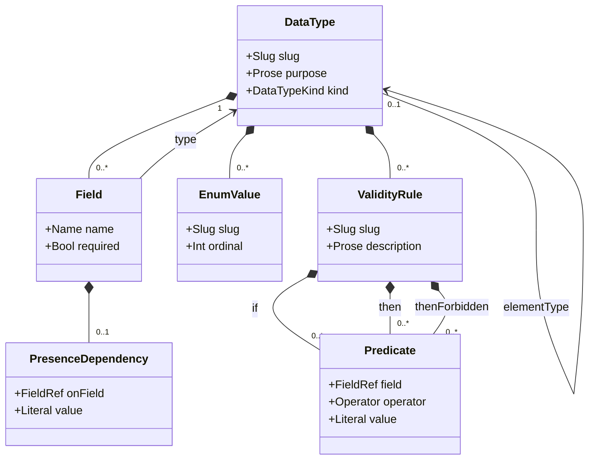

# Data Dictionary

## Context
* [Data Model](DATA-MODEL.md) - the layers, the verification claim, and the addressing and maturity conventions
* [Function And Call Graph](function-and-call-graph.md) - the signatures that reference these types
* [Condition Model](condition-model.md) - the dimensions derived from these types and pruned by their rules
* [Decision Model](decision-model.md) - the shape of the decision recorded in §5

## 1 Scope

The data dictionary defines the schema of every shape that **crosses a functional boundary**:

* in and out of the boundary being designed, through its own perimeter operations;
* in and out through its dependency boundaries, to and from the boundaries it depends on;
* across the perimeters of its own contained boundaries — business domain to shared logic, interface to
  business domain, and so on.

It does not extend to shapes used only inside a boundary by its `private` functions
([Function And Call Graph](function-and-call-graph.md) §1.1). Those still have types; the model simply makes
no completeness claim about them, because nothing outside the boundary can depend on them.

Types are defined by boundaries (§2.1); the **dictionary** is a design target's view over the types defined in
its own scope. A design target with only operations and behaviors has type *names* in its signatures and no
definitions to resolve them against — legal below `M2`, a finding at or above it.

## 2 Data Type



| Attribute | Type | Required by | Meaning |
|---|---|---|---|
| `slug` | `Slug` | `M2` | stable identifier, unique on its owning boundary |
| `purpose` | `Prose` | `M2` | what this type represents |
| `kind` | `DataTypeKind` | `M2` | `scalar`, `enum`, `structure`, `collection`, or `external` |
| `fields` | `Field[]` | `M2` | for a `structure` (§3) |
| `values` | `EnumValue[]` | `M2` | for an `enum`: the discrete, ordinal-ranked values |
| `elementType` | `DataTypeRef` | `M2` | for a `collection` |
| `rules` | `ValidityRule[]` | `M2` | cross-field validity rules (§4) |

An `external` type is one owned by a depended-on boundary and referenced rather than defined — the shape a
shim receives from the outside. It is recorded so signatures resolve and dimensions can be derived from it,
without this design claiming authorship of something it does not control.

### 2.1 Ownership And Resolution

A type is defined by exactly one boundary — any `FunctionalBoundary`, design target or not. A type reference
resolves by walking outward from the referencing boundary through its containers, taking the nearest
definition, so a shape shared across several contained boundaries is defined once on the boundary containing
them all.

The walk **cascades through containing design targets**, not only through plain boundaries
([Data Model](DATA-MODEL.md) §5.1.1). A promoted domain resolves a type its parent service defines with no
prefix and no restatement: a design target's perimeter bounds authority and tracing, not name resolution.

This makes the dictionary a tree of scopes rather than one flat namespace, and it means the address of a type
says which boundary is entitled to change it. The **dictionary** of a design target is the view over every
type defined in its own scope, down to but not into any contained design target
([Boundary Model](boundary-model.md) §3) — the same relationship the function catalog has to functions.

Owning and resolving are different questions, and the two rules above answer them separately. The dictionary
says which types this design is responsible for; resolution says which types it can name, and reaches wider —
outward through its containers, and by prefix into other namespaces.

### 2.2 Referencing Across Namespaces

A function may use **any data type it can address**, including one from a library it does not otherwise use.
Such a reference carries a namespace prefix ([Data Model](DATA-MODEL.md) §5.1.1):

```
ns/money-lib/bnd/money/type/currency-amount
```

Naming a type this way does not make its design a dependency of anything — no `dependsOn` edge, no shim, no
interaction. It names a shape defined elsewhere, and nothing more.

Where the namespaced design is itself modelled, the reference resolves to a real definition and ordinary
provenance applies: a change to that type invalidates the signatures naming it, exactly as a local change
would. Where it is not modelled, the referencing boundary records it as an `external` type (§2) instead.

## 3 Fields And Presence

| Attribute | Type | Required by | Meaning |
|---|---|---|---|
| `name` | `Name` | `M2` | the field's name within its structure |
| `type` | `DataTypeRef` | `M2` | the type of its value |
| `required` | `Bool` | `M2` | whether it must be present when its parent is |
| `presenceDependsOn` | `PresenceDependency` | — | the field and value this field's existence is conditional on |

A field's own value is constrained by `ValidityRule`s on its type (§4), not by a separate per-field mechanism.

A field may declare that it exists only when another field holds a particular value — a `card-details` field
that exists only when `payment-method` is `credit-card`. This makes a structure a **tree**, not a flat record:
the existence of a subtree is conditional on a value elsewhere.

### 3.1 Presence And Validity Prune Differently

Presence dependency and validity rules (§4) are both what make an operation's input space finite and
reviewable rather than the combinatorial product of every field's every value. They are separate entities
because they produce **different prunings**, and the condition space needs both
([Condition Model](condition-model.md) §4.2):

| | Constrains | Prunes by |
|---|---|---|
| `PresenceDependency` | which fields **exist** in an instance | **irrelevance** — the subtree collapses and its parent becomes a leaf |
| `ValidityRule` | which **combinations of values** are possible among fields that do exist | **impossibility** — the branch is removed |

When `payment-method` is `paypal`, nothing beneath `card-details` is a dimension at all. That is not "this
combination cannot occur" but "this question does not apply", and it produces a shorter tree rather than a
narrower one. Presence dependency is read directly to get that; deriving it from general rules would require
proving irrelevance from impossibility, which is a harder question with a less useful answer.

## 4 Validity Rules

A `ValidityRule` is the model's **single** statement of what makes an instance valid. It constrains the values
fields may hold, alone or in combination.

| Part | Type | Meaning |
|---|---|---|
| `slug` | `Slug` | stable identifier |
| `description` | `Prose` | the constraint in the architect's words |
| `if` | `Predicate[]` | the predicates that activate the rule; empty means it always applies |
| `then` | `Predicate[]` | what must also hold when it activates |
| `thenForbidden` | `Predicate[]` | what must not hold when it activates |

A `Predicate` is the shared atom every rule is written in — a `field`, an `Operator` (`eq`, `neq`, `in`,
`notIn`, `lt`, `lte`, `gt`, `gte`, `present`), and a `Literal` value. It is vocabulary rather than a concept
in its own right.

**A field-local bound is the degenerate case**: an empty `if`. "`amount` is between 1 and 1,000,000" is a rule
that always applies, with `then` asserting the bounds. There is deliberately no separate per-field constraint
type — it would be a third notation for something the rules already express, and three overlapping ways to say
one thing invites saying it twice, inconsistently, with nothing checking which is meant.

The rules are declarative and mechanically solvable. Negating the conjunction of a type's structural
invariants and its rules yields the combinations that are *invalid*, and those combinations are exactly what
prunes an operation's condition space. That is the whole reason validity is modelled as rules rather than
described in prose: a prose constraint cannot prune anything.

## 5 Security Of Data

The dictionary records no security classification, and carries no encryption of its own, at rest or in
transit. This is a decision, not an omission.

Every entity in this model is **derived from documentation prose** by LLM judgement and elicitation. Once
derived, a document gains YAML frontmatter tied to the checksum of the reviewed prose that gave rise to it
([Reconciliation Model](reconciliation-model.md) §2). Three consequences follow:

* **Data at rest is a derivative of clear text.** The frontmatter says nothing the prose beside it does not
  already say. Encrypting the derivative while the source sits in the clear next to it protects nothing.
* **Encrypting the frontmatter would cost something real.** Markdown formatters natively either ignore
  frontmatter or render it cleanly; an encrypted block breaks both, degrading the documents for every reader
  in exchange for no confidentiality that the prose does not already lack.
* **There is no data in transit** until something publishes this data outside the system that defines it. Even
  then it remains derived from clear-text prose, so securing the channel gains nothing the source has not
  already given away.

The confidentiality of a design is therefore the confidentiality of the repository holding its prose. That is
where protection belongs, and it is not this model's to provide.

### 5.1 Rule Applicability Is Uniform

The above closes the question for a design whose data is derived prose — which is every design this model
currently describes, including the design assistant's own. It leaves one thing genuinely open, and the gap is
not a missing field on `DataType`.

An `NfrRule` has no way to say **what it applies to** beyond the function set its cross-cutting boundary
selects ([Boundary Model](boundary-model.md) §7.1). Applicability is therefore **uniform**: a rule imposed on
a function constrains everything crossing that function, without distinction.

That is sufficient for rules that really are uniform, which most are — every request must carry a valid auth
token, every call to this dependency must abort at the latency budget. It is not sufficient for a rule that
distinguishes *kinds of data*: "card numbers must never reach the log stream" applies to one field of a
payload whose other fields are unremarkable, and the function handling it handles both.

Closing that gap means giving a rule an **applicability selector over data**, not merely over functions. A
classification attribute on `DataType` is one way to express it — the rule predicates on the classification —
but only one, and the sharper question is what a selector should be able to range over: a type, a field, a
field's classification, or a path through a structure.

**Closing it reaches three places, not one.** The selector is the obvious one; the other two are consequences
of it, and the last is easy to miss:

* the **rule**, which gains the applicability selector above;
* the **condition space**, because such a rule discriminates on payload directly. Presenting a rule's
  behaviors relies on ignoring payload variation that does not cause *different functions on that rule's
  boundary* to be reached — two payload values reaching the same boundary functions are indistinguishable for
  that rule, so they present as one. A rule about card numbers breaks that: the values it distinguishes reach
  the same functions, so the collapse stops being sound;
* **fixture selection**, because a fixture set chosen to reach every function a rule governs need not
  exercise both sides of a data predicate, and nothing currently requires it to. "Card numbers must never
  reach the log stream" is only exercised by a condition carrying a card number **and** a condition carrying
  none. Covering a boundary's functions and satisfying a data predicate are different objectives, and one
  selection would have to serve both.

The third looks like a presentation concern and is actually a **coverage** one: a rule nothing exercises on
both sides is a rule the design has not really been checked against, however complete its cells look.

The model is deliberately not extended for it now. No design built with this model yet needs finer-grained
applicability, so a mechanism invented here would have nothing to exercise it, and its shape is far easier to
get right against a real case than an imagined one. Uniform applicability stands until one presents itself;
this section is the record of what will then have to change, so the extension starts from a stated limitation
rather than a rediscovered one.

# Rationale

**Why the dictionary's obligation is scoped to what crosses a boundary rather than every type in the design.**
The dictionary exists so that contracts are unambiguous and so that condition dimensions can be derived from
real value sets. Neither purpose reaches a type used only within one boundary's private functions. Extending
the obligation there would add a large, permanently incomplete surface to every maturity check without making
any claim in the verification more true.

**Why the parameter tree from the source notes is modelled as fields with presence dependencies rather than
its own structure.** The notes describe an "API parameter interdependency specification" — a tree of nodes with
types, requiredness, parent-value dependencies and cross-node rules — as a separate artifact attached to an
endpoint. Every element of it is already a statement about a data type: the nodes are fields, the parent-value
link is a presence dependency, the rules are validity rules. Modelling it separately would mean an operation's
input shape is defined twice, in two notations, with nothing keeping them in step. Folding it into the type
means the pruning machinery reads the same definition the signature does.

**Why the security-of-data question closed the way it did.** The source notes raised it as an open question
and it stood unanswered through the first draft. What settled it was noticing that the model's own data is
*derived* — frontmatter generated from reviewed prose and checksummed against it — so every candidate control
protects a derivative while its source sits in the clear beside it. Encryption at rest would break markdown
rendering for no confidentiality gain; there is no transit until something publishes outside the defining
system, and what it would publish is still derived from clear text. Recording the reasoning matters more than
recording the answer: "no classification" and "nobody thought about classification" are indistinguishable in a
document that simply stays silent, and only the first is safe to rely on.

**Why there is one constraint mechanism rather than a separate per-field one.** An earlier draft had a
`Constraint` on each field alongside cross-field `ValidityRule`s. A single-field bound is a rule with an empty
`if`, so the two were one idea in two notations — and a reader with two ways to state `amount >= 1` will
eventually state it both ways, differently, with nothing detecting the disagreement. The solver would also have
needed two input paths whose semantics had to be kept identical by hand. Folding it in costs a slightly longer
way of writing the common case and removes a whole class of contradiction.

**Why presence dependency was *not* folded in the same way.** It is the same temptation and the wrong answer:
presence is expressible as a rule (`present(card-details)` iff `payment-method eq credit-card`), but what the
model needs from it is not whether an instance is valid — it is which fields exist to have dimensions derived
from them at all. That produces irrelevance pruning, which collapses a subtree and shortens the condition tree,
where a validity rule removes a branch and narrows it (§3.1). Recovering "this question does not apply" from a
set of impossibility statements means proving irrelevance, which is harder to compute and easier to get subtly
wrong than reading a declared parent link.

**Why validity is expressed as solvable rules rather than prose constraints.** The condition space of a
realistic operation is large enough that enumerating it by hand is not viable, and most of it is
mutually-exclusive nonsense. Pruning is what makes the space reviewable, and pruning requires the constraints
to be machine-readable. A prose constraint is not a weaker version of a rule — it is a different thing that
happens to be readable by a person, and it contributes nothing to the coverage claim.

**Why a type reference can carry a namespace prefix at all.** A function may legitimately name a shape from a
published library it has no other relationship with — it wants the type, not the library. Without a namespace,
that type could only be addressed relative to some consumer's own tree, which would mean a library's types had
no stable name of their own and a second consumer would address the same type differently. The prefix also
keeps "names a shape" cleanly distinct from "depends on a boundary," which the model otherwise expresses only
through `dependsOn` and would otherwise be forced to overload.

**Why type resolution walks outward through containers rather than using one flat namespace.** A flat
namespace makes every type name a project-wide commitment and forces disambiguating prefixes onto types that
are only ever used in one place. Lexical scoping gives the common case — a type used by one boundary, defined
on it — the shortest name, and makes the promotion of a type to a wider scope an explicit, visible move rather
than a silent naming collision.

**Why an `external` type is modelled at all rather than left untyped.** A shim's signature has to name what it
receives. Leaving that as an unresolvable name would make every dependency boundary permanently fail the `M2`
signature check, and would remove the ability to derive dependency-state dimensions from the shape of what
comes back. Recording it as `external` states both facts that matter: the shape is known, and it is not ours
to change.
