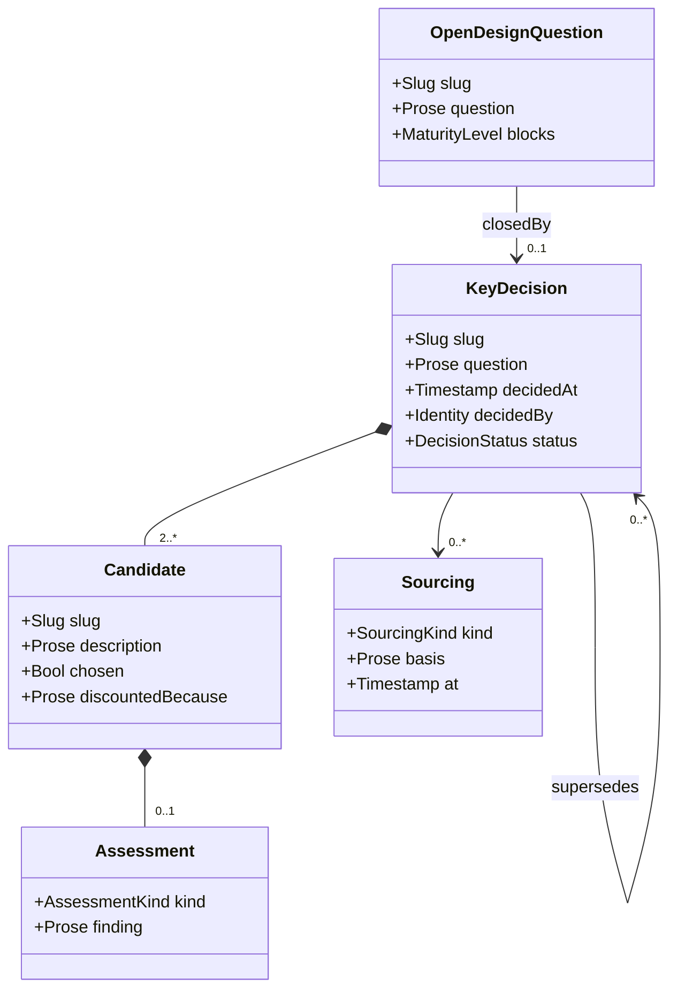

# Decision Model

## Context
* [Data Model](DATA-MODEL.md) - the layers, the verification claim, and the addressing and maturity conventions
* [Reconciliation Model](reconciliation-model.md) - the findings a decision closes, and the provenance decisions feed
* [Boundary Model](boundary-model.md) - the elements a decision produces

## 1 Scope

This concern records **why the design says what it says**: the questions that were open, the decisions that
closed them, and how each fact entered the model. It is in the metamodel because a decision is the provenance
of a structural element — a function exists because something decided it should — and provenance is what makes
the design's current state re-examinable rather than merely present.

Design-process orchestration is deliberately **not** here. Design tasks, work scheduling and chunk scope are
about running the process, not about the boundary, and belong to the workflow that drives this model.

## 2 Open Design Question

An `OpenDesignQuestion` is a known gap: something the design needs an answer to and does not have.

| Attribute | Type | Required by | Meaning |
|---|---|---|---|
| `slug` | `Slug` | — | stable identifier |
| `subject` | `Address` | — | the element the question is about, where it has one |
| `question` | `Prose` | — | what is being asked |
| `raisedBy` | `Identity` | — | the architect, an agent, or a finding that surfaced it |
| `blocks` | `MaturityLevel` | — | the checkpoint this question prevents, if any |
| `closedBy` | `KeyDecisionRef` | when closed | the `KeyDecision` that answered it |

A question may be raised against the model itself rather than an element — the security-of-data question in
[Data Dictionary](data-dictionary.md) §5 is one. Such a question has no `subject` and typically blocks nothing
yet, which is exactly why recording it matters: it is the difference between a gap someone knows about and a
gap nobody has noticed.

## 3 Key Decision

A `KeyDecision` closes a question by choosing among candidates.

| Attribute | Type | Required by | Meaning |
|---|---|---|---|
| `slug` | `Slug` | — | stable identifier |
| `question` | `Prose` | — | the gap being closed |
| `candidates` | `Candidate[]` | — | every option considered, including the chosen one (§3.1) |
| `produces` | `Address[]` | — | the elements this decision brought into existence |
| `status` | `DecisionStatus` | — | `current` or `superseded` |
| `supersedes` | `KeyDecisionRef[]` | — | decisions this one consolidates or replaces (§3.2) |
| `decidedBy` | `Identity` | — | who decided |
| `decidedAt` | `Timestamp` | — | when |

Every element that exists above `M1` traces to a decision. A function nobody decided on is either an
`orphan-function` finding or evidence that a decision was made and not recorded.

### 3.1 Candidates

A decision holds **at least two** candidates wherever more than one was plausible, each with what ruled it
out:

| `Assessment.kind` | Means |
|---|---|
| `analysis` | assessed against the boundary's NFRs and the gap's own requirements, and scored worse |
| `logical-argument` | ruled out by an argument that it cannot work |
| `poc-finding` | ruled out by something a proof of concept demonstrated |

A proof of concept records its finding in the candidate's assessment and needs no permanent artifact of its
own. Recording only the winner makes a decision where one option was ever considered look identical to one
where five were, which removes the only thing a later reader can check the reasoning against.

### 3.2 Consolidation

Two decisions taken independently can turn out to want the same thing — a function for "post a purchase
order" and another for "post a large purchase order" to the same queue. When that is discovered, one decision
consolidates the others: it records them in `supersedes`, they become `superseded`, and the elements they
produced are removed rather than left standing alongside their replacement.

The model holds the design's **current state**, never its history. A superseded decision is retained as
explicitly superseded, which is a fact about the present; a superseded *element* is deleted, because a reader
or a script has no way to distinguish a deliberately-retained obsolete function from one nobody noticed was
orphaned.

## 4 Change Request

A `ChangeRequest` is raised by one design target when it needs a change to **another** design target's
operations or behaviors. It never makes the change itself ([Boundary Model](boundary-model.md) §3.2).

| Attribute | Type | Required by | Meaning |
|---|---|---|---|
| `slug` | `Slug` | — | stable identifier |
| `raisedBy` | `BoundaryRef` | — | the design target that needs the change |
| `subject` | `Address` | — | the operation or behavior on the other design target |
| `change` | `Prose` | — | what is needed, and why this design needs it |
| `ticket` | `ExternalRef` | — | the ticket raised so the owning design can do the work |
| `blocks` | `MaturityLevel` | — | the checkpoint this request prevents `raisedBy` from reaching |

A change request puts its raiser into a legitimate terminal state: **blocked**. The design is not complete, no
further evolution of it is possible, and nothing is wrong. Work moves elsewhere and returns when the ticket
resolves.

A change request is not an `OpenDesignQuestion` (§2) despite the similar shape. A question is closed by a
decision *this* design makes; a change request is closed by work *another* design does, which is precisely the
authority distinction that makes it a separate thing.

### 4.1 A Change Request Is Not A Permanent Artefact

It has no `status`, because it has only two states: it exists, or it is gone. Once the change has been made
the request is **deleted**.

This is where it parts company with a `KeyDecision`. A decision is provenance — it explains why the design is
shaped as it is, stays true indefinitely, and is retained even when superseded (§3.2) because "this was
considered and replaced" is still a fact about the present. A change request explains nothing about the
present once it is satisfied. The change itself lives in the other design target, and the reason that target
made it is that target's own key decision. Keeping a resolved request would make the design a record of its
own history, which the model does not do.

A withdrawn request goes the same way, and for the same reason: the design no longer needs the change, so
nothing about its current state depends on the request having existed.

**Nothing is lost by deleting it.** The follow-up work does not depend on the request lingering to represent
it: when the other design target's operation behavior changes, every fixture standing in for it and every
behavior traced against those fixtures invalidate by the ordinary rule
([Reconciliation Model](reconciliation-model.md) §4). The request's own audit trail — who asked, for what,
when — lives in the ticket it references and in version control, neither of which is this model's to
duplicate.

## 5 Sourcing

Every **authored** fact records how it entered the model. This is the counterpart to provenance
([Reconciliation Model](reconciliation-model.md) §2), which covers derived facts.

| `kind` (`SourcingKind`) | Documented in | Changeable by | `basis` (`Prose`) holds |
|---|---|---|---|
| `document` | a document outside this design's scope | change control against the owning document | the `ExternalRef` |
| `elicited` | a document inside this design's scope | the architect, directly | what was asked, and when |
| `inferred` | a document inside this design's scope | the architect, directly, once they have approved it | what it was inferred from, and the reasoning |

**Every authored fact is documented, whatever its kind.** `elicited` does not mean undocumented: a fact that
lives only in a conversation is not durable, cannot be reviewed or checksummed, and cannot be invalidated when
something it depended on moves. The architect may supply that document themselves or have the design process
write it for them; either way it exists.

### 5.1 Change Authority

What the kinds actually distinguish is **who may change the fact**.

An `elicited` or `inferred` fact and its documentation sit inside the design, so the architect changes both
directly — no ceremony, because they own what they are changing. A `document` fact does not: its source is
owned elsewhere, and correcting it means change control against the owning document, which for a use case
means going back to Analysis.

This is the same authority rule design targets follow among themselves
([Boundary Model](boundary-model.md) §3.2) — you may not unilaterally change what you do not own — applied to
the requirement side rather than the solution side. It is also why only `document` carries an `ExternalRef`
with a checksum ([Data Model](DATA-MODEL.md) §5.4): a fact that can change without this design's involvement
needs detecting when it does, and one the architect changes deliberately does not.

Sourcing matters most for required effects and for the entry conditions of a condition space, because those
are what a human review is actually reviewing. Presenting a behavior for approval means presenting the
provenance of each of its Given conditions: which document defined it, whether the architect said so, or
whether it was inferred and on what basis. An inferred condition presented as though it came from a use case
is the failure mode this exists to prevent.

Both halves of an entry condition carry it: a `ConditionDimension`'s sourcing says how the fact that these are
the behavior-affecting variations entered the model, and a `ConditionValue`'s says how the bucketing did,
which is the part that is pure judgement ([Condition Model](condition-model.md) §2.3). An authored dimension
or value carrying none is an `unsourced-condition-dimension` finding, so the presentation this paragraph
describes cannot quietly become a presentation of facts with no recorded basis.

`inferred` is the only kind an agent may assign to itself, and it is the weakest. A design at `M4` may hold
inferred facts; it may not hold inferred facts nobody has looked at, because approval is what converts an
inference into something the architect has taken responsibility for.

# Rationale

**Why decisions are in the metamodel while design tasks are not.** A decision is a fact about the boundary:
this function exists because this was chosen over that. It stays true after the work that produced it is
finished, and a later reader needs it to understand why the design is shaped as it is. A design task is a fact
about a work session — who was doing what, in what order, and what shipped together — which is true of the
process and says nothing about the boundary. Putting the first in and the second out keeps the model to
"facts about a boundary" without losing the reasoning.

**Why every candidate is recorded rather than just the chosen one.** "How might we close this gap" is only a
real question if the answer was not already settled. A decision recording one candidate is indistinguishable
from a decision recording the only option anyone thought of, and both are indistinguishable from a decision
that was made first and justified afterwards. The discarded candidates and their assessments are the evidence
that the question was actually asked.

**Why superseded decisions are retained but superseded elements are deleted.** The two are different kinds of
fact. "This decision was replaced by that one" is a true statement about the present and is what stops the
same rejected option being re-proposed. "This function exists" is a claim about the design, and leaving it
standing after it has been consolidated away makes the model claim two functions where one was decided —
which nothing downstream can distinguish from a genuine pair.

**Why a change request is deleted rather than marked resolved.** A resolved request is spent: the change is in
the other design, the reasoning behind it is that design's own key decision, and nothing about either design's
current state depends on the request having been made. Retaining it with a status would give the model a
second, weaker kind of history alongside the superseded decisions it deliberately does keep — and the test for
those is that a superseded decision still says something true about the present, which a satisfied request does
not. It also removes a state nobody benefits from: a reader who finds a resolved request has to work out
whether it still matters, and the answer is always no.

**Why a change request is separate from an open design question.** Both record something the design needs and
does not have, and both block. They differ in who may close them, which is the only thing that matters
operationally: a question is answered by a decision this design is entitled to make, while a change request
waits on another design target exercising authority this one does not have. Collapsing them would make
"blocked on someone else" indistinguishable from "we have not decided yet," and the second is actionable here
while the first is not.

**Why the sourcing kinds are about change authority rather than about having a document.** An earlier draft
read `elicited` as "the architect said so, with no document behind it", which quietly made a whole class of
requirement undurable — unreviewable, unchecksummable, and invisible to invalidation. Every authored fact is
documented; what differs is where the document lives and therefore who may change it. Stating the axis that
way also explains a detail that otherwise looks arbitrary: only `document` carries an `ExternalRef` with a
checksum, because only an externally-owned fact can change without this design's involvement and therefore
needs detecting when it does.

**Why sourcing is modelled separately from provenance rather than as one mechanism.** They answer opposite
questions. Provenance asks whether a derivation is still valid, and is checked by recomputing checksums.
Sourcing asks who is responsible for a fact that was never derived from anything, and is checked by a human
reading it. Merging them would give authored facts a checksum over content nobody derived, which would say
only that the text has not been edited — not the thing anyone needs to know.

**Why `inferred` is called out as the weakest kind.** An agent filling a gap by inference is often exactly
right and is a large part of what makes the design assistant useful. The risk is not that inference happens;
it is that an inference presented alongside elicited and documented facts becomes indistinguishable from them,
and is then approved as though a human had supplied it. Naming the kind means the review can see which facts
are the agent's own and weigh them accordingly.
