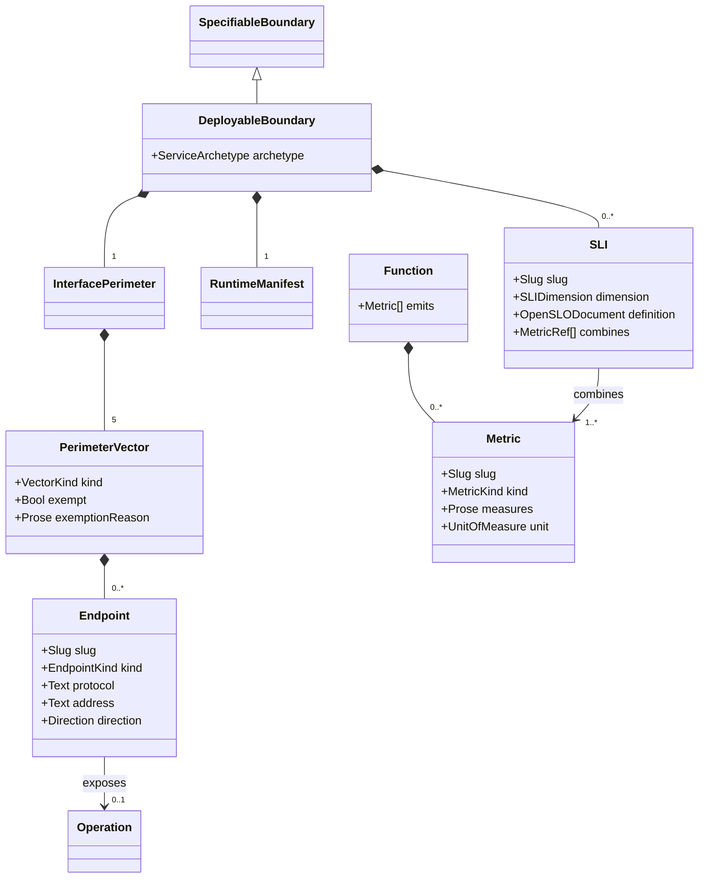

# Deployable Model

## Context
* [Data Model](DATA-MODEL.md) - the layers, the verification claim, and the addressing and maturity conventions
* [Boundary Model](boundary-model.md) - the operations these endpoints expose, and why they are distinct from them
* [Behavior Model](behavior-model.md) - emitted metrics are effects on behaviors
* [Condition Model](condition-model.md) - host and kernel resources become dependency-state dimensions
* https://github.com/OpenSLO/OpenSLO - the OpenSLO specification, canonical for the `SLI` objects §5.2 requires
* https://www.openslo.com - the OpenSLO project site and documentation

## 1 What Deployable Adds

A `DeployableBoundary` is a `SpecifiableBoundary` that is **run** as a process. Only here does the model know
how the outside world reaches a running instance, what it needs from its host, and how its measurements are
aggregated into a statement about delivery.

None of this exists on a Library. A Library has a perimeter of operations and no process, so it has no
configuration vector to inject into, no signal to handle, no health probe, no container image and no SLI.
These are not attributes a Library leaves blank; they have no referent on it.

Three things that might look like they belong here do not:

* **What the codebase is built as** — language, build system, dependency constraints, test stack, and how
  consumers obtain the artifact — is the `BuildManifest` every design target carries
  ([Boundary Model](boundary-model.md) §3.3), because a Library needs every one of them and is never deployed.
  The `RuntimeManifest` here extends it rather than repeating it (§2).
* **Cross-cutting boundaries** are design-target attributes, declared by any `SpecifiableBoundary` over its own
  scope
  ([Boundary Model](boundary-model.md) §7) — a Library declares its own, and NFR consideration is part of
  specification rather than of deployment.
* **Metrics** are defined by the functions that emit them
  ([Function And Call Graph](function-and-call-graph.md) §6), because measurement is something code does; only
  their aggregation into SLIs needs a process.

## 2 Runtime Manifest

The `RuntimeManifest` **extends** the `BuildManifest` every design target already carries
([Boundary Model](boundary-model.md) §3.3). What a codebase is written in, built with, constrained to and
tested by is settled there, because a Library needs all of it and is never deployed. What remains here is
everything that only means something for a **running process**:

It is a set of `ManifestSetting`s in the same shape, with its own closed enumeration of `SettingKind`s:

| Dimension | `SettingKind`s | Type |
|---|---|---|
| `runtime` | `runtime-version`, `base-image` | `Text` |
| `execution` | `execution-paradigm` | `ExecutionParadigm` |
| `frameworks` | `core-framework` | `Text[]` |
| `wiring-and-infrastructure` | `persistence-driver`, `config-mechanism`, `observability-sdk` | `Text[]` |
| `operational-scaffold` | `build-output-target`, `container-build-stages`, `healthcheck-command` | `Text` |

`ExecutionParadigm` is `long-running-server`, `ephemeral-worker`, `event-consumer`, `scheduled-job`, or
`wasm-module`.

Every setting is stated or exempted by `M5`, the same rule the build manifest and the interface perimeter both
follow (§3.1) — an unanswered one is an `unassessed-manifest-setting` finding. None of these settings has a
referent on a Library: there is no image to base, no paradigm to execute under, nothing to wire to
infrastructure and no health to probe, which is why they are here rather than in the build manifest.

The manifest is authored, not derived. It is a set of decisions, and each dimension's content traces to the
key decision that made it ([Decision Model](decision-model.md)).

## 3 The Interface Perimeter

The `InterfacePerimeter` is the formal boundary around the running process: every vector through which data,
state, execution triggers, control signals or configuration enter or leave. It has exactly five vectors, and
completeness at `M5` means every vector has been *considered*, not that every vector is populated.

| Vector | Carries | `EndpointKind`s |
|---|---|---|
| `network-and-invocation` | external invocation and response | `request-response`, `streaming`, `message-consumer`, `message-producer`, `webhook`, `in-process-api` |
| `configuration-and-environment` | operational context injected at startup or runtime | `environment-variable`, `cli-argument`, `mounted-file`, `remote-config` |
| `system-signals` | host and orchestrator control of the process lifecycle | `process-signal`, `hardware-interrupt`, `exit-code` |
| `streams-and-telemetry` | outbound diagnostics | `stdout`, `stderr`, `metrics-scrape`, `health-probe`, `trace-export` |
| `host-and-kernel` | implicit inputs from the host | `system-clock`, `shared-memory`, `filesystem-path`, `file-descriptor` |

The kinds are **enumerated rather than described**, because that is what makes elicitation systematic. "What
are this service's endpoints?" is an open question and gets an incomplete answer; "does it take CLI arguments,
does it read mounted files, does it publish messages?" is a finite walk with an answer per item. A CLI tool
whose primary invocation vector is `cli-argument` is exactly the case an open question loses.

### 3.1 Every Vector Is Assessed Or Exempted

For each of the five vectors, a `DeployableBoundary` must either

* **declare** its endpoints, each carrying an `EndpointKind` from that vector's enumeration (§4), or
* **exempt** itself — record explicitly that nothing crosses the perimeter on that vector, with a reason.

Neither is optional and there is no third state. A vector with no endpoints and no exemption is an
`unassessed-perimeter-vector` finding ([Reconciliation Model](reconciliation-model.md) §3), blocking `M5`.

This is the same rule NFR rules follow ([Boundary Model](boundary-model.md) §7.3) and for the same reason: a
genuinely empty vector and a vector nobody examined are indistinguishable if silence is permitted, and the
whole value of a closed taxonomy is being able to assert that every vector was examined. "Considered" has to
leave a record or it is not a claim.

### 3.2 Host And Kernel

The `host-and-kernel` vector exposes no endpoints — nothing invokes the boundary through it. What it holds is
**declared implicit dependencies**, and each one is a source of non-determinism that becomes a
`dependency-state` dimension in the condition spaces of the operations that read it
([Condition Model](condition-model.md) §2). A boundary that reads the system clock has clock-dependent
behavior whether or not anyone modelled it; declaring the dependency is what brings it into the condition
space where it can be covered.

Its enumeration is therefore a list of dependency kinds rather than endpoint kinds. It is assessed the same
way: declared, or exempted with a reason.

### 3.3 What The Model Does Not Own

The enumeration says *what must have an answer*. It does not say how to ask, in what order, or how to adapt
the questioning to what the perimeter already has — that belongs to the workflow driving elicitation, and
depends on how far the design has got. The model's part is making the set finite, closed and recorded, so a
workflow can walk it and a checkpoint can assert it was walked.

## 4 Endpoint

An `Endpoint` is a protocol-bound exposure of the boundary on one perimeter vector.

| Attribute | Type | Required by | Meaning |
|---|---|---|---|
| `slug` | `Slug` | `M5` | stable identifier |
| `vector` | `VectorKind` | `M5` | which of the five it sits on |
| `exposes` | `OperationRef` | `M5` for invocable vectors | the `Operation` it exposes |
| `protocol` | `Text` | `M5` | REST, gRPC, Kafka, POSIX signal, environment variable, and so on |
| `address` | `Text` | `M5` | the concrete address in that protocol: a route, a topic, a flag name, a signal number |
| `kind` | `EndpointKind` | `M5` | which of its vector's enumerated kinds this is (§3) |
| `direction` | `Direction` | `M5` | `inbound`, `outbound`, or `bidirectional` |

An operation may be exposed by several endpoints — the same `create-order` over REST and gRPC — and the
behaviors are the operation's, not the endpoint's. This is the whole reason the two are separate types: adding
a second protocol must not duplicate a condition space or re-derive a single behavior.

Endpoints on non-invocable vectors expose no operation. A `SIGTERM` handler or a `DATABASE_URL` variable is
still a point on the perimeter with a contract and a required behavior, and it is still where the model
records that graceful shutdown or a missing startup credential has been designed for.

## 5 Observability

### 5.1 Archetype

A `DeployableBoundary` has one `ServiceArchetype`: `request-response`, `batch`, or `storage`. A composite may
contain boundaries of different archetypes — a database service is `request-response` at its server and
`storage` at its files.

The archetype is not descriptive. It determines which dimensions of service delivery must have an SLI:

| Archetype | SLI dimensions |
|---|---|
| `request-response` | availability, latency, quality |
| `batch` | coverage, correctness, freshness, throughput |
| `storage` | durability, throughput, latency |

`M5` requires an SLI for every dimension the archetype demands. This is what makes observability a mechanical
completeness check rather than an intention.

### 5.2 SLIs

A `Metric` is defined by the **function** that emits it, and is specified in
[Function And Call Graph](function-and-call-graph.md) §6 rather than here — measurement is something code
does. An `SLI` is declared on a `DeployableBoundary` and turns metrics into a measurement of one delivery
dimension.

**An SLI is defined as an OpenSLO `SLI` object.** The model does not invent a notation for service level
indicators; it requires the open standard.

| Attribute | Type | Required by | Meaning |
|---|---|---|---|
| `slug` | `Slug` | `M5` | stable identifier |
| `dimension` | `SLIDimension` | `M5` | which of the archetype's required delivery dimensions this serves (§5.1) |
| `definition` | `OpenSLODocument` | `M5` | an OpenSLO object with `kind: SLI` |
| `specVersion` | `Text` | `M5` | the OpenSLO specification version the definition is validated against, e.g. `openslo/v1` |
| `combines` | `MetricRef[]` | derived | the design's own metrics its queries draw on (§5.3) |

#### 5.2.1 Conformance Is Checked, Not Asserted

The model requires that a definition **is validated** against the revision its `specVersion` names, and that a
definition failing validation is an `invalid-sli-definition` finding
([Reconciliation Model](reconciliation-model.md) §3), blocking `M5`.

It says nothing about what a valid structure looks like, or how validation is performed. The standard is
authoritative for the first and the tooling owns the second; restating either here would create a copy that
goes stale the moment OpenSLO revises, with nothing detecting the divergence.

`specVersion` exists because without it the model's own claim is not decidable. "Valid OpenSLO" is not a
question with an answer unless it names a revision — the standard evolves, and a definition valid under one
need not be valid under the next. Changing an SLI's `specVersion` invalidates its validation by the ordinary
rule ([Reconciliation Model](reconciliation-model.md) §4), so it is re-validated rather than assumed to carry
over.

The version is recorded per SLI rather than once per project. A design target's SLIs will normally share one,
but a mixed set is legitimate while a migration is in progress, and a project-wide pin would introduce a
concept this model does not otherwise have.

### 5.3 What The Model Adds To The Standard

Two things, both linkage the standard has no reason to carry:

* **`dimension`** ties the SLI to the delivery dimension its archetype requires (§5.1). That is what turns
  "an SLI exists" into "every dimension this archetype demands has one".
* **`combines`** is derived by reading the metric queries in the `definition` and resolving them against the
  metrics the design's own functions emit ([Function And Call Graph](function-and-call-graph.md) §6). An SLI
  whose queries reference a metric no function emits is an `unbacked-sli` finding
  ([Reconciliation Model](reconciliation-model.md) §3): it measures something the design does not produce.

That second check is the one that closes the loop. Metrics are emitted as effects on behaviors, so an SLI
resolving to real metrics is transitively an SLI resolving to something a behavior actually causes under a
known entry condition.

The split is where the two things actually live. Code emits measurements, so any function may emit one,
including a Library's: a retry library that cannot report its own retry and giveup counts is unobservable
inside whatever deploys it, and the host service has no way to add that instrumentation from outside. What a
Library cannot do is say whether those numbers are acceptable, because acceptability is a statement about
delivery and a Library delivers nothing on its own. So metrics travel with the code and SLIs are assembled by
the process.

A `DeployableBoundary`'s SLIs therefore combine metrics emitted by functions anywhere inside it, including in
contained boundaries and contained design targets it did not author. That is the intended direction — the
service is what is measured, whoever emitted the numbers.

Emitted metrics are **required effects on behaviors** ([Behavior Model](behavior-model.md) §2). A metric that
the design says is emitted but which no behavior's effects account for is not observable in any sense the
model can verify; making it an effect means it is covered by the same coverage, matching and review machinery
as everything else the boundary does.

### 5.4 The SLO Stays Outside

The **SLO** that monitors an SLI is deliberately not in this model. An SLO is a product-level commitment about
acceptable service, made against a customer expectation; the SLI is the measurement the service is designed to
make possible. Recording the SLO here would put a product decision inside a boundary's design, where it would
be invisible to the product and would change without the product noticing.

OpenSLO makes that split clean rather than awkward, because it treats an indicator as a thing an objective can
refer to rather than something an objective must contain. So the design owns and publishes the `SLI` and the
Product owns the `SLO` pointing at it: both in the same notation, each held by whoever is entitled to change
it, which is the ordinary authority rule ([Boundary Model](boundary-model.md) §3.2) landing on observability.

# Rationale

**Why the runtime manifest is at Deployable rather than Specifiable.** A library is built and packaged too, so
it is tempting to put the manifest one level up and let a service add only the container image. But most of
the manifest is about a *running process* — execution paradigm, healthcheck, config conventions, observability
SDKs — and the parts that are not are build concerns of a different shape for a published library than for a
deployed image. Putting the whole manifest at Deployable keeps the level boundary meaningful; a library's own
build concerns can be modelled when a library actually needs them, rather than by generalising a service's
manifest into something that fits neither.

**Why the perimeter has exactly five vectors rather than an open list.** The five are the complete set of ways
anything crosses a process boundary, and their value is precisely that the list is closed: `M5` can assert
that every vector was considered. An open list makes that assertion impossible — there is always another
vector nobody thought of, which is the failure the taxonomy exists to prevent.

**Why the vectors enumerate endpoint kinds instead of describing typical ones.** An earlier draft listed
examples in prose — "REST routes, gRPC methods, queue consumers" — which reads well and elicits badly.
Examples invite recognition rather than enumeration: an architect reads them, thinks "yes, REST", and records
the endpoints they were already thinking of. The gap that drove this whole model was of exactly that shape —
a design that said plenty and still had not said what the service *was*. A closed enumeration converts one
open question into a finite walk with an answer required per item, which is the only form in which
"considered" can be checked.

**Why a vector must be assessed or exempted rather than merely populated.** The earlier wording said
completeness meant every vector had been *considered*, and then recorded nothing when consideration found
nothing — so an empty vector meant either "nothing crosses here" or "nobody looked", with no way to tell.
That is the same defect as an unrecorded NFR exemption and an unexplained cell exclusion, and it gets the same
fix, because the alternative is a closed taxonomy whose closure proves nothing.

**Why the model stops at the enumeration and leaves elicitation to the workflow.** What must have an answer is
a property of the perimeter and belongs here. How to ask, in what order, and how to adapt to what has already
been decided depends on the state of a particular design and on a conversation in progress — putting that here
would bind the model to one way of running the process, and would go stale the moment the workflow improved.

**Why the host-and-kernel vector is modelled despite exposing nothing.** It is the vector most likely to be
forgotten and most likely to cause the failures that are hardest to reproduce: clock drift, file descriptor
exhaustion, shared memory contention. Declaring these dependencies is what turns them into condition
dimensions, which is what gets them covered. A perimeter that only modelled the vectors with visible endpoints
would systematically exclude the sources of non-determinism.

**Why endpoints are separate from operations rather than an operation carrying its protocol.** An operation
exposed over both REST and gRPC would otherwise either be duplicated — two operations with two condition
spaces and two sets of behaviors that must be kept identical by hand — or carry a list of protocols, at which
point it is an endpoint collection with extra steps. Separating them means the behavior is derived once, and
adding a protocol is additive.

**Why SLIs are OpenSLO objects rather than a notation of this model's own.** An SLI expressed in a private
format is a description of a measurement; an SLI expressed in OpenSLO is a measurement that existing tooling
can evaluate, and that survives leaving this design. Inventing a notation would also mean maintaining it —
every metric source, every ratio form, every alerting integration — for no advantage over a standard that
already covers them. The model's contribution is not a better way to write an SLI but the linkage around it:
which delivery dimension it serves, and whether the metrics it queries are ones this design actually emits.

**Why pinning and validating are both required rather than alternatives.** Pinning a revision without
validating against it records an intention nobody checks. Validating without pinning is not a well-formed
question, because the thing being validated against moves. Together they make "conforms to OpenSLO" a decidable
claim rather than a description, which is the standard this model applies to everything else it asserts.

**Why the model does not describe a valid SLI or say how one is validated.** Both were in an earlier draft and
both were overreach. What a valid structure is belongs to the standard, and any restatement here becomes a copy
that goes stale on the first OpenSLO revision with nothing detecting the divergence — the same reason external
documents are held as references rather than parsed ([Data Model](DATA-MODEL.md) §5.4). How validation is
performed belongs to the tooling, and pinning it here would bind the model to one implementation. The model's
whole contribution is the obligation and the linkage: that validation happens, against a named revision, and
that the metrics an SLI queries are ones this design emits.

**Why the archetype determines required SLI dimensions rather than being a label.** "Observability is
important" is not checkable. Google's service archetypes exist precisely because each one has a known set of
delivery dimensions that matter, so binding the archetype to a required set turns observability into the same
kind of coverage claim the condition space makes: named things that must each have something, mechanically
verifiable, with gaps reportable.

**Why emitted metrics are behavior effects rather than a list hanging off an endpoint or a boundary.** A list
of metrics says what can be emitted; it says nothing about when. The interesting question — is the failure
path actually instrumented — is a question about a specific entry condition, which is exactly what a behavior is.
Declaring the metric on the boundary gives it an address and a definition; making its emission an effect on a
behavior means an uninstrumented error path is a satisfaction failure on a cell, found by the same check that
finds any other missing effect.

**Why metrics are defined by functions and SLIs by the deployed boundary, rather than both here.** An earlier
draft put both at Deployable and attached metrics to endpoints. That makes a Library unobservable: it could not
declare the counters and timings its own code produces, and a host service cannot instrument a library's
internals from outside, so the measurements would simply not exist. Splitting on who produces what — code
emits, processes aggregate — lets any function anywhere be properly instrumented while keeping the judgement
about acceptable delivery where delivery actually happens.

**Why the SLO is excluded.** An SLI is a property of the service's design: this is measurable, here is how.
An SLO is a promise about acceptable values of that measurement, and it is made by the product to its
customers — the same SLI can carry different SLOs for different offerings. Modelling the SLO inside the
boundary would mean a product commitment could only be changed by editing a service design.
