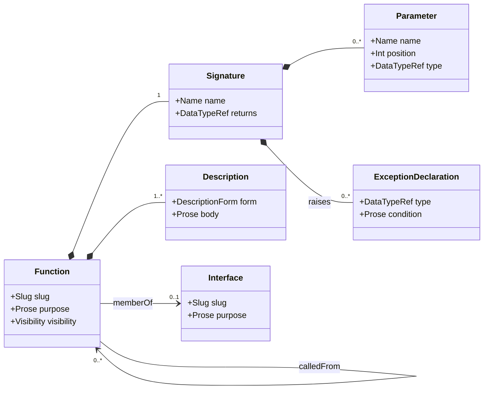

# Function And Call Graph

## Context
* [Data Model](DATA-MODEL.md) - the layers, the verification claim, and the addressing and maturity conventions
* [Boundary Model](boundary-model.md) - the boundaries functions belong to, and the operations they realize
* [Data Dictionary](data-dictionary.md) - the types a signature names
* [Behavior Model](behavior-model.md) - the call trees traced through this graph
* [Reconciliation Model](reconciliation-model.md) - the findings this concern's invariants produce; `Provenance` is defined there (§2)

## 1 Function

A `Function` is the unit of the design's own logic. It belongs to a `FunctionalBoundary` — any boundary, design
target or not — which is why a function's address nests through that boundary
([Data Model](DATA-MODEL.md) §5.1).

| Attribute | Type | Required by | Meaning |
|---|---|---|---|
| `slug` | `Slug` | `M0` | stable identifier, unique on its boundary |
| `purpose` | `Prose` | `M0` | one line: what this function does |
| `boundary` | `BoundaryRef` | `M2` | the single boundary this function belongs to |
| `visibility` | `Visibility` | `M2` | `perimeter` or `private` (§1.1) |
| `interface` | `InterfaceRef` | `M2` | the interface it is a member of; required only when `visibility` is `perimeter` (§3) |
| `signature` | `Signature` | `M2` | parameters, return type, declared exceptions (§2) |
| `descriptions` | `Description[]` | `M3` | one or more of prose, pseudocode, sequence (§2.2) |
| `calls` | `FunctionRef[]` | `M3` | the functions this one invokes |
| `calledFrom` | `FunctionRef[]` | derived | the functions that invoke this one; the materialized reverse index (§4) |
| `emits` | `Metric[]` | `M3` | the metrics this function emits (§6) |

Every function belongs to exactly one boundary. That is what makes the boundary graph a partition of the
design's logic rather than a loose grouping.

The boundary a function belongs to is frequently a plain `FunctionalBoundary` — shared logic, an unpromoted
business domain — and the function's definition belongs there, not to the design target above it.

What the design target owns is the **catalog**: the nearest containing design target's catalog spans every
function in its own subtree down to, but not into, any contained design target
([Boundary Model](boundary-model.md) §3). So `Function.boundary` records where the function lives, while
catalog membership records which design has authority over it. Promotion changes the second and never the
first, which is why it re-addresses nothing.

### 1.1 Visibility

`perimeter` — the function is on its boundary's perimeter: reachable from outside the boundary, and therefore
a member of one of that boundary's interfaces, with everything it takes and returns present in the data
dictionary.

`private` — the function is wholly inside its boundary. It still belongs to that boundary, still has a
signature and a description, and still appears in the call graph; it is simply not part of any contract.

The distinction is not a modifier on where the function lives — a private function is not "on no boundary," it
is not on its boundary's *perimeter*. Keeping it that way means every function has a boundary, so the
partition has no exceptions, while the data dictionary's obligation (§3) stays scoped to what actually
crosses.

### 1.2 Lifecycle

A function is progressively specified, and the model records the intermediate states rather than treating a
half-defined function as invalid:

```
slug + purpose  →  boundary + visibility + interface + signature  →  description + calls/calledFrom
     M0                            M2                                          M3
```

At `M0` a function may exist as nothing but a name and a line of intent — typically because a key decision
named it before anything about it was settled. It becomes addressable at that point, which is what lets other
parts of the design reference it before it is finished.

## 2 Signature And Description



### 2.1 Signature

Expressed in UML form: `function-name([arg-name: arg-type]*): return-type`. Every type named is a reference
into the data dictionary ([Data Dictionary](data-dictionary.md)); at `M2` a bare word that resolves to no
`DataType` is a finding.

`raises` declares the exceptions this function can produce to its callers, each with the condition under which
it is raised. This is a contract, not a summary of the implementation: an exception a function propagates
without declaring is precisely what §5 detects.

Because it is a contract, it is what signature conformance reads against
([Boundary Model](boundary-model.md) §6.1.1). A function realizing an operation *is* the perimeter, so
whatever it declares here escapes to that operation's consumer: the two must declare the same set of
exceptions, where parameters may legitimately differ. A function that must not surface a callee's failure
catches it and declares its own translation instead.

### 2.2 Description

A function's description is what the design actually says it does, and it is what a behavior is traced
through. It takes one or more of three forms, and a function may carry several at once:

| Form | Used for |
|---|---|
| `prose` | early definition, and functions whose logic is genuinely narrative |
| `pseudocode` | the normal form once the function participates in a traced behavior |
| `sequence` | interactions across several boundaries, where ordering is the point |

The description must be sufficient to track behavior from a perimeter operation through to every external
dependency it reaches. A description that cannot be traced is not a description for this model's purposes,
whatever its literary merits — `M3` is the gate that says so.

## 3 Interface

An `Interface` is a named grouping of a boundary's perimeter functions, belonging to that boundary. It is the
unit a consumer of the boundary depends on — including a consumer inside the same design target, which is why
a plain `FunctionalBoundary` has interfaces too: shared logic's own interface is exactly what its sibling
domains depend on.

| Attribute | Type | Required by | Meaning |
|---|---|---|---|
| `slug` | `Slug` | `M2` | stable identifier, unique on its boundary |
| `purpose` | `Prose` | `M2` | what this interface is for |
| `members` | `FunctionRef[]` | derived | the perimeter functions naming this interface (§3.1) |

Every `perimeter` function is a member of exactly one interface by `M2`. There is no requirement that all the
functions on a boundary share an interface, though in practice most do.

### 3.1 Membership Is Declared Once

`Function.interface` is the authored fact; `Interface.members` is **derived** from it — the set of perimeter
functions naming this interface.

Storing both would be the same information twice, and the two directions are not equally enforceable:
`Function.interface` is required of every perimeter function at `M2`, so a function cannot quietly belong to
nothing, whereas an authored `members` list can silently omit a function without any rule being violated.
Deriving the weaker direction from the stronger one removes the possibility of disagreement rather than adding
a check for it.

`calls`/`calledFrom` (§4) follows the same principle and differs only in *how* the derived direction is held.
There too one direction is authored and one derived; the derived one is additionally **materialized**, because
the reverse index is walked constantly, from arbitrary starting points, across a whole project, and rebuilding
it on demand is the expensive option. An interface's membership is a small set local to one boundary, so
computing it costs nothing and storing it would only create something to go stale.

Everything an interface's members take or return crosses that boundary and must therefore be in the data
dictionary. This is the obligation the perimeter/private split (§1.1) exists to scope.

## 4 The Call Graph

The call graph is **derived**, not authored. Its nodes are every function in the boundary and everything it
contains; its edges are the `calls` declarations.

`calls` is the **authored** direction: invoking another function is part of what a function does, stated where
whoever changes it is already looking. `calledFrom` is **derived** from it — the reverse index — and unlike
`Interface.members` (§3.1) it is *materialized* rather than computed on demand, because invalidation walks it
constantly from arbitrary starting points across a whole project.

An edge carries nothing but its target. Which condition provokes the call, and in what order it happens, are
properties of a particular walk rather than of the graph, and belong to a behavior's own call tree
([Behavior Model](behavior-model.md) §4) — so there is no edge object here, only a reference.

Two invariants, both mechanical:

* **Forward** — every node in a behavior's recorded call tree ([Behavior Model](behavior-model.md) §5) appears
  in the `calls` declared by that node's parent in the tree. A call actually traced but never declared means
  either a stale declaration or a call nobody decided on.
* **Reverse** — the materialized `calledFrom` index agrees with the `calls` declarations it is built from.
  This is a staleness check on a cache, not a reconciliation between two independent claims: where they
  disagree `calls` is right by definition, and the index is rebuilt.

The reverse index is what makes invalidation tractable: when a function's description changes, the set of
behaviors that need re-deriving is found by walking `calledFrom` outward, not by re-tracing every behavior in
the project ([Reconciliation Model](reconciliation-model.md) §4).

## 5 The Exception Contract

For every function, and every call it makes: an exception the callee declares in `raises` is either

* **caught** by the caller, in the caller's own description, or
* **declared** onward in the caller's own `raises`.

Anything that is neither is a finding — a failure mode nobody has designed a response for. It is detected by
walking the call graph, not by reading any one function in isolation, which is why the contract is stated here
rather than as a property of a single signature.

## 6 Metrics

A `Metric` is a measurement the design emits. It is **defined by the function that emits it** — measurement is
something code does, so it belongs where the code is, not on the boundary above it or the process below it.

| Attribute | Type | Required by | Meaning |
|---|---|---|---|
| `slug` | `Slug` | `M3` | stable identifier; the name the metric is published under |
| `kind` | `MetricKind` | `M3` | `counter`, `gauge`, `histogram`, or `timer` |
| `measures` | `Prose` | `M3` | **what** is being measured: success latency, records processed, records failed |
| `unit` | `UnitOfMeasure` | `M3` | **in what units** a value is expressed (§6.1) |
| `labels` | `Slug[]` | `M3` | the dimensions it is broken down by |

`measures` and `unit` answer different questions and the model needs both. `measures` is prose — a reader has
to know that a number counts failed records rather than failed batches, and no enumeration can carry that.
`unit` is an enumeration, because a value is uninterpretable without one and a machine has to be able to
compare, convert and aggregate them.

### 6.1 Units Of Measure

`UnitOfMeasure` enumerates how a value is expressed, not what it is about:

| Group | Values |
|---|---|
| counts | `count`, `thousands`, `millions`, `billions` |
| duration | `nanoseconds`, `microseconds`, `milliseconds`, `seconds`, `minutes`, `hours` |
| absolute time | `epoch-seconds`, `epoch-milliseconds` |
| size | `bytes`, `kilobytes`, `megabytes`, `gigabytes` |
| proportion | `ratio`, `percent` |
| rate | `per-second`, `per-minute`, `per-hour` |

A metric measuring *records failed* has `measures: "records that failed validation"` and `unit: count`. One
measuring *success latency* has `measures: "time to complete a successful request"` and `unit: milliseconds`.
The pair is what makes a metric interpretable by a person and aggregatable by a machine.

Any function may emit a metric, at any boundary, in any design target — including a Library's, which is why a
Library is properly instrumented rather than depending on a host to reach inside it
([Deployable Model](deployable-model.md) §5.2).

Emission itself is recorded as an effect on a behavior ([Behavior Model](behavior-model.md) §2), not as a
property of the function alone. The function's `emits` says what it can produce; the behavior's `emits-metric`
effect says under which entry condition it actually does — which is what makes "is the failure path instrumented"
a checkable question rather than a matter of reading code.

### 6.2 Several Emitters Of One Metric

More than one function may emit the same metric. This is a **design smell, not a failure**: it usually means
the emission belongs in a shared function, or that one metric is doing the work of two — but it is legitimately
what you want where, say, a single error counter is incremented on several distinct failure paths.

It is therefore raised as an **advisory** finding, `duplicate-metric-emitter`
([Reconciliation Model](reconciliation-model.md) §3.1). It does not block on its content, but it does have to
be answered: the architect either redesigns, or records an acknowledgement saying why this instance is
correct. An advisory finding left unanswered blocks `M4`.

## 7 The Function Catalog

The **function catalog** is a flat listing of every function a design target owns — its own subtree down to,
but not into, any contained design target — with each function's boundary, interface, visibility and the
maturity of its own definition. It is a **view**, derived from the model, not a separate entity that could
disagree with it.

It exists because the model's natural shape is a tree and the question an architect most often asks is flat:
what is not finished yet. Deriving it rather than maintaining it means the answer cannot drift from the
design.

# Rationale

**Why a private function still belongs to a boundary.** The alternative reading — functions are "on" a
boundary or on nothing — leaves a large part of the call graph unattributed, so any question of the form
"what does this domain do" has to be answered by tracing rather than by looking. Making membership total and
the perimeter a property of the function keeps the partition complete without extending the data dictionary's
obligation to internal detail, which is the thing the distinction was actually protecting.

**Why `calledFrom` is materialized despite being derivable.** A reverse index is derivable in principle, but
invalidation walks it constantly and from arbitrary starting points, and rebuilding it on every walk over a
whole project is the difference between a check that runs on every save and one that runs nightly. Storing it
turns a performance problem into a mechanical staleness check, which the model already has machinery for.

What it does *not* do is make `calledFrom` a second authored fact. An earlier draft described the two lists as
mutually reconciled, "and vice versa," which implied either could be the one that is wrong. That is not a
coherent position: a function declares what it calls, so where the index and the declarations disagree the
declarations are right and the index is stale. Saying so removes a class of question — which of these two do
I believe — that the model would otherwise have no answer to.

**Why a call edge is a bare reference rather than an object.** An earlier draft reified `calls` as a
`CallEdge` carrying provenance. Provenance belongs to derived elements, and a `calls` declaration is authored,
so it had nothing legitimate to carry beyond its target — and the things that might have justified an edge
object, the condition provoking a call and its ordering among siblings, are properties of one concrete walk
rather than of the graph, and already live on a behavior's call tree. It also made the two directions
gratuitously different types for no reason a reader could recover.

**Why the call graph is derived from `calls` rather than being a first-class authored artifact.** A separately
authored graph is a second place for the same fact, and the two disagree the moment a function is edited
without the graph being updated. Deriving it means the only authored statement is local to each function,
where the person making the change is already looking.

**Why a function may carry several description forms at once.** Prose, pseudocode and sequence diagrams are
not stages of a single artifact that supersede one another; they answer different questions, and a function
that coordinates several boundaries genuinely needs a sequence diagram *and* pseudocode. Modelling
`descriptions` as a collection avoids the alternative, which is a single field that silently loses whichever
form was there before.

**Why the exception contract is checked over the graph rather than declared complete per function.** A
function's own `raises` list is a claim about what it produces; whether that claim is complete depends on what
its callees produce, which is not visible from the function itself. The only place the question is answerable
is the graph, so that is where the invariant lives.

**Why a metric is defined by its emitting function rather than by a boundary.** Earlier drafts put metrics on
the endpoint, then on the design target. Both are places metrics are *aggregated* or *consumed*, not places
they are produced — and a definition that lives away from the code emitting it drifts from it, and cannot say
which function is responsible when the number looks wrong. Attaching it to the emitter also makes the
several-emitters case visible as a fact about the model rather than something only a reader would notice.

**Why several emitters of one metric is advisory rather than blocking.** The pattern is usually wrong: it makes
the metric's meaning ambiguous, and the emission normally belongs in one shared place. But it is not always
wrong — one counter incremented across several genuinely distinct failure paths is a reasonable design — so a
blocking finding would force designers to work around a rule that is right most of the time and wrong some of
it. An advisory finding puts it in front of the architect without pretending the model can tell which case
this is.

**Why the function catalog is a view and not an entity.** The catalog's whole value is that it is the same
facts arranged flat. Maintaining it as its own record would make it possible for the catalog and the functions
to disagree, and there is no useful interpretation of that disagreement — it would only ever mean the catalog
is stale.
