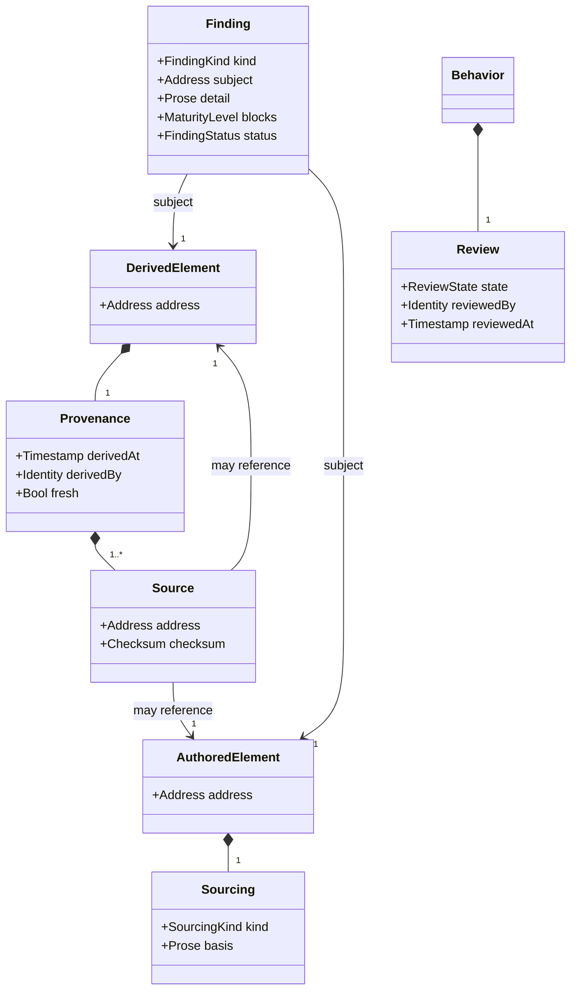
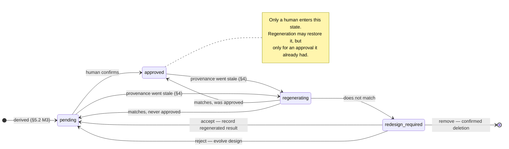

# Reconciliation Model

## Context
* [Data Model](DATA-MODEL.md) - the layers, the verification claim, and the addressing and maturity conventions
* [Behavior Model](behavior-model.md) - the traces and effects this concern keeps fresh and matched
* [Condition Model](condition-model.md) - the coverage the gates assert over
* [Function And Call Graph](function-and-call-graph.md) - the reverse index invalidation walks

## 1 What Reconciliation Is

Reconciliation is the part of the model that makes the verification claim
([Data Model](DATA-MODEL.md) §3) **falsifiable over time**. Every other concern states what is true now;
this one states how the model detects that something it previously asserted has stopped being true, without
re-deriving everything to find out.

It has four mechanisms: provenance (§2), findings (§3), invalidation (§4), and maturity gates (§5). Review
(§6) is the one part that is checked mechanically and never granted mechanically.

## 2 Provenance

Every **derived** element carries `Provenance`. Authored elements do not.

| Attribute | Type | Meaning |
|---|---|---|
| `sources` | `Source[]` | every element the derivation read, each with a checksum of its content at the time |
| `derivedAt` | `Timestamp` | when |
| `derivedBy` | `Identity` | the agent or tool that performed the derivation |
| `fresh` | `Bool` | derived: whether recomputing every source's checksum reproduces what is recorded |

Provenance is **fresh** when recomputing every source's checksum reproduces what is recorded, and **stale**
otherwise. Staleness is not an error; it is a statement that this derivation needs re-running before anything
built on it can be trusted.

| Derived element | Sources |
|---|---|
| `ExpectedEffect`, `Trace`, `CallTree` | every function description walked; the fixtures used; the cell's dimension values |
| `Behavior.review` | the behavior's required effects, its expected effects, and the `ExternalRef`s it realizes |
| `ConditionCell` (rule-pruned) | the validity rules that pruned it |
| `ConditionDimension` (`dependency-state`, `cross-cutting`) | the call tree or NFR rule that generated it |
| `CallGraph`, function catalog | every `calls` declaration in scope |

An `ExternalRef`'s checksum is what lets a use case edit invalidate the behaviors realizing it without the use
case ever being parsed ([Data Model](DATA-MODEL.md) §5.4).

## 3 Findings

A `Finding` is a detected violation, recorded against the element it is about rather than reported and
forgotten. It is the model's own record of what is wrong.

| Attribute | Type | Meaning |
|---|---|---|
| `kind` | `FindingKind` | which check produced it (below) |
| `subject` | `Address` | the element the finding is about |
| `detail` | `Prose` | what was found, concretely — enough that a cold session need not re-derive it |
| `blocks` | `MaturityLevel` | the checkpoint this finding prevents; absent for an advisory finding (§3.1) |
| `status` | `FindingStatus` | `open` or `resolved`, with the resolution |
| `acknowledgement` | `Acknowledgement` | for an advisory finding accepted as intended (§3.1) |

| Kind | Raised when |
|---|---|
| `unparsed-document` | a document within the design's scope whose contents have not been assessed for their contribution to the design ([Data Model](DATA-MODEL.md) §1.1) |
| `conflicting-claim` | two contributions state differing values for one attribute, or for one entry of one collection ([Serialization](../serialization/parse-contract.md) §3) |
| `uncovered-cell` | a valid leaf cell has no behavior |
| `unexplained-exclusion` | a cell is excluded by the architect with no recorded reason |
| `unresolved-type` | a signature names a type the dictionary does not define |
| `signature-nonconformance` | an operation's signature and its realizing function's do not conform |
| `orphan-function` | a function is neither reachable from an operation nor called by anything |
| `shim-inconsistency` | a dependency boundary's shim is not a one-for-one translation of a depended-on operation |
| `build-manifest-conflict` | a contained design target's build manifest contradicts rather than tightens what it inherits (Boundary Model §3.3.1) |
| `invalid-sli-definition` | an SLI definition does not validate against the OpenSLO revision its `specVersion` names ([Deployable Model](deployable-model.md) §5.2.1) |
| `unbacked-sli` | an SLI's metric queries reference a metric no function in the design emits ([Deployable Model](deployable-model.md) §5.3) |
| `unassessed-manifest-setting` | a manifest setting is neither stated, inherited, nor exempted ([Boundary Model](boundary-model.md) §3.3) |
| `unassessed-perimeter-vector` | a perimeter vector has neither declared endpoints nor a recorded exemption ([Deployable Model](deployable-model.md) §3.1) |
| `unassessed-nfr-rule` | a rule in the design's scope is neither applied by a cross-cutting boundary nor explicitly exempted ([Boundary Model](boundary-model.md) §7.3) |
| `nfr-conflict` | two NFR rules on the same design target require incompatible effects of the same function under the same cell |
| `mock-inconsistency` | a stub or mock declares a result no behavior of the operation it stands for produces ([Behavior Model](behavior-model.md) §3.1) |
| `unauthorized-change` | a design has altered an operation or behavior belonging to another design target instead of raising a change request (Boundary Model §3.2) |
| `call-declaration-mismatch` | a call tree node is absent from its parent function's declared `calls` |
| `calls-index-mismatch` | the materialized `calledFrom` index disagrees with the `calls` declarations it is built from |
| `undeclared-exception` | an exception is neither caught by the caller nor declared in its `raises` |
| `missing-fixture` | a condition value that needs one has no fixture at `M3` |
| `unpredicated-effect` | an effect has no checkable predicate at `M4` |
| `satisfaction-failure` | a required effect has no corresponding expected effect |
| `unexpected-side-effect` | an expected dependency interaction is anticipated by no required effect |
| `stale-provenance` | a derived element's sources no longer checksum to what is recorded |
| `redesign-required` | regeneration produced a result that does not match what was reviewed (§6.2) |

`unexpected-side-effect` and `redesign-required` are the two that never resolve mechanically. Every other kind
either self-clears when the underlying condition is corrected, or is closed by a decision recorded in the
model.

### 3.1 Advisory Findings

Every kind above **blocks** a maturity level on its content: it names something that must be corrected. An
**advisory** finding does not — the model cannot tell whether this instance is a problem — but it is not
therefore ignorable.

| Kind | Raised when |
|---|---|
| `duplicate-metric-emitter` | more than one function emits the same metric ([Function And Call Graph](function-and-call-graph.md) §6.2) |
| `duplicate-claim` | two contributions state the same value for one attribute, or for one entry of one collection ([Serialization](../serialization/parse-contract.md) §3) |

Advisory findings exist for patterns that are usually wrong and legitimately right often enough that a gate
would be worse than a note. They are not a softer severity for things nobody got round to enforcing: a finding
belongs here only when the model genuinely cannot tell whether this instance is a problem, and never because
enforcing it would be inconvenient.

**An advisory finding resolves in exactly one of two ways**, and both are the architect's:

* **Redesign** — the pattern was wrong here. Correcting the condition clears the finding like any other.
* **Acknowledgement** — the pattern is intended here. The architect records an `Acknowledgement`: who, when,
  and the reason this instance is correct.

| Attribute | Type | Meaning |
|---|---|---|
| `acknowledgedBy` | `Identity` | the architect accepting this instance |
| `acknowledgedAt` | `Timestamp` | when |
| `reason` | `Prose` | why this instance is correct despite the pattern |

An advisory finding that is neither corrected nor acknowledged **blocks `M4`**. It is detected mechanically,
so leaving it unanswered is not a decision anyone made — the finding becomes a unit of work like any other,
and the work is a judgement rather than an edit.

Acknowledgement is scoped to the instance, not the kind. Accepting one metric with two emitters says nothing
about the next one, which is the point: a blanket suppression would turn the detector off, while an
instance-level record leaves every future occurrence still to be judged.

An acknowledgement carries provenance like any derived-from record: if the condition that raised the finding
changes, the acknowledgement no longer applies to what is now there, and the finding is raised again unanswered.

The condition may also **disappear** rather than change — the duplication is removed, by a decision that had
nothing to do with the finding — and that case has no finding to raise. An acknowledgement whose condition no
longer arises is **spent, and is deleted**. This is the treatment a satisfied change request already gets
([Decision Model](decision-model.md) §4.1), for the same reason: it says nothing about the present, and a
reader who finds one has to work out whether it still matters, where the answer is always no. Deletion is
mechanical and needs none of the confirmation removing a behavior does (§6.3), because nothing re-examinable is
lost — the instance the acknowledgement was about is gone, so there is nothing left to re-examine.

If the same condition later recurs, its finding is raised unanswered and judged afresh. That follows from
acknowledgement being scoped to the instance: a duplication removed and later reintroduced is a new occurrence,
and answering it from a record made about the old one is exactly the blanket suppression instance-scoping
exists to prevent.

A `Review` needs no equivalent rule, because it is composed into the behavior it reviews and dies with it. An
acknowledgement has no such parent — findings are not stored ([Serialization](../serialization/parse-contract.md)
§7) — so it is held against the finding's subject, and outlives its condition unless this rule removes it.

**Matching therefore runs in both directions.** Computing the findings and looking up each one's acknowledgement
is only half the check, and it is the half that can never see an orphan. The same pass must also walk the
recorded acknowledgements and confirm each still has a finding to answer — the same shape as the
`calls`/`calledFrom` reverse check (§3), and needed for the same reason: an index cannot detect what it has no
entry for.

The two directions have different outcomes. A finding with no acknowledgement may be work. An acknowledgement
with no finding is spent and is removed without surfacing anything, because there is no judgement left for
anyone to make about a record whose subject matter has gone.

Retirement requires a **complete** determination, and an unmatched acknowledgement is not on its own evidence of
one. The finding that would have matched it may simply not have been computable — its subject sitting in a
document that has not been assessed, so nothing about that document is yet known. `unparsed-document` already
reports exactly that state, so while one stands the model is known-incomplete and no acknowledgement is retired.
This needs no condition of its own; it is the existing finding being allowed to mean what it says.

## 4 Invalidation

### 4.1 The Rule

There is one rule: **when an element changes, every derived element whose provenance names it becomes stale.**

Everything else is an application of it. The model does not need a separate invalidation mechanism per
artifact type, which is the reason provenance is uniform rather than a bespoke block on one kind of document.

### 4.2 Reach

Staleness propagates transitively, and it is computed by walking backwards, never by re-deriving forwards:

* a changed **function description** reaches every behavior whose recorded call tree names that function's
  address — found via `calledFrom` and then the call trees, not by re-tracing every behavior;
* a changed **use case** reaches every behavior whose `realizes` names it;
* a changed **validity rule** reaches the cells it pruned, and therefore the coverage claim over that space;
* an added **dimension** reaches the whole space it was added to, because cells that did not exist cannot have
  been covered ([Condition Model](condition-model.md) §2.2).

Reach is deliberately narrow. A behavior whose own call tree never reached the changed function stays fresh,
even when a sibling behavior of the same operation is invalidated — the concrete call tree exists precisely so
that this distinction is available.

### 4.3 What Is Not A Change

**Re-addressing is not a semantic change.** Moving or renaming an element, re-ranking condition dimensions, or
renumbering a dimension's values re-addresses that element and everything beneath it, and rewrites every
reference to it — but it changes no content, and must not make anything stale or clear any review.

Checksums are therefore computed over **content with addresses normalized**, not over the literal serialized
text. Without that, every rename would invalidate the entire project's review state, and the model would
punish exactly the mechanical hygiene it depends on.

## 5 Maturity Gates

A boundary is at a level when every gate up to and including it passes. A gate is a conjunction of the
absence of findings that block it.

| Level | Gate |
|---|---|
| `M0 Identified` | every document in scope has been assessed — no `unparsed-document`; boundary has slug, name, purpose, kind (if contained), and at least one operation |
| `M1 Behavioral` | every operation has a condition space with ranked dimensions and a pruned cell tree; every valid leaf has a behavior with at least one required effect; every rule in scope is applied or exempted; no `uncovered-cell`, `unexplained-exclusion`, `unassessed-nfr-rule` |
| `M2 Structured` | every build manifest setting is stated, inherited or exempted — no `unassessed-manifest-setting` ([Boundary Model](boundary-model.md) §3.3); every function has a boundary, visibility, interface (if perimeter) and a conforming signature; every crossing type is in the dictionary; every cross-cutting boundary's selector resolves to real functions; no `unresolved-type`, `signature-nonconformance`, `orphan-function`, `shim-inconsistency`, `build-manifest-conflict` |
| `M3 Traced` | every behavior has a fixture set, a trace, a call tree and expected effects; no `missing-fixture`, `mock-inconsistency`, `call-declaration-mismatch`, `calls-index-mismatch`, `undeclared-exception` |
| `M4 Reconciled` | every behavior's expected effects satisfy its required effects; no `unpredicated-effect`, `satisfaction-failure`, `unexpected-side-effect`, `nfr-conflict`, `unauthorized-change`, `stale-provenance`, `redesign-required`; every advisory finding corrected or acknowledged (§3.1); no outstanding `ChangeRequest` (§5.1); every behavior approved (§6) |
| `M5 Deployable` | every runtime manifest setting stated or exempted — no `unassessed-manifest-setting`; every perimeter vector declared or exempted — no `unassessed-perimeter-vector`; archetype set; an OpenSLO `SLI` object defined for every delivery dimension the archetype requires, each validating against its pinned `specVersion` and backed by metrics the design emits — no `invalid-sli-definition`, no `unbacked-sli` ([Deployable Model](deployable-model.md) §5) |

One kind is absent from the table because it has no fixed level. A `conflicting-claim` blocks the checkpoint at
which the **contested attribute** becomes required: contradictory statements of a boundary's purpose block
`M0`, of an SLI block `M5`. The gate is the general rule this table enumerates — the absence of every finding
whose `blocks` names that level — so nothing further is needed to make it bite.

A `SpecifiableBoundary` is complete at `M4`; a `DeployableBoundary` at `M5`. A containing boundary is at the
lowest level any boundary it contains is at — a service is not reconciled while one of its domains is not.

### 5.1 Blocked

A design target with a `ChangeRequest` ([Decision Model](decision-model.md) §4) is **blocked**: it
cannot reach the level that request blocks, no further work on it is possible, and nothing is wrong with it.

Blocked is a third status alongside *at a level* and *failing a gate*, and the distinction matters because the
three call for different responses. A failing gate is work to do here. Blocked is work to do elsewhere, and
the only correct action is to move to the next available unit of work and return when the ticket resolves. A
whole project can legitimately sit blocked across every remaining design target: not complete, not advancing,
and not in error.

Blocked is derived, never asserted: it is simply the existence of a change request raised by this target.
Change requests have no resolved state — a satisfied one is deleted (Decision Model §4.1) — so existence is
the whole test.

## 6 Review

### 6.1 State

Every behavior carries a review state:

| State | Meaning |
|---|---|
| `pending` | derived, presented or not, but not yet confirmed by a human |
| `approved` | confirmed, with `reviewedBy` and `reviewedAt` |
| `redesign-required` | regeneration no longer matches what was approved, with the disconnect recorded |

`approved` is the only state a human can put a behavior into, and the design assistant can never grant it to
itself. Everything else about review is mechanical.

### 6.2 Regeneration

When a behavior's provenance goes stale, its trace is re-run against the current design and the result
compared with what is recorded:

* **Matches, and the behavior was previously `approved`** — restore the approval and refresh provenance. No
  human is involved: nothing about what was approved has actually changed, and asking for a fresh confirmation
  of a provably identical result would be re-litigating a decision nobody disputed.
* **Matches, and the behavior was never approved** — refresh provenance; the behavior stays `pending`. A match
  says the record is consistent with the design, not that anyone has agreed it is right.
* **Does not match** — raise `redesign-required`, recording what regenerated against what was recorded, and
  surface it.

### 6.3 Resolving `redesign-required`

Three resolutions, all human:

* **Accept** — the design's evolution is right and the recorded behavior is stale. Replace the recorded
  expected effects with the regenerated result; the behavior returns to `pending`, never straight to
  `approved`, because what is now recorded has not itself been confirmed.
* **Reject** — the design is wrong. It is evolved further until the behavior regenerates to its original
  result. Also returns to `pending`.
* **Remove** — the design no longer produces this behavior under any entry condition. The behavior is deleted and
  its cell becomes uncovered, which either prunes (with a reason) or raises `uncovered-cell`.

Removal is irreversible in a way the other two are not: accept and reject both leave a re-derivable behavior
on record, removal leaves nothing. It requires an unambiguous confirmation naming exactly what is being
removed, not a general nod at a batch.

### 6.4 Scope

Review is **project-wide and a fixed point**, not a pass over the boundary currently being worked on. A
function change reaches behaviors in any boundary whose call tree names it (§4.2), including boundaries whose
design was finished long ago. Resolving one disconnect can invalidate another, so the pass is complete only
when a full scan finds nothing outstanding anywhere — not when the boundary in hand is clean.

# Rationale

**Why provenance is uniform across every derived element rather than a block on behaviors alone.** The
alternative — a bespoke reconciliation record on the one artifact that obviously needed it — works until
something else turns out to be derived too: a generated dimension, a rule-pruned cell, the call graph. Each
would then need its own invalidation logic, and the rules would be almost-but-not-quite the same. One uniform
record makes invalidation a single graph walk that does not care what kind of element it is walking.

**Why checksums rather than a checkbox or a timestamp.** A checkbox records that a check passed once and can
never say whether it is still true. A timestamp records when, which only helps if something else is tracking
what changed and when. A checksum makes the record falsifiable on its own: recompute it, and a mismatch is
proof that something the derivation depended on has moved, without reading or re-reasoning about anything that
has not.

**Why checksums normalize addresses.** Path-derived addressing ([Data Model](DATA-MODEL.md) §5.1) makes
renames frequent and mechanical. If an address were part of checksummed content, every rename would
invalidate every derivation that mentions the renamed element, clearing review state across the project for a
change that altered no meaning. Normalizing addresses out of the checksum is what makes the addressing scheme
affordable.

**Why invalidation walks backwards from the change rather than forwards from every behavior.** Forwards means
re-deriving everything to discover that almost nothing moved, which does not scale past a small project and
makes the check something run occasionally rather than continuously. Backwards, via `calledFrom` and the
recorded call trees, touches only what could actually be affected — and the recorded call tree is what narrows
"could" to "did".

**Why a match against a prior approval restores it without a human, but a match with no prior approval does
not.** The two look identical mechanically and are completely different in what they mean. In the first case a
human already agreed to this exact result and nothing about it changed; asking again is asking someone to
re-decide something nobody disputed. In the second, nobody has ever agreed to anything — a match only says the
record is internally consistent, which is not what approval is for.

**Why `redesign-required` always resolves back to `pending` rather than to `approved`.** In both the accept and
reject resolutions, what ends up recorded is not the thing that was originally approved — accept records a new
result, and reject records a design that reached the old result by a new route. Returning straight to approved
would mean trusting an outcome nobody has looked at, which defeats the purpose of having detected the
disconnect at all.

**Why removal has a higher bar than accept or reject.** Accept and reject both leave a behavior that can be
re-derived and re-examined if the decision was wrong. Removal leaves nothing to re-examine, and the cell it
frees is indistinguishable from a cell nobody ever reached. That asymmetry justifies a different standard of
confirmation, not merely more care within the same one.

**Why a spent acknowledgement is deleted rather than left inert.** An orphaned acknowledgement costs nothing
until the same condition recurs — and then it matches again, and answers a finding nobody has looked at from a
record made about an instance that no longer exists. That is the blanket suppression instance-scoping exists to
rule out, arrived at by accident, and it is silent: the finding never surfaces, so nothing prompts anyone to
notice it was answered on their behalf. Deleting it makes a recurrence cost one judgement, which is what keeps
the detector honest. No reasoning is lost either way — it is in the history of the document that held it.

**Why a containing boundary's maturity is the minimum of what it contains.** Any other rule would let a
service claim to be reconciled while one of its domains was not, which is exactly the state the verification
claim exists to rule out. Taking the minimum makes the claim compositional: proving it for the root is proving
it for everything inside.
