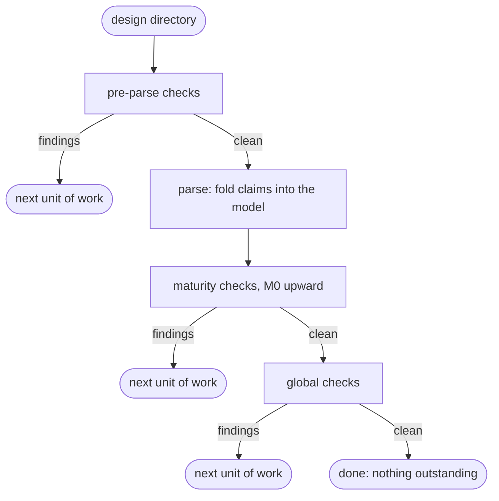
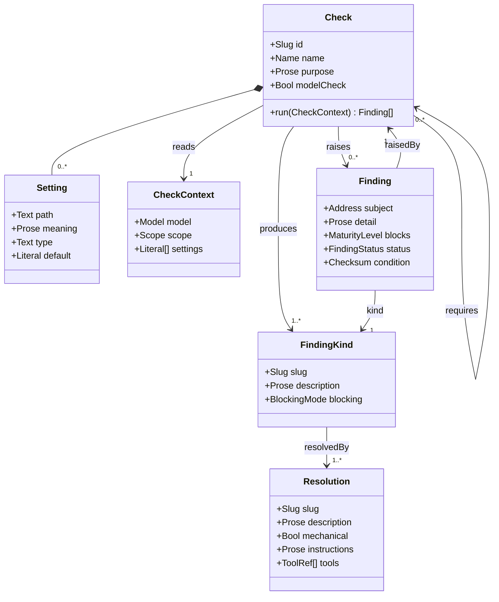
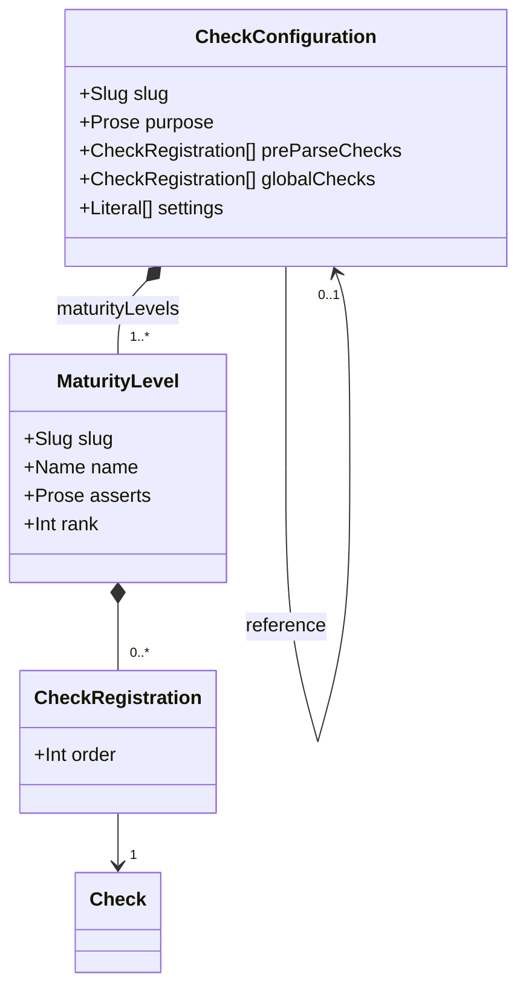
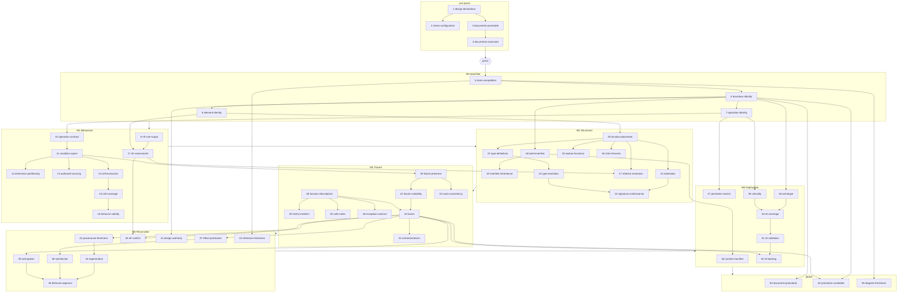

# Design A Specifiable Boundary

## Context
* [Data Model](../datamodel/DATA-MODEL.md) - the facts a design records, and the maturity checkpoints this
  workflow is registered into
* [Reconciliation Model](../datamodel/reconciliation-model.md) - findings, provenance, invalidation and the
  gates; the default finding kinds this configuration draws on
* [Serialization](../serialization/SERIALIZATION.md) - the scope a run operates over and the claims a parse
  produces
* [Parse Contract](../serialization/parse-contract.md) - the fold, and why findings are computed rather than
  stored
* [Assessment And Trust](../serialization/assessment-and-trust.md) - the attestation the pre-parse stage
  verifies
* @docs/standards/design-layout-standards.md - the layout the global checks report against
* @docs/workflows/weaver-workflows.md - where design sits in the workflow

## 1 What This Workflow Is

This is the workflow that takes a functional boundary from an idea, or from documents that already exist, to a
complete design. It has **one entry point**:

> Given a directory, what is the next unit of work?

Everything else in this document is the answer to that question, and the answer is not a sequence of phases. It
is a **configuration**: a set of checks, each registered at a point in the process, each declaring the finding
kinds it may produce and the checks that must have run before it. The next unit of work is the findings of the
first check that produces any.

**The workflow is therefore data, not procedure.** Adding a concern to a design means defining a check and
registering it, not editing this document. A design is assessed against the checks its own configuration names
([Data Model](../datamodel/DATA-MODEL.md) §1), so what "complete" means for a design follows from its
configuration and not from here.

§4 states the **default** configuration: the checks that, run in that order, assess a design against what the
data model and the layout standard actually require. It is deliberately opinionated — it is what we currently
think the right assessment is — and it is configurable for exactly that reason, because opinions differ and a
project that disagrees should be able to say so without forking the model.

### 1.1 There Is No Entry Ceremony

"I have an idea" and "here are some documents I already wrote" are the same entry. A directory is walked, its
documents are assessed, the model is whatever those documents' claims describe, and the next unit of work is
reported against that. A directory with one sentence in it and a directory holding a finished design differ
only in which check reports first.

This falls out of the model rather than being arranged: an unassessed document is a finding, the model's floor
is an element with an identity and nothing else, and the checkpoints report what is genuinely absent
([Data Model](../datamodel/DATA-MODEL.md) §1.1). Nothing has to be imported, adopted, or converted.

## 2 The Process

### 2.1 The Stages



**Parse is not a check.** It builds the model in whatever state the design's claims describe — there is no
schema to violate, because the model is the sum of the claimed positions with whatever attributes are claimed
([Parse Contract](../serialization/parse-contract.md) §2). Nothing about a parse can fail on content; only
checks report that content is wrong or missing.

**Only checks raise findings.** A parse produces claims and trust states, which are facts; a check reads those
facts and reports. Keeping that line makes every reportable condition reachable through one mechanism, which is
what lets the whole workflow be configuration.

### 2.2 Model Checks And Non-Model Checks

A check declares whether it inspects the model.

* A **model check** reads claimed positions. It inspects them for completeness — is the position claimed at all
  — and for accuracy — does what is claimed hold together.
* A **non-model check** reads anything else: the directory, the files, their attestations, the configuration
  itself.

**Only a non-model check may be registered pre-parse**, because there is no model before the parse. A model
check registered pre-parse is an invalid configuration, not a runtime failure (§3.3).

A check does **not** declare its stage. Where it runs is a property of where the configuration puts it, and the
same check may legitimately be registered at different points by different projects.

### 2.3 What The Runner Does

For each registered check, in configured order:

1. **If any required check did not complete, skip it.** A skipped check stays outstanding. A check that was
   blocked (§2.5) did not complete, so anything requiring it is skipped too.
2. **Run it.** A check answers with **every finding it raises, soft-resolved ones included** (§2.5), each
   carrying the status that tells them apart. It costs nothing — a check computes each condition digest to
   match a standing acknowledgement regardless, so reporting the matches is returning what was computed — and
   it is what lets an architect see what has been accepted alongside what is outstanding. A check raising
   nothing at all is complete; move on.
3. **Findings, some workable** — those findings are the next unit of work. Report and stop.
4. **Findings, none workable** — every finding is soft-resolved. Where all of them are **acknowledged** the
   check is complete, since an acknowledged finding blocks nothing; where any is **blocked** the check is
   blocked, because a change request leaves the level unreachable. Either way, carry on to the next check.

**A check's findings are one unit of work, however many there are.** There is no cap and no reporting limit:
the unit is the check, not the finding. A `Finding` therefore records the check that raised it, and resolution
operates over a **set** of findings all from one check. The resolution loop is: resolve one, re-run the check,
resolve what it now reports, re-run — until the check is clean. Re-running is what keeps the set honest, since
resolving one finding frequently removes others.

That is also why `unstated-required-attributes` is plural. It does not assert that an entity has every
attribute it will eventually need; it asserts that the attributes **this check requires** are present. Two
checks may require different attributes of one entity at different checkpoints, and neither is making a claim
about the other's.

### 2.4 Maturity Is Earned, Level By Level

**The levels themselves are declared by the configuration** (§4), each with a name and a statement of what
reaching it asserts. Where the line between "requirement settled" and "solution structured" falls is a judgement
about what is worth asserting separately, and a project may draw it elsewhere. What is *not* configurable is that
the levels are sequential and that a design climbs them.

A design starts with **no maturity**. It is at level `L` when, for every level up to and including `L`:

* **every check registered there completed** — it ran, and was neither skipped for an incomplete requirement
  (§2.3) nor blocked (§2.5); **and**
* **none of them reported a finding that blocks it** — an acknowledged finding blocks nothing (§2.5), which is
  the same formula [Reconciliation Model](../datamodel/reconciliation-model.md) §5 states.

**Both conditions are needed, and the first is not implied by the second.** A skipped check reports no findings
— trivially, because it never ran — so absence of findings alone would let a design climb past a level whose
checks were never performed. That is the precise reason an unmet requirement makes a check *skipped* rather than
*passed*, and why a blocked check does not satisfy another check's `requires`.

A consequence worth expecting rather than puzzling over: because the runner carries on past a skipped or blocked
check, a report can legitimately show every `M4` check clean while the design sits below `M3`. Nothing is
contradictory there — the `M4` checks found nothing, and an `M3` check never answered.

Levels are sequential: `M3` is not a question a design without an `M1` condition space can answer.

Global checks run **after** the maturity checks and never touch maturity. That ordering is the point: the
maturity checks are what establish the level, and a global check finds real work while saying nothing about
whether the design is complete or accurate. A boundary over its document budget is work to do and leaves the
design exactly as mature as it was.

A check registered at a level **resets the design to that level** when it finds something. This is ordinary and
frequent rather than a failure: a call tree traced at `M3` reveals dependencies, dependency-state dimensions
accrete into the condition space, the cells they add are uncovered, and `cell-coverage` — an `M1` check —
reports again. The design falls back to `M1` and climbs.

### 2.5 Soft Resolution

A finding may stand without being a unit of work. There are two ways, and they differ in what they mean and in
what they permit.

| | Says | Recorded as | Maturity |
|---|---|---|---|
| **Acknowledged** | this instance is correct despite the pattern | an `Acknowledgement`: who, when, why | the level is achievable |
| **Blocked** | this is wrong and the fix belongs to another design target | a `ChangeRequest` carrying its ticket | the level is **not** achievable |

**Blocked is a property of a finding, not a check of its own.** Where a finding's resolution requires a change
to another design target, the resolution is to raise a change request
([Decision Model](../datamodel/decision-model.md) §4) — and the finding is then soft-resolved. Every subsequent
run raises the same finding, finds the request already standing, and reports it as blocked rather than as work.
Other findings from the same check remain workable; when none is, the runner moves on.

So a design may be blocked at `M3` and still have `M4` checks run and come back clean. It does not thereby
reach `M4`: a blocked check never completed, and the level below it was never passed. "Blocked, incomplete,
not in error" is a legitimate terminal state for a whole design
([Reconciliation Model](../datamodel/reconciliation-model.md) §5.1).

Both forms key onto the **condition that raised the finding** — its kind, its subject, and a digest of the
condition ([Parse Contract](../serialization/parse-contract.md) §7). So a soft resolution stops applying the
moment the condition changes. An acknowledged boundary spend of 1 acknowledges a spend of 1; at a spend of 2
the condition is different, the acknowledgement no longer matches, and the finding is raised unanswered. It is
then resolved either way round — reduce the spend, or acknowledge the new one.

An acknowledgement whose condition has gone entirely is spent and is deleted, mechanically and without
surfacing anything (Reconciliation Model §3.1). There is no judgement in it and nothing for anyone to do — but
it is **a check's output rather than a step in building the model**, because only the check that would raise a
condition can say whether it still arises. So an acknowledgement whose check ran and did not report it is
spent; one whose check was skipped or blocked is *unknown* rather than spent, and is kept.

### 2.6 The Run Is Stateless, And Stays Correct When It Is Not

The first delivery is a stateless CLI: every invocation walks the directory, parses the scope, folds the model
and runs the checks. It will not stay stateless, so nothing here may depend on it.

One rule keeps the difference invisible: **a check is a pure function of the model and its own settings, and
writes nothing.** It holds no cache, remembers no previous run, and produces findings that are recomputed every
time rather than stored. Everything durable is a claim in a document — a review, an acknowledgement, a change
request — and reaches a check through the fold like any other fact.

Subset-parse equivalence ([Parse Contract](../serialization/parse-contract.md) §6) is what makes the stateful
version correct rather than merely faster, and it is already guaranteed. So becoming stateful is a change to
when the model is built, and to nothing in this workflow.

## 3 The Check Interface

A check is a **plug-in**. The intent is that anyone can write one as a TypeScript package, publish it, and name
it in a check configuration — with no change to the model, to this workflow, or to the service.



**A check is one thing, not a definition plus a runner.** What it declares and what it does are the same
object — a package exports both together — so splitting them would add an indirection nothing ever holds one
half of, and would give the model two names for one entity. Every relationship above is drawn once and is not
restated as an attribute, which is the convention the data model already follows
([Data Model](../datamodel/DATA-MODEL.md) §5.5).

**What a check answers with** is every finding it raises — open, acknowledged and blocked alike — each carrying
the `status` that tells them apart (§2.3). A check does not filter its own soft-resolved findings out, because
an acknowledgement is only falsifiable by the check that would otherwise raise it (§2.5), and because the
architect needs to see what has been accepted at each level as well as what is still outstanding.

**A check may also fail rather than answer.** Where the model's positions do not support a projection the check
builds, and the inconsistency should already have been reported by an earlier check, it raises an **exceptional
finding**: kindless, carrying a log of what was inconsistent. It has no kind because it is ambiguous by
construction — either the design is inconsistent and nothing caught it, or a check is missing from the
configuration — and those two resolve in different places, so triage is human. Having no kind it declares no
resolution routes, so it is not soft-resolvable and needs no condition digest. A check that raises one **did not
complete**, so §2.3's skip rule and §2.4's gate apply to it unchanged, and nothing in the runner is added to
accommodate it. See [Evolving A Check](checks/evolving-checks.md) §3.3.

### 3.1 What A Check Declares

| Declares | Meaning |
|---|---|
| `id` | stable identifier, unique in a configuration; the slug its detail document is named for |
| `name`, `purpose` | what question this check asks, for a human reading a report |
| `modelCheck` | whether it inspects claimed positions (§2.2) |
| `produces` | every finding kind it may raise (§3.2) |
| `requires` | the checks that must have completed before its own question is answerable (§3.3) |
| `settings` | the thresholds and budgets a design may set, **or that it has none** (§3.4) |

It does **not** declare a stage, a maturity level, or an order. Those are the configuration's (§4).

Two further things belong to a check and are **P6's to fill in**: the claimed positions it requires, and the
prose and tools of each resolution route. This document names the routes; it does not write them.

### 3.2 How A Check Declares Finding Kinds

A check names each kind it may produce, either

* **by reference** to a kind that already exists — the default set in
  [Reconciliation Model](../datamodel/reconciliation-model.md) §3 and §3.1, or one another check defines; or
* **inline**, defining the kind as part of the check.

**Finding kinds are not owned by checks.** One check may produce several kinds, and one kind may be produced by
several checks — `unstated-required-attributes` is produced by a dozen of them, each requiring different
attributes at a different checkpoint. A kind defined inline by one check is referenceable by any other.

A kind declares how it blocks:

| `blocking` | Means |
|---|---|
| `at-registration` | blocks the level its check is registered at; blocks nothing when the check is global |
| `computed` | the finding carries its own `blocks` level, decided per instance |
| `advisory` | blocks nothing on its content, and blocks `M4` while neither corrected nor acknowledged |

`computed` is what `conflicting-claim` and `unsourced-condition-dimension` already need: contradictory
statements of a boundary's purpose block `M0` and of an SLI block `M5`, and a dimension blocks the checkpoint
at which that dimension becomes required.

**Advisory and global are different axes.** Advisory says the model cannot tell whether this instance is a
problem. Global says the finding is not about whether the design is complete. A check is registered global or
at a level; its kinds are advisory or not; the four combinations are all meaningful, and the document-budget
checks are global *and* acknowledgeable.

### 3.3 Required Checks Are A Configuration Constraint

A check may require others. `signature-conformance` compares two signatures against a type dictionary, so it
has nothing to say until `type-resolution` is clean; `regeneration` re-runs traces, so it has nothing to say
until `provenance-freshness` has established which are stale.

`requires` is checked twice:

* **At configuration time.** Every required check must be registered, earlier in the sequence, with no cycle.
  A configuration that fails this is an `invalid-check-configuration` — a pre-parse finding, because a
  configuration nobody validated cannot be run against anything. A model check registered pre-parse fails the
  same way.
* **At run time.** A check whose requirements did not complete is skipped, not run and failed. Blocked counts
  as not complete (§2.5), which is what stops a blocked dependency being silently treated as satisfied.

### 3.4 Settings

Every threshold, budget and count in a check is a declared **`Setting`**. Nothing in the default configuration
hard-codes one project's sense of "too big" (@docs/standards/design-layout-standards.md §2.4).

**Every check declares its settings, or declares that it has none.** There is no third state, and silence is not
one of them. This is the same rule the model already applies to manifest settings, perimeter vectors and NFR
rules, for the same reason: a check with no knobs and a check nobody asked the question of are indistinguishable
if nothing is recorded, and only the second is work. A declaration of none is a complete and common answer —
most checks have nothing to tune.

**A setting is a knob at a path, and the path is its identity.** The check declares which knob it reads, never
what the knob is set to:

| Declares | Meaning |
|---|---|
| `path` | the setting's address, relative to a check configuration's root |
| `meaning` | what this knob does, for whoever is deciding whether to move it |
| `type` | what a value there must be |
| `default` | the check author's own value — **omitted where the setting is required** |

There is no per-check slug, because the path already names the knob and a second name would be a second thing
to keep in step.

**One knob, however many checks read it.** Several checks may declare the same path, and then one value governs
all of them. That is a real capability rather than an accident of addressing: an organisation deciding what
"too big" means for a boundary should be able to set it once. Checks that mean genuinely different things
declare different paths — in the default configuration
[document-granularity](checks/document-granularity.md) and [promotion-candidate](checks/promotion-candidate.md)
both count functions and do **not** share a path, because one asks what a boundary's own documents can carry and
the other uses the count as a stand-in for complexity.

**The values live in the check configuration** (§4), alongside the checks and levels:

```yaml
check-config:
  pre-parse-checks: ...
  maturity-levels: ...
  global-checks: ...
  boundaries:
    function-count-budget: 15
```

**Setting paths are relative to the configuration's root, so they may not begin with a field the configuration
itself defines.** `pre-parse-checks`, `maturity-levels`, `global-checks` and `reference` are the configuration's
own structure; a setting rooted at one of them would be indistinguishable from it.
[check-configuration](checks/check-configuration.md) rejects that, along with two checks declaring one path with
different types.

**A configuration may instead reference another and set values on top of it:**

```yaml
check-config:
  reference: {pointer-to-check-config}
  boundaries:
    function-count-budget: 10
```

That is the whole of how a design, at any scope, moves a threshold: it declares a configuration that references
the one it would otherwise have resolved, and overrides the settings it wants. The structure is still taken
whole — a configuration declares its own checks and levels or references another's, never both — so the
override reaches thresholds and can neither add a check, remove one, nor redraw a level.

So the effective value of a setting is the first of:

1. a value set by the design's own configuration, or by any configuration in its `reference` chain, nearest
   first;
2. the check's own `default`.

**A setting with no default and no value anywhere in the chain is required and missing**, which is an
`invalid-check-configuration` — the same category as any other unrunnable configuration, because the check
cannot be run at all without it.

**A setting is part of the condition a soft resolution keys onto.** Changing a budget changes the condition, so
an acknowledgement made against the old one stops matching and the finding is raised again unanswered (§2.5).
That is the reason settings are declared here at all rather than left as implementation configuration: a knob
nobody records is a knob that silently ratifies judgements made against a different threshold.

### 3.5 Plugging One In

A check package exports one `Check` — its declarations and its `run` together. A configuration names the
package and places it. The
service resolves the package, validates the configuration (§3.3), and runs it in order. Nothing about the model
changes, because a check defines the positions it requires rather than the model defining what may be checked
([Data Model](../datamodel/DATA-MODEL.md) §1).

## 4 The Default Configuration



**The three stages are structural, not data.** Pre-parse checks always run pre-parse and global checks always
run last — that is the process, not an opinion — so they are named fields rather than instances of some generic
stage. A configuration with none of either says so with an empty list rather than by omitting the field, for the
same reason a check declares that it has no settings (§3.4): nothing recorded and nothing asked are otherwise
indistinguishable.

**The maturity levels are the opinionated part, so the configuration declares them.** How far a design has got
is a judgement about what is worth asserting separately, and a project may reasonably draw the line in different
places. So a `MaturityLevel` carries a name and a statement of **what reaching it asserts** — which is what lets
a configuration justify its own levels rather than presenting them as given. `rank` makes them sequential.

`M0 Identified` through `M5 Deployable` are therefore *this* configuration's levels, not the workflow's and not
the model's. §4.2–§4.7 state what each asserts.

**A design gets its configuration from somewhere, and a pointer is all it needs.** A configuration is a complete
statement of *this is what we check at design time* — the checks, the levels and every threshold — so
`DESIGN.yaml` either declares one inline, points at one, or names none and lets the walk continue outward to the
containing design, its Product, or the organisation. Several configurations exist across an organisation;
exactly one applies to a design. No configuration anywhere on that walk is a failure, not a default
([Serialization](../serialization/SERIALIZATION.md) §3).

**The structure is taken whole. A configuration declares its own checks and levels, or references another's,
never both.** A design does not take its container's levels and add a check, or keep its checks and redraw a
level. That is what keeps the verification claim legible: "complete and reconciled" is decidable only relative
to a stated check set ([Data Model](../datamodel/DATA-MODEL.md) §3), and a set assembled by merging fragments
down a containment chain would be a set nobody can read off any single document.

**Settings are the deliberate exception, and they layer.** A configuration that references another may set
values on top of it, and a value nearer the design wins. So moving one threshold costs a configuration of three
lines — a `reference` and the setting — rather than a fork of an organisation-wide statement, and the design
remains assessed by exactly the same checks and levels as everything else under it.

The two behave differently because they are different kinds of claim. Which checks run decides *what the
maturity claim means*, so it has to be readable in one place. What a budget is set to decides only how loudly a
particular design is told something, and a design that has looked at its own boundary and disagrees about "too
big" is exercising precisely the judgement the budget exists to prompt.

The tables below are the default settings — the registration that produces the sequence in §5.

### 4.1 Pre-Parse

Non-model checks establishing that a parse will produce the model the design's documents describe.

| # | Check | Asks | Produces | Requires |
|---|---|---|---|---|
| 1 | [design-declaration](checks/design-declaration.md) | is this a design directory, and does it say what it is | `not-a-design-directory`, `undeclared-namespace`, `missing-check-configuration` | — |
| 2 | [check-configuration](checks/check-configuration.md) | is the configuration itself runnable | `invalid-check-configuration` | 1 |
| 3 | [documents-parseable](checks/documents-parseable.md) | is every file in scope well-formed | `malformed-document` | 1 |
| 4 | [documents-assessed](checks/documents-assessed.md) | has every prose document been judged, and does that judgement still hold | `unparsed-document` | 3 |

### 4.2 M0 Identified

**Asserts:** there is a boundary here, what it is responsible for is settled, and it can be asked to do
something. Nothing whatever about whether any of that is right. It is a level because the work of arriving at it
is real design work — eliciting what the boundary is *for* — and a design below it is a legitimate in-progress
state rather than an error.

| # | Check | Asks | Produces | Requires |
|---|---|---|---|---|
| 5 | [claim-competition](checks/claim-competition.md) | does the design contradict or repeat itself | `conflicting-claim`, `duplicate-claim` | — |
| 6 | [boundary-identity](checks/boundary-identity.md) | is every boundary identified, and is the root a design target | `unstated-required-attributes` | 5 |
| 7 | [operation-identity](checks/operation-identity.md) | can the boundary be asked to do anything, and is each of those named | `unstated-required-attributes` | 6 |
| 8 | [element-identity](checks/element-identity.md) | is every other element named so far identified | `unstated-required-attributes` | 6 |

### 4.3 M1 Behavioral

**Asserts:** the design is complete as a *statement of what is required* — every operation's condition space
covered, every rule in scope assessed — with nothing about how any of it is satisfied decided at all. What makes
it worth separating is precisely what it does **not** require: no functions, no interfaces, no dictionary, no
fixtures, no trace. That is what keeps requirement and solution separable, and lets an architect settle a
boundary's obligations before designing anything.

| # | Check | Asks | Produces | Requires |
|---|---|---|---|---|
| 9 | [nfr-rule-scope](checks/nfr-rule-scope.md) | which NFR rules is this design in scope of | `unresolved-nfr-scope` | 6 |
| 10 | [operation-contract](checks/operation-contract.md) | does every operation state its contract | `unstated-required-attributes` | 7 |
| 11 | [condition-space](checks/condition-space.md) | does every operation have a ranked, pruned condition space | `unstated-required-attributes` | 10 |
| 12 | [dimension-partitioning](checks/dimension-partitioning.md) | do a dimension's values actually partition what they are over | `non-partitioning-dimension` | 11 |
| 13 | [authored-sourcing](checks/authored-sourcing.md) | does every authored fact record how it entered the model | `unsourced-condition-dimension`, `unsourced-fact` | 11 |
| 14 | [cell-exclusions](checks/cell-exclusions.md) | does every excluded cell say why | `unexplained-exclusion` | 11 |
| 15 | [cell-coverage](checks/cell-coverage.md) | does every valid leaf have a behavior requiring something | `uncovered-cell`, `unstated-required-attributes` | 11, 14 |
| 16 | [behavior-validity](checks/behavior-validity.md) | does every behavior still fit the cell it sits at | `invalid-behavior` | 15 |
| 17 | [nfr-assessment](checks/nfr-assessment.md) | is every rule in scope applied or exempted | `unassessed-nfr-rule`, `unstated-required-attributes` | 9, 8 |

### 4.4 M2 Structured

**Asserts:** there is a solution — functions placed on boundaries, types defined, contracts conforming, the
manifest settled — with no claim that it does what `M1` requires. Worth separating from `M3` because a structure
can be reviewed for coherence before anything has been traced through it, and because everything here is
answerable without fixtures existing.

| # | Check | Asks | Produces | Requires |
|---|---|---|---|---|
| 18 | [build-manifest](checks/build-manifest.md) | is every build setting stated, inherited or exempted | `unassessed-manifest-setting` | 6 |
| 19 | [manifest-inheritance](checks/manifest-inheritance.md) | does a contained target tighten rather than contradict | `build-manifest-conflict` | 18 |
| 20 | [function-placement](checks/function-placement.md) | does every function have a boundary, a visibility, an interface and a signature | `unstated-required-attributes` | 8 |
| 21 | [type-definitions](checks/type-definitions.md) | is every type that crosses a boundary defined | `unstated-required-attributes` | 20 |
| 22 | [type-resolution](checks/type-resolution.md) | does every name in a signature resolve to a definition | `unresolved-type` | 21 |
| 23 | [realization](checks/realization.md) | does every operation name a function that could realize it | `unstated-required-attributes`, `invalid-realization` | 20, 10 |
| 24 | [signature-conformance](checks/signature-conformance.md) | do an operation and its realizing function agree | `signature-nonconformance` | 23, 22 |
| 25 | [orphan-functions](checks/orphan-functions.md) | is every function reachable or called | `orphan-function` | 20 |
| 26 | [shim-thinness](checks/shim-thinness.md) | is every dependency shim still a one-for-one translation | `shim-inconsistency` | 20 |
| 27 | [selector-resolution](checks/selector-resolution.md) | does every cross-cutting selector reach real functions | `unresolved-selector` | 17, 20 |

### 4.5 M3 Traced

**Asserts:** the design's own account of what it does is **derived rather than written** — every behavior has a
concrete trace, against concrete fixtures, producing a call tree and expected effects. It asserts nothing about
whether those effects are the required ones. This is the level that makes the comparison at `M4` a comparison
between two independently-sourced facts rather than a reading of one.

| # | Check | Asks | Produces | Requires |
|---|---|---|---|---|
| 28 | [function-descriptions](checks/function-descriptions.md) | can every function be traced through | `unstated-required-attributes` | 20 |
| 29 | [metric-emitters](checks/metric-emitters.md) | does any metric have more than one emitter | `duplicate-metric-emitter` | 28 |
| 30 | [fixture-presence](checks/fixture-presence.md) | does every condition value that needs a fixture have one | `missing-fixture`, `unstated-required-attributes` | 11 |
| 31 | [fixture-suitability](checks/fixture-suitability.md) | can every cell be traced against something concrete | `no-suitable-fixtures` | 30 |
| 32 | [mock-consistency](checks/mock-consistency.md) | does every mock agree with the design it stands for | `mock-inconsistency` | 30 |
| 33 | [traces](checks/traces.md) | does every behavior have a trace, a call tree and expected effects | `unstated-required-attributes` | 31, 28 |
| 34 | [call-declarations](checks/call-declarations.md) | was every traced call declared | `call-declaration-mismatch` | 33 |
| 35 | [calls-index](checks/calls-index.md) | does the reverse index still agree with the declarations | `calls-index-mismatch` | 28 |
| 36 | [exception-contract](checks/exception-contract.md) | is every exception caught or declared onward | `undeclared-exception` | 28 |

### 4.6 M4 Reconciled

**Asserts:** what is required and what the design does have been compared and agree, the agreement is current,
and a human has taken responsibility for every behavior. **A Specifiable boundary is complete here** — which is
what makes this the level the whole configuration is arranged to reach, and the only one whose gate includes
something no machine may grant.

| # | Check | Asks | Produces | Requires |
|---|---|---|---|---|
| 37 | [effect-predicates](checks/effect-predicates.md) | is every effect stated in checkable terms | `unpredicated-effect` | 33 |
| 38 | [satisfaction](checks/satisfaction.md) | does the design do what was required | `satisfaction-failure` | 37 |
| 39 | [anticipation](checks/anticipation.md) | does the design do anything nobody asked for | `unexpected-side-effect` | 33 |
| 40 | [nfr-conflict](checks/nfr-conflict.md) | do two rules demand incompatible things of one function | `nfr-conflict` | 17, 33 |
| 41 | [design-authority](checks/design-authority.md) | has this design changed something it does not own | `unauthorized-change` | 6 |
| 42 | [provenance-freshness](checks/provenance-freshness.md) | does every derivation still checksum to its sources | `stale-provenance` | 33 |
| 43 | [reference-freshness](checks/reference-freshness.md) | does every referenced document still checksum | `stale-reference` | 5 |
| 44 | [regeneration](checks/regeneration.md) | does re-deriving a stale behavior reproduce what was approved | `redesign-required` | 42 |
| 45 | [behavior-approval](checks/behavior-approval.md) | has a human taken responsibility for every behavior | `unapproved-behavior` | 44, 38, 39 |

### 4.7 M5 Deployable

**Asserts:** the boundary can be run as a process, everything crossing its perimeter has been accounted for, and
its delivery can be measured. It is a separate level rather than part of `M4` because a Library is complete
without any of it — these are not attributes a Library leaves blank, they have no referent on it.

Registered only for a `DeployableBoundary`.

| # | Check | Asks | Produces | Requires |
|---|---|---|---|---|
| 46 | [runtime-manifest](checks/runtime-manifest.md) | is every runtime setting stated or exempted | `unassessed-manifest-setting` | 18 |
| 47 | [perimeter-vectors](checks/perimeter-vectors.md) | has every one of the five vectors been answered | `unassessed-perimeter-vector`, `unstated-required-attributes` | 7 |
| 48 | [archetype](checks/archetype.md) | what kind of delivery is this | `unstated-required-attributes` | 6 |
| 49 | [criticality](checks/criticality.md) | which operations owe a service contract, and who says so | `unstated-required-attributes`, `unsourced-fact` | 7 |
| 50 | [sli-coverage](checks/sli-coverage.md) | does every critical operation have an SLI per required dimension | `missing-sli` | 48, 49 |
| 51 | [sli-validation](checks/sli-validation.md) | does every SLI validate against the revision it pins | `invalid-sli-definition` | 50 |
| 52 | [sli-backing](checks/sli-backing.md) | does every SLI measure something the design emits and reaches | `unbacked-sli` | 51, 33 |

### 4.8 Global

Real work that says nothing about completeness or accuracy, so it never resets maturity.

| # | Check | Asks | Produces | Requires |
|---|---|---|---|---|
| 53 | [document-granularity](checks/document-granularity.md) | is a boundary outgrowing the documents holding it | `boundary-over-budget` | 6 |
| 54 | [promotion-candidate](checks/promotion-candidate.md) | has a contained boundary earned its own design | `promotion-candidate` | 6, 33 |
| 55 | [diagram-freshness](checks/diagram-freshness.md) | does every derived diagram still depict the design | `out-of-date-diagram` | 5 |

## 5 The Check Sequence

Edges are `requires`. Order within a stage is the registration order in §4; a check with no incoming edge is
gated only by that order.



The cross-level edges are the ones worth reading. Three are structural: the condition space is settled at `M1`
and its fixtures are not needed until `M3`; NFR rules are assessed at `M1` and their selectors cannot resolve
until functions exist at `M2`; a call tree at `M3` is what almost everything at `M4` is derived from. The rest
follow from identity — nothing can be checked about an element before it has one.

## 6 Finding Kinds And Their Resolution Routes

Every kind the default configuration uses, and how each is resolved. Routes marked ● are mechanical: the
service performs them and no human is involved.

### 6.1 Pre-Parse

| Kind | Raised when | Resolution routes |
|---|---|---|
| `not-a-design-directory` | the directory has no `DESIGN.yaml` at its root | [declare-the-design](resolutions/declare-the-design.md) |
| `undeclared-namespace` | `DESIGN.yaml` names no namespace for the design's addresses to root in | [declare-the-design](resolutions/declare-the-design.md) |
| `missing-check-configuration` | the walk outward from the design reaches no check configuration | [declare-the-design](resolutions/declare-the-design.md) |
| `invalid-check-configuration` | a named check is unknown, a required check is absent or registered later, `requires` has a cycle, or a model check is registered pre-parse | [correct-the-configuration](resolutions/correct-the-configuration.md) |
| `malformed-document` | a `*.md` or `*.yaml` in scope is not well-formed | [correct-the-design](resolutions/correct-the-design.md) |
| `unparsed-document` | a prose document in scope carries no verifying attestation — never assessed, or edited since | [re-judge](resolutions/re-judge.md) |

### 6.2 Structural And Identity

| Kind | Raised when | Resolution routes |
|---|---|---|
| `unstated-required-attributes` | a position the running check requires is unclaimed | [state-the-fact](resolutions/state-the-fact.md) · [take-a-decision](resolutions/take-a-decision.md) · [raise-a-change-request](resolutions/raise-a-change-request.md) |
| `conflicting-claim` | two contributions state differing values for one position | [correct-the-design](resolutions/correct-the-design.md) |
| `duplicate-claim` | two contributions state the same value for one position | [correct-the-design](resolutions/correct-the-design.md) · [acknowledge](resolutions/acknowledge.md) |
| `unresolved-type` | a signature names a type the dictionary does not define | [state-the-fact](resolutions/state-the-fact.md) · [correct-the-design](resolutions/correct-the-design.md) |
| `signature-nonconformance` | an operation's signature and its realizing function's are not compatible | [correct-the-design](resolutions/correct-the-design.md) |
| `invalid-realization` | `realizedBy` names a function outside this target, inside a contained one, or off the interface boundary | [correct-the-design](resolutions/correct-the-design.md) |
| `orphan-function` | a function is neither reachable from an operation nor called by anything | [correct-the-design](resolutions/correct-the-design.md) · [remove-the-element](resolutions/remove-the-element.md) |
| `shim-inconsistency` | a dependency shim is not a one-for-one translation of one depended-on operation | [correct-the-design](resolutions/correct-the-design.md) |
| `unassessed-manifest-setting` | a manifest setting is neither stated, inherited nor exempted | [state-the-fact](resolutions/state-the-fact.md) · [exempt](resolutions/exempt.md) |
| `build-manifest-conflict` | a contained target's manifest contradicts rather than tightens what it inherits | [correct-the-design](resolutions/correct-the-design.md) · [raise-a-change-request](resolutions/raise-a-change-request.md) |

### 6.3 Requirement And Coverage

| Kind | Raised when | Resolution routes |
|---|---|---|
| `uncovered-cell` | a valid leaf cell has no behavior | [state-the-fact](resolutions/state-the-fact.md) · [prune-the-cell](resolutions/prune-the-cell.md) |
| `unexplained-exclusion` | a cell is excluded by the architect with no recorded reason | [state-the-fact](resolutions/state-the-fact.md) · [correct-the-design](resolutions/correct-the-design.md) |
| `non-partitioning-dimension` | a dimension's values are not exhaustive and mutually exclusive over what they partition | [correct-the-design](resolutions/correct-the-design.md) |
| `unsourced-condition-dimension` | an authored dimension or value carries no `Sourcing` | [record-sourcing](resolutions/record-sourcing.md) |
| `unsourced-fact` | any other authored fact that must carry `Sourcing` carries none | [record-sourcing](resolutions/record-sourcing.md) |
| `invalid-behavior` | a behavior does not reconcile with its cell's dimensions or its fixtures | [re-express](resolutions/re-express.md) · [remove-the-element](resolutions/remove-the-element.md) |
| `unassessed-nfr-rule` | a rule in scope is neither applied by a cross-cutting boundary nor exempted | [state-the-fact](resolutions/state-the-fact.md) · [exempt](resolutions/exempt.md) |
| `unresolved-nfr-scope` | the walk outward finds no Product, or a Product with no NFR rule pointer | [state-the-fact](resolutions/state-the-fact.md) · [acknowledge](resolutions/acknowledge.md) |
| `unresolved-selector` | a cross-cutting boundary's selector resolves to no real function in this design's scope | [correct-the-design](resolutions/correct-the-design.md) · [exempt](resolutions/exempt.md) |
| `nfr-conflict` | two rules require incompatible effects of one function under one cell | [take-a-decision](resolutions/take-a-decision.md) · [raise-a-change-request](resolutions/raise-a-change-request.md) |
| `unauthorized-change` | a design has altered another design target's operations or behaviors | [correct-the-design](resolutions/correct-the-design.md) · [raise-a-change-request](resolutions/raise-a-change-request.md) |

### 6.4 Derivation And Trace

| Kind | Raised when | Resolution routes |
|---|---|---|
| `missing-fixture` | a condition value that needs a fixture has none | [state-the-fact](resolutions/state-the-fact.md) |
| `no-suitable-fixtures` | a cell's possible fixture set is empty — nothing exposes the combination it selects | [state-the-fact](resolutions/state-the-fact.md) · [prune-the-cell](resolutions/prune-the-cell.md) |
| `mock-inconsistency` | a stub or mock declares a result no behavior of the operation it stands for produces | [correct-the-design](resolutions/correct-the-design.md) · [raise-a-change-request](resolutions/raise-a-change-request.md) |
| `call-declaration-mismatch` | a call tree node is absent from its parent function's declared `calls` | ● [regenerate](resolutions/regenerate.md) · [take-a-decision](resolutions/take-a-decision.md) |
| `calls-index-mismatch` | the materialized `calledFrom` index disagrees with the declarations it is built from | ● [regenerate](resolutions/regenerate.md) |
| `undeclared-exception` | an exception is neither caught by its caller nor declared in its `raises` | [correct-the-design](resolutions/correct-the-design.md) · [take-a-decision](resolutions/take-a-decision.md) |
| `duplicate-metric-emitter` | more than one function emits one metric | [correct-the-design](resolutions/correct-the-design.md) · [acknowledge](resolutions/acknowledge.md) |

### 6.5 Reconciliation And Review

| Kind | Raised when | Resolution routes |
|---|---|---|
| `unpredicated-effect` | an effect has no checkable predicate | [state-the-fact](resolutions/state-the-fact.md) |
| `satisfaction-failure` | a required effect has no corresponding expected effect | [correct-the-design](resolutions/correct-the-design.md) · [take-a-decision](resolutions/take-a-decision.md) · [raise-a-change-request](resolutions/raise-a-change-request.md) |
| `unexpected-side-effect` | an expected dependency interaction is anticipated by no required effect | [state-the-fact](resolutions/state-the-fact.md) · [correct-the-design](resolutions/correct-the-design.md) |
| `stale-provenance` | a derived element's sources no longer checksum to what is recorded | ● [regenerate](resolutions/regenerate.md) |
| `stale-reference` | an authored claim's referenced document no longer checksums to what is recorded | [re-judge](resolutions/re-judge.md) |
| `redesign-required` | regeneration produced a result that does not match what was reviewed | [accept-the-regeneration](resolutions/accept-the-regeneration.md) · [correct-the-design](resolutions/correct-the-design.md) · [remove-the-element](resolutions/remove-the-element.md) |
| `unapproved-behavior` | a behavior has no standing human approval | [approve](resolutions/approve.md) |

### 6.6 Deployable

| Kind | Raised when | Resolution routes |
|---|---|---|
| `unassessed-perimeter-vector` | a perimeter vector has neither declared endpoints nor a recorded exemption | [state-the-fact](resolutions/state-the-fact.md) · [exempt](resolutions/exempt.md) |
| `missing-sli` | a critical operation has no SLI for a delivery dimension its archetype requires | [state-the-fact](resolutions/state-the-fact.md) · [correct-the-design](resolutions/correct-the-design.md) |
| `invalid-sli-definition` | an SLI definition does not validate against the OpenSLO revision its `specVersion` names | [correct-the-design](resolutions/correct-the-design.md) |
| `unbacked-sli` | an SLI's queries reference a metric no function emits, or one its operation cannot reach | [state-the-fact](resolutions/state-the-fact.md) · [correct-the-design](resolutions/correct-the-design.md) |

### 6.7 Global

| Kind | Raised when | Resolution routes |
|---|---|---|
| `boundary-over-budget` | a boundary's document spend is above zero | [partition](resolutions/partition.md) · [acknowledge](resolutions/acknowledge.md) |
| `promotion-candidate` | a contained boundary's promotion spend is above zero | [promote](resolutions/promote.md) · [acknowledge](resolutions/acknowledge.md) |
| `out-of-date-diagram` | a derived embedded diagram's checksum no longer matches what it depicts | ● [regenerate](resolutions/regenerate.md) |

## 7 Standard Resolutions

A resolution is prose instructions with tools — the same shape as a skill. A check may reference an existing
resolution, define its own, or both. Everything below is referenced by more than one kind except where noted,
which is what makes it worth naming rather than writing out per check.

**The prose and the tools are P6's to write.** What this document fixes is the set of routes, what each one
means, and whether it is mechanical.

| Resolution | Does | Mechanical |
|---|---|---|
| [state-the-fact](resolutions/state-the-fact.md) | supply what is absent — an attribute, a behavior, a fixture, a predicate, an exemption's substance | no |
| [exempt](resolutions/exempt.md) | record that this has no referent here, with a reason; an answer, not a blank | no |
| [record-sourcing](resolutions/record-sourcing.md) | attach how an authored fact entered the model: a document, the architect's assertion, or an approved inference | no |
| [acknowledge](resolutions/acknowledge.md) | record that this instance is correct despite the pattern — who, when, why | no |
| [re-judge](resolutions/re-judge.md) | re-read the prose and re-establish what it contributes; the ordinary outcome is that nothing changes | no |
| [regenerate](resolutions/regenerate.md) | re-run a derivation and write the result | ● yes |
| [correct-the-design](resolutions/correct-the-design.md) | change the design so the condition no longer holds | no |
| [take-a-decision](resolutions/take-a-decision.md) | close a genuine gap with a `KeyDecision` naming every candidate considered | no |
| [raise-a-change-request](resolutions/raise-a-change-request.md) | the fix belongs to another design target: raise it with its ticket, and the finding becomes blocked | no |
| [remove-the-element](resolutions/remove-the-element.md) | delete it, against an unambiguous confirmation naming exactly what goes | no |
| [re-express](resolutions/re-express.md) | restate a requirement against the condition its cell now expresses | no |
| [prune-the-cell](resolutions/prune-the-cell.md) | record that this combination does not arise, with a reason | no |
| [approve](resolutions/approve.md) | a human takes responsibility for a behavior; the one thing the service may never grant itself | no |
| [accept-the-regeneration](resolutions/accept-the-regeneration.md) | the design moved and is right: record the regenerated result, returning the behavior to pending | no |
| [declare-the-design](resolutions/declare-the-design.md) | write the `DESIGN.yaml` that says where and what this design is | no |
| [correct-the-configuration](resolutions/correct-the-configuration.md) | fix the check configuration so it can be run | no |
| [partition](resolutions/partition.md) | split a boundary's content across the documents the layout standard would give it | no |
| [promote](resolutions/promote.md) | make a contained boundary a design target of its own, mechanically | no |

# Rationale

**Why the workflow is a configuration rather than a sequence of phases.** The process it replaces named its
phases in prose and hard-coded their order into a numbered checklist, which meant every new concern was an edit
to the document that also described how to do the work. Registering checks separates the two: what is assessed
is data a project can change, and how each assessment is resolved is a document per check that can be improved
without touching the order. It also makes the thing dog-foodable — the first serving is the configuration and
the first check, and each check is bottomed out as it is reached rather than all of them in advance.

**Why a check does not declare its stage.** A check declares what it needs, not where it sits. The same
question can legitimately be asked at different points by different projects — a project that wants document
granularity to block rather than advise should be able to register it at a level without the check knowing.
Making the stage a property of the registration keeps the check's own definition to what is true of it
anywhere.

**Why the three stages are structural while the maturity levels are declared.** An earlier form had one generic
`Stage` entity carrying a kind, which made all three look like the same sort of thing and invited the reading
that a project might have stages of its own. Two of them are not opinions at all: pre-parse checks run before the
parse because there is no model before the parse, and global checks run last because the maturity checks are what
establish the level and a global check must not disturb it. Neither could be otherwise, so neither is data —
they are named fields, and a configuration with none of either says so with an empty list. The maturity levels
are the genuinely opinionated part, since where to draw the line between "requirement settled" and "solution
structured" is a judgement about what is worth asserting separately. Making them declared, with a name and a
statement of what each asserts, is what lets a configuration justify its own levels instead of presenting
`M0`–`M5` as given — and it puts the justification next to the checks that constitute it.

**Why only non-model checks may run pre-parse.** It is not a policy: there is no model before the parse, so a
model check has nothing to read. Stating it as a configuration constraint rather than a runtime error means the
mistake is caught once, when the configuration is validated, rather than every time a design is assessed.

**Why the unit of work is a check's whole finding set rather than one finding.** Findings from one check are
almost always one piece of work — twelve uncovered cells of one operation are one sitting, not twelve. They
also interact: resolving one commonly removes several, so presenting them individually would mean repeatedly
offering work that is already done. Re-running the check between resolutions is what keeps the set honest, and
makes a reporting cap unnecessary rather than merely unset.

**Why `unstated-required-attributes` is plural and scoped to its check.** A singular finding would be a claim
about the entity — that it is missing an attribute — which invites the reading that some other check has
certified the rest. What a check can honestly say is that the positions *it* requires are not all claimed. The
plural names the set it is reporting, and keeps two checks requiring different attributes of one entity from
appearing to contradict each other.

**Why blocked is a property of a finding rather than a check of its own.** Any finding may turn out to need a
change this design has no authority to make, and which one that is cannot be known in advance — a missing
attribute, a failed satisfaction, an inconsistent mock. A dedicated check would have to enumerate them, and
would be wrong on the first case nobody predicted. Making "raise a change request" a resolution route available
everywhere puts the judgement where the finding is, and gives the runner one rule: a finding with a standing
request is reported, not worked.

**Why a blocked check does not satisfy another check's requirement.** The alternative — treating blocked as
good enough to proceed — would let a check run against a question its prerequisite never answered, and produce
findings that are artefacts of the gap rather than facts about the design. Skipping instead keeps every finding
meaningful, and costs only that some work waits for a ticket that was always going to hold it up.

**Why a gate is not simply the absence of findings.** That is how the metamodel states it
([Reconciliation Model](../datamodel/reconciliation-model.md) §5), and it is sound only while every check
actually runs. Once a check can be skipped for an unmet requirement, absence of findings becomes trivially
satisfiable by not asking — so the gate needs the second conjunct, and completion is the half this workflow
owns. The metamodel half-knows this already: its `M4` row demands no outstanding `ChangeRequest`, which is a
gate condition that is not a finding either.

**Why maturity checks run before global ones.** The maturity checks are what establish the level, and a global
check must not be able to disturb it. Running them after is the simplest way to make that true, and it matches
what the two are for: the first says whether the design is finished, the second says whether it is well kept.

**Why the default configuration is stated here at all, given that it is configurable.** A mechanism with no
default is a mechanism nobody can use, and "configurable" is not a reason to decline to have an opinion. What
the configurability buys is that the opinion is legible and replaceable — a project can read exactly what it is
being assessed against and change it — rather than being dissolved into the model where disagreeing with it
would mean forking the schema.
