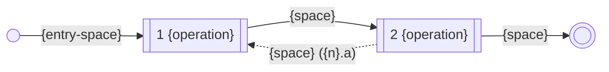

# Use Case Analysis Template

## Context
* Documentation Standards (@docs/standards/documentation-standards.md) - the document shape (Context, numbered sections, Rationale/Appendix) this template follows
* [Analysing A Use Case](../../notes/analysing-a-use-case.md) - what must be true of an analysed use case; this template is the document that must exist once it is
* [Analysing An Operation](../../notes/analysing-an-operation.md) - where §4.2's flagged operations go next
* [find-and-read-documentation](../analysis/use-cases/find-and-read-documentation/USE-CASE.md) - a use case whose `USE-CASE.md` this analysis evolves
* [find-and-read-documentation's examples](../analysis/use-cases/find-and-read-documentation/examples/EXAMPLES.md) - the input this template is derived from, and the shape a use case's examples take

Template for a use case's analysis, filed as `ANALYSIS.md` beside the `USE-CASE.md` it evolves, in the use
case's own directory. The `USE-CASE.md` states the goal and the steps in the actor's words; this document
states what must be true for those steps to reach that goal, in states.

It is written in the order it is derived: the model first, then what varies in it, then the spaces those
variations name, then the sequence, then what has happened by the end.

**It has one input that is not a document: the use case's examples**, in `examples/` beside the `USE-CASE.md`.
The model in §1 and the aspects in §5 are read off them — a `USE-CASE.md` is a story about an actor and
contains neither. Examples exist to expose how things vary; this document is where that becomes what must be
true however they do. Starting without them produces an invented domain that reads exactly like an elicited
one, which is why finding or writing them is the first question of
[the instructions](../../notes/analysing-a-use-case-instructions.md) and not a section here.

Two things about them bear on what is written below. **Every example is something that could be true** — an
instance of a fixture this analysis might end up asserting — so an attribute or an ordinal that no example
could ever carry is one to question rather than record. Nothing impossible is ever exemplified; what cannot
exist is *stated* here instead, as a validity or invalidity rule, which is a true statement about the
boundary rather than an artefact from beyond it. And **the minimum is one example of every fixture type of
every operation**, covering the happy path and every exception the use case names, a state counting as one
before and one after; where that minimum is not met, the fixture type with no example is where this document
is most likely to invent something.

**The block quotes are part of the document, not scaffolding to delete.** Each says what its section is for,
and it stays there once the section is filled in — this is a long document whose sections are easy to
misread in isolation, and the instruction beside the content is what keeps a reader oriented.

Where the data model outgrows §1 it splits into a `DATA-MODEL.md` alongside, with §1 becoming a pointer. That
should be rare — the model is the *minimal* types and attributes the spine needs, not a description of the
domain.

The template itself is in the Appendix below, since it's reference material to copy from, not indexed content
in its own right.

# Appendix

````
# {Use Case Name} — Analysis

## Context
* {link to the USE-CASE.md this analyses}
* {link to the examples this is derived from — examples/EXAMPLES.md}
* {link to the parent use case's ANALYSIS.md, and the operation of it this expands — omit if there is none}
* {links to the ANALYSIS.md of any use case sharing a type with this one}

## 1 The Data Model

> The minimal types and attributes the spine needs, and nothing else. Type names come from the analysis type
> catalog; where the analysis declares a primary key it is that type's, not this use case's to change. An
> attribute this use case does not vary is declared `INVARIANT` — and is worth a word saying why it is here.
>
> **Read this off the examples**, whose state is a populated instance of the model being drafted here: each
> distinct kind of thing in them is a candidate type and each column a candidate attribute. An attribute they
> do not carry is one being invented — keep it if the spine needs it, and say in its description that the
> examples do not show it, because that is either a gap in them or an attribute the model does not need.

```mermaid
classDiagram
    class {Type} {
        {type} {attribute}
    }
    {Type} "1" --> "*" {OtherType}
```

### 1.{n} `{Type}`

> What one of these is, in a sentence. A `foreign` key names the type it links to in its description, as
> **link-to**: `{TypeName}`, so the link can be read without interpreting prose.
>
> **A modelled attribute is not a physical attribute.** It has to be derivable from whatever design ends up
> building, and nothing more is owed — so `list-size` and `has-context` are perfectly good attributes, and
> how they would be stored is not this document's business.
>
> **An attribute that comes from other data rather than standing on its own says so**, as **derived from**.
> The model is not obliged to carry what derives it: if the only thing that varies behaviour is how many are
> in the list, declare `list-size` and leave the members out. Name the sources this model carries; describe
> the ones it does not.
>
> **Where the model carries both a thing and something derived from it, the two must agree.** Three members
> and a `list-size` of four describes nothing, and no example or fixture written from it could be true.

| Attribute | Type | Key | Description |
|---|---|---|---|
| `{name}` | {type} | primary | {what it is} |
| `{name}` | {type} | foreign | **link-to**: `{TypeName}` — {what the link means} |
| `{name}` | {type} | — | {what it is}<br>**derived from**:<br>• `{Type}.{attribute}` — one this model carries<br>• {one it does not, described} |
| `{name}` | {type} | — | `INVARIANT` — {why it is declared at all, given the use case never varies it} |

#### 1.{n}.1 Ordinals By Attribute

> The discrete values each attribute holds. **`not-set` is always an ordinal**, of every attribute without
> exception — it is how the model says an attribute may be absent, and ruling it invalid is how the model says
> the attribute is required. There is no separate notion of required.
>
> These ordinals are what §1.{n}.2's rules are written over, and they are the type's own. §2's dimensions are
> a selection from them, made by this use case.

| Attribute | Id | Value | Means |
|---|---|---|---|
| `{attribute}` | `{attribute}.1` | `not-set` | {what its absence means} |
| `{attribute}` | `{attribute}.2` | `{value}` | {what it means} |

#### 1.{n}.2 Validity Rules

> How instances of this type may legitimately vary, in the form every rule takes, over the ordinals above.
> Each rule is named, because §2.{n+1}'s invalidity rules cite them and a rule citing none is a rule nobody
> can check.
>
> A rule with no condition is how required attributes are declared, and several can share one rule.

**V{n}** — {name}

| Attribute | Ordinals |
|---|---|
| `{attribute}` | • `not-set` |
| `{attribute}` | • `not-set` |

are **invalid**.

> A rule with a condition is how an attribute becomes required, or restricted, only in some circumstances.

**V{n}** — {name}

Given

| Attribute | Ordinals |
|---|---|
| `{attribute}` | • `{ordinal}`<br>• `{ordinal}` |

Then

| Attribute | Ordinals |
|---|---|
| `{attribute}` | • `not-set` |
| `{attribute}` | • `{ordinal}` |

are **invalid**.

## 2 The Dimensions

> The variations of the state this use case's narrative turns on, selected from §1's attributes and whatever
> else about the corpus can vary — a count, a presence, a length. Dimensions not named here are free for an
> operation to claim within its own condition space; an operation may not claim one that is.

| Dimension | Varies | Ordinals |
|---|---|---|
| `{dimension}` | {the aspect of §1 it varies} | {n} |

### 2.{n} `{dimension}`

> What this dimension settles about the use case's narrative — what the story does differently depending on
> it. Where the use case names a dimension it does not vary on, say so here: naming it and never varying on
> it is a claim, not an omission.

| Id | Value | Means |
|---|---|---|
| `{dimension}.1` | `{ordinal}` | {what this value of the state means} |

#### 2.{n}.1 What Drives It

> Which aspect of §1 this dimension varies, and how that aspect's physical values partition into the ordinals
> above. The partition must be complete and non-overlapping: every value the model admits falls in exactly
> one ordinal.

| Ordinal | Physical values |
|---|---|
| `{dimension}.1` | {the range, set or predicate over the aspect} |

### 2.{n+1} Invalidity Rules

> Combinations of ordinals this use case will not accept. They live here rather than under any one dimension
> because they span dimensions, and they come from two places:
>
> * **From the model** — extracted from §1's validity rules. These cite the rule they come from, and a rule
>   claiming to be one of these while citing nothing is a rule nobody can check.
> * **From the use case** — states the model permits and this use case does not. A large order with no
>   delivery address may be a perfectly valid order and still not something *this* use case can start from.
>   These cite no validity rule and must say why instead.
>
> The difference matters when the rule is questioned. One is the model's claim and is argued there; the other
> is this use case's and is argued here.

Given

| Dimension | Ordinals |
|---|---|
| `{dimension}` | • `{ordinal}` |

Then

| Dimension | Ordinals |
|---|---|
| `{dimension}` | • `{ordinal}` |

are **invalid** — §1.{n}.2 **V{n}**, or {why this use case will not accept it}.

## 3 The State Spaces

> Every space the spine names, declared once here as not-applicable rules over §2, and referred to by name
> everywhere else. A space's name is its identity: two transitions carrying the same name carry the same
> space, and a route producing something different carries a different name.

| Space | What it is |
|---|---|
| **{name}** | {in the actor's terms} |

### 3.1 The Entry Space

> The space in which starting this use case is a valid course of action — the first state space like any
> other. Worth constraining deliberately rather than by omission, because whatever it admits the first
> operation must answer for.

| Dimension | Ordinals |
|---|---|
| `{dimension}` | • `{ordinal}`<br>• `{ordinal}` |

are **not-applicable**.

### 3.{n} **{space-name}**

> What this space is, in the actor's terms.

| Dimension | Ordinals |
|---|---|
| `{dimension}` | • `{ordinal}` |

are **not-applicable**.

## 4 The Spine

> The graph. Operations are nodes, transitions are edges, and every edge is named after the state space it
> carries.



### 4.1 Transitions

> Every edge of the graph, as an index. Each has its own subsection below.

| Transition | Space | Produced by | Consumed by |
|---|---|---|---|
| **{name}** | §3.{n} | {operation, or the entry} | {operation, or the goal} |

#### 4.1.{n} **{transition}**

> What the operation consuming this transition may rely on, and what it may not. Where more than one
> operation produces it, they produce the same space — that is what carrying the same name claims.

### 4.2 Transformations

> Every operation, as an index. The last column is the whole of which operations get an operation document:
> the cost is the product of the entry space and what may be done with it, and both are readable from the
> row.

| Operation | In | Out | Owed an analysis |
|---|---|---|---|
| {n} {name} | {transition} | {transition(s)} | {why, or **no**} |

#### 4.2.{n} {n} {operation}

> What this operation does to the state and what drives it — "for every order line, reduce that product's
> stock by the line item count". Then why it is owed a full analysis, or the claim that its transformation is
> unconditional. An operation with more than one transition out has an extension.

### 4.3 Extensions

> Every alternative route to the goal, as an index. **A use case is the happy path and has no dead ends**, so
> an exception is declared only where there is a way round to the same goal — jiggle the doodah, not burn the
> computer. A failure with no way round is simply not part of the use case: it cannot complete while that
> failure is extant, and the operation owes graceful failure for it regardless.
>
> **Returns to** is blank where the extension goes to whatever follows the operation it extends — the next
> operation, or the goal where it extends the last. Fill it only to send the actor somewhere else, which is
> usually back.

| | Extension | Produces | Returns to |
|---|---|---|---|
| {n}.a | {what goes differently} | {space} | {operation} |

#### 4.3.{n} {n}.a {extension}

> What goes differently, what the actor does about it, and how that reaches the same goal. Then what the
> operation it returns to must now also answer for, since a route in widens its entry space.

## 5 The End State

> What must have occurred by the time the use case completes. The comparison below is what §5.1 to §5.3 are
> read against: every dimension is the goal, an invariant, a side effect, or unconstrained, and the three
> sections that follow say which and why.

| Dimension | At entry | At end |
|---|---|---|
| `{dimension}` | {ordinals} | {ordinals} |

### 5.1 The Goal

> The dimensions the actor came for, and what the actor can now do that they could not before. At least one,
> and every one of them changed between the two columns above.

| Dimension | At end | Why it is the goal |
|---|---|---|
| `{dimension}` | {ordinals} | {what the actor came for} |

### 5.2 The Invariants

> The dimensions constrained identically at both ends — what the use case guarantees it leaves alone. A
> dimension unconstrained at both ends is not an invariant: the use case makes no claim about it, and it
> should be released for an operation to claim.

| Dimension | Ordinals | Why it must survive |
|---|---|---|
| `{dimension}` | {ordinals} | {what would break if it did not} |

### 5.3 The Side Effects

> The dimensions that changed and are not the goal — real, often necessary, and not what the actor came for.

| Dimension | At entry | At end | Why it changes |
|---|---|---|---|
| `{dimension}` | {ordinals} | {ordinals} | {what makes it unavoidable} |

## 6 Open Questions

> Genuine unresolved points — a dimension whose ordinals do not yet partition their aspect, a type whose
> primary key the analysis has not had to settle, a step that cannot be shown to matter and has not been
> chased down. Not a hedge against having done the analysis.

# Rationale

> Only where a shape or scoping choice in this analysis is not self-justifying — why a step was split, why an
> exception has a way round where a reader might expect none, why the entry space is as wide as it is.
````

# Rationale

**Why `ANALYSIS.md` beside `USE-CASE.md` rather than replacing it.** The `USE-CASE.md` is the actor's account
of what they do and why, and it stays readable by someone who does not want the state model. The analysis is
what must be true for that account to hold, which is a different document for a different reader, and keeping
both means neither has to compromise for the other.

**Why the instructions are block quotes that survive population.** This is a long document whose sections are
easy to misread in isolation — an invalidity rule looks much like a validity rule, and a side effect looks
much like an invariant. Guidance written as placeholder text disappears the moment the section is filled in,
taking the distinction with it. A block quote stays, and costs a reader nothing once they no longer need it.

**Why the goal, the invariants and the side effects are written out rather than derived.** All three follow
mechanically from comparing the end space with the entry space, so a document could state the goal and leave
the other two to be worked out. It should not. Prose is read by a human, and a human asked to infer which
dimensions are invariant will sometimes infer wrongly and never notice. Written out, each is a claim a reader
can hold against the comparison and say *that makes no sense*. The derivation does not disappear; it becomes
the check.

**Why a type's ordinals are its own and §2's dimensions are a selection from them.** An attribute's discrete
values are a fact about the type, true whichever use case is looking at it. Which of them the narrative turns
on is a fact about this use case. Keeping them apart is what lets two use cases share a type and disagree
about which of its variations matter, without either having to know about the other.

**Why the entry space is §3.1 and not a section of its own.** It is the first state space and nothing else.
Giving it its own section implied it was a different kind of thing, and invited a second way of declaring one.

**Why which operations are owed an analysis is a column and not a section.** It is a flag on what §4.2 already
says — the entry space is in one column and the transitions out are in another, so the cost is readable from
the row. A section would have restated the table to add one fact to it.
