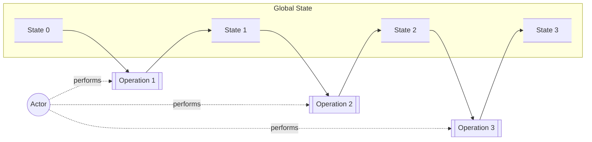
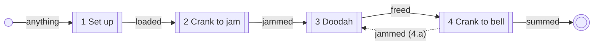

# Analysing A Use Case

## 1 Analysis Starts From Examples

**The first question of any use case analysis is: where are the examples?** Ask it before §2, before the
model, before anything. An analysis has no other place to start.

A `USE-CASE.md` is a story about an actor. A data model is not in it, a dimension is not in it, and an aspect
is not in it. Those are read off something the story has been carried out on — these documents in this state,
this request against them, this answer back.

### 1.1 If There Are None, Stop

| | |
|---|---|
| **There are examples** | read them, and check with the architect that they are this use case at the minimum being analysed |
| **There are none, and the architect gives a seed** | write them from it, and take them back before §2. A seed is the shape of the input, the kind of request, roughly what comes back. It need not be much |
| **There are none, and there is no seed** | **stop and ask for one** |

That last row is the one that matters, and it is an instruction to stop rather than a preference. An agent has
no knowledge of the domain beyond what it has been told, so examples it invents are not examples of anything —
and they will read exactly like examples somebody chose, right down to the confident file names. Everything
below inherits them and nothing below can contradict them.

### 1.2 What They Are For

**To expose variation.** That is the whole objective, and the rest follows from it.

An analysis asserts what must be true of how a thing changes. You cannot assert that until you know **how the
thing might change** — and nobody knows that from a narrative. Examples are how the variability of the real
world gets in front of you: this could be empty, this could be enormous, this one has no sections, that one is
not a document at all. Seeing the ways things vary is what makes it possible to say what holds however they do.

So examples inform the answer needed to *start* analysing a condition space. They are the input to that work,
not a small version of it.

### 1.3 An Example Is An Example Of A Fixture That Could Be True

Every example is an instance of some fixture the analysis might end up asserting. It is not that fixture — it
asserts nothing — but it is drawn from the same world, and that constrains it absolutely:

**If the thing could not exist, it is not an example.**

So do not write data that could not be. Not a malformed record, not an impossible combination, not a value
outside the range its own type allows — **not even to show that it would be rejected**. An artefact that could
never exist is an example of nothing, and putting one beside real ones teaches whoever reads them that the set
cannot be trusted as a picture of the world.

**What cannot exist is stated, not exhibited.** This is what the analysis is *for*: drawing a boundary through
the world state between applicable and inapplicable, valid and invalid, variant and invariant, and so defining
the condition space in which the use case must be true. It draws that boundary by **stating things that are
true**:

> The following parameters exist
> * `mode`: enum
> * `preview-length`: int
>
> The parameter `mode` has discrete values `list` and `preview`.
>
> The parameter `preview-length` is not valid when the `mode` is `list`.

Every line there is a true statement, the last one included. It rules a possibility out by being true about
the boundary, not by exhibiting something impossible on the far side of it. **This state could exist; this
possibility cannot** — and the two are said in completely different ways.

So an example never illustrates invalidity. An invalid combination has no instance to show, which is exactly
what makes it invalid.

#### 1.3.1 Which Unwelcome States Need Examples

A use case is the happy path to a goal, and **the exceptions it names are the ones with a way round** — jiggle
the doodah, not burn the computer. That, and only that, is what needs an example:

* **The happy path**, throughout.
* **Every exception the use case actually names.** If it names a doodah, the doodah needs an example just as
  the main route does. It is a route to the goal, so it is part of what must be true for the actor to get
  there.

Everything else on the unhappy path needs no example to start. It is not a concern of what must be true for
the actor to achieve their goal, and an analysis does not become sounder by cataloguing the ways the world can
go wrong around it. Where one turns out to matter, the use case gains an extension and the extension gains an
example — in that order.

### 1.4 One Of Every Fixture Type, For Every Operation

Examples are not a body of work with an arbitrary size. They are indexed: **every fixture type of every
operation**, where a fixture type is a kind of artefact that operation deals in — what is handed to it, what
it is parameterised by, the state it acts on, and each shape of result it can produce.

There is a ladder, and only the bottom rung is required:

| | |
|---|---|
| **Minimum** | one example of every fixture type of every operation, covering the happy path and every exception the use case names (§1.3.1). For a state, that means one of what it could be *before* and one of what it could be *after*. None of them related |
| **Better** | several per fixture type, chosen to expose the edges of how that fixture can vary. Still none of them related |
| **Better still** | several per fixture type, exposing edges, and some of them related |
| **Platinum** | several per fixture type, exposing edges, **and** one fully worked example end to end |

**The minimum is a gate: do not start §2 without it.** A fixture type with no example is a kind of artefact
nobody has looked at, and the analysis will either skip it or invent it.

**Platinum is named so it can be recognised, not so it can be aimed at.** It is not required, and reaching for
it is exactly how examples turn into the burden §1.5 warns about. Rungs above the minimum are reached the
cheap way, by adding an example when elicitation turns up an edge worth showing — not by setting out to fill
a grid.

### 1.5 Do Not Work Them Too Hard

**An example worked hard enough becomes a fixture, and then the analysis has been skipped.** Starting from
fixtures is starting from assertions about what must be true — which is the conclusion, arrived at without the
reasoning, and it is the failure this ordering exists to prevent.

**Examples must not be a burden.** Enough to show how things vary, and no more. Accuracy is worth having where
it is cheap — the more accurate they are the better the analysis they support — but effort spent polishing an
example is effort taken from the analysis that example exists to make possible.

| | An example | A fixture |
|---|---|---|
| exists | before there is a condition space | because analysis found a cell |
| says | *this is roughly how this varies* | *this must be true* |
| when it disagrees with the analysis | ask which is wrong | something is broken |
| may be cited as a requirement | never | always |

### 1.6 They Need Not Be Related

**Nothing requires one example to follow from another, and nothing is gained by forcing it.** The temptation
is to write a tidy run-through where each step takes up where the last left off. Coherence is not what exposes
variability, and the effort of maintaining it is the burden again.

Independent is the default and is perfectly good. **Where examples *are* related, the combination has to be
one that could be true** — the same rule as §1.3, applied across two artefacts instead of inside one. A state
example that could not have come from the call example beside it is not two examples, it is one
contradiction.

### 1.7 When Their Work Is Done

Examples are not maintained alongside the analysis. They have a job, and it finishes:

1. Elicitation on top of the examples **evolves the model**.
2. Doing that may expose something wrong in an example. Fix it then — that is the one moment examples change.
3. With a model in place, the work moves to **aspects**, and those expose the rough edges of the model —
   sometimes wholesale changes to its details, as the architect's understanding of how the real world varies
   percolates into the dimensions of the condition space.
4. **At that point the examples' work is done.** Later reworks of the condition space come from rough edges
   that will not smooth, not from the examples, and there is little reason to revisit them again unless one is
   egregiously wrong.

New examples can be added at any time to make a point. That is a cheap and good thing to do, and it is not the
same as maintaining the old ones.

### 1.8 The Same Device, One Level Up

§4 works this method through on a wooden adding machine with a missing tooth. That machine is doing for the
method exactly what a use case's examples do for a use case: it is a crude, concrete thing you can watch state
move in, chosen because its variability is visible rather than because it is realistic. Examples are that
device pointed at the use case in hand.

## 2 The Spine

A use case is the sequence of operations an actor performs to achieve a goal.

Every operation acts against a **shared state** — the corpus of data the use case works on. There is always
one, and it may be the empty state. Over the course of the use case that state mutates, and **the mutation is
the actor's goal**.

**The state an operation starts in is the state its precursor ended in** — not as a rule two declarations must
satisfy, but because there is only one state and one narrative of what happens to it. **The use case owns the
spine; the operations do not own their entry and exit states.** An operation is described *by* the spine, and
is capable of any transformation the spine says it makes.

That ownership is not a formality. If each operation declared its own exit state, then an operation that
simply did not mention a piece of state would be claiming its deletion — operation 2 saying nothing about the
peg board would wipe it, and operation 3 would have nothing to work on. Omission has to mean *left alone*, and
it can only mean that if there is a whole for it to be left alone in.

**So there is nothing to reconcile along the spine, because there are not two claims to compare.** The spine
is *the* fact the use case asserts. It is not falsifiable by anything in the analysis; it is what the rest of
the analysis is falsified against. What carries the narrative is the state model itself — `calc-state` going
`not-started` → `in-progress` → `complete` *is* the story of the use case, written in states.

One thing along it can be checked mechanically, and it is not the transitions:

* **The model is consistent across the operations.** The same type names, the same attributes, and the same
  **enumeration** for a state value wherever it appears. A spine that says `calc-state: complete` in one
  operation and `calc-state: finished` in another is not telling one story.

  The enumeration belongs to the model, not to any operation. An operation that does not vary on it sees it as
  an **invariant**; one that varies on a single value of it is invariant to all the rest. Ordinals are an
  operation's reading of an enumeration, and they belong in the operation document, not here.

And one thing about its ends:

* **The end state must differ from the start state.** A use case that returns to where it began achieved
  nothing but side effects, and therefore had no goal. This holds even where the whole use case is a decision:
  if the decision leaves no trace, the fact of its having been made cannot be asserted afterwards. A tree that
  falls with nothing to record it made no noise.

A use case need not start from the empty state and need not return to one. It must not return to the state it
started in.

## 3 State Spaces

A **state** is a corpus of identifiable, typed entities. Rows in tables. Objects at prefixes in a bucket.
Key/value pairs in a cache. Items on a queue. A notification in flight. Those types have attributes, to any
depth.

**Anything about that corpus that can vary is a potential dimension**, and the ways it can vary are its
ordinals. Not only attribute values: how many rows there are, whether a list is empty, whether anything
exists at a prefix, how long a collection is. Any variable aspect of the corpus.

### 3.1 The Use Case Owns Its Dimensions

Of everything that *could* vary, the use case declares which its narrative actually turns on. Those dimensions
and their ordinals are the use case's, and together they are its **global space**.

* **The use case varies by them, or it declares itself invariant to them.** Naming a dimension and then never
  varying on it is a claim to be made, not an omission to be inferred.
* **Dimensions the use case does not name are free.** Every other variable aspect of the model is available
  for an operation to claim inside its own condition space.
* **An operation's dimensions may not overlap the use case's.** At any point on the spine the use case's
  dimensions are already constrained by the state space there; an operation cannot vary what the spine has
  pinned, and if it needs to then the spine is wrong rather than the operation.

**Dimensions link to the model.** A state space is a corpus of data, so every dimension it declares names the
aspect of the data model it varies — an attribute, a count, a presence, a length. A dimension that names no
aspect of the model is a dimension of nothing, which is the same both-ends check the operation document runs
one level down.

### 3.2 A State Space Prunes The Global Space

A state space is not a list of values. It is a set of **not-applicable** rules over the use case's global
space: at this point on the spine, these ordinals cannot arise.

**Every space on the spine is a pruning of the same global space.** The entry condition, an operation's start
and end, a transition, an extension's product, the goal. That is what makes them commensurable, and why the
comparison in §3.4 is arithmetic rather than judgement.

### 3.3 Recording One

**A state space is declared as not-applicable rules, in the form every rule takes**, so that there is one data
structure and one way of writing it. A state space's own rules are unconditional, so the form collapses to a
single table:

| Dimension | Ordinals |
|---|---|
| `calc-state` | • `in-progress` • `complete` |
| `peg-board` | • `no-pegs` • `1-number` • `gibberish` |

are **not-applicable**.

That declares the space named **loaded**: whatever is left of the global space once those are gone, which is
`calc-state` at `not-started` and `peg-board` at `2-numbers`.

**A declaration says what cannot be, not what can.** That inversion is worth expecting, because it is what
makes a space the same kind of object as every other pruning — and because a dimension a space does not
mention keeps all of its ordinals, which is the open-world reading again: omission is not denial.

Where a rule does carry a condition, it takes the full form:

Given

| Dimension | Ordinals |
|---|---|
| `peg-board` | • `gibberish` |

Then

| Dimension | Ordinals |
|---|---|
| `calc-state` | • `in-progress` • `complete` |

are **not-applicable**.

**Shorthand is for referring to a space, never for declaring one.** Once **loaded** is declared, writing
`calc-state` • `not-started` beside a transition or a goal reads well and costs nothing:

| Written | Means |
|---|---|
| `value` | exactly this — every other ordinal is not applicable |
| `a` · `b` | any of these, and none other |
| *any* | every ordinal remains applicable; the space does not constrain it |
| *none* | the dimension has no value here, because the thing it varies does not exist |

*any* and *none* are different claims and the difference carries weight. *any* says the thing exists and the
space does not care what it holds; *none* says there is nothing there. An empty peg board is
`peg-board` • *none*, not `peg-board` • *any*.

### 3.4 Comparing Two

Set a start space beside an end space, dimension by dimension, and three of the four outcomes are derived
rather than declared:

| Start | End | The dimension is |
|---|---|---|
| constrained | constrained differently | **changed** |
| constrained | constrained the same | **invariant** — the use case guarantees it survives |
| *any* | *any* | **unconstrained** — the use case makes no claim about it |
| *any* | constrained | **changed**, from something to something definite |

Only one thing has to be declared: **which of the changed dimensions is the goal** (§7). Everything else
follows — the remaining changed dimensions are the side effects, and the identically-constrained ones are the
invariants.

Which gives a check the spine can be run against on its own:

* **A dimension free in every space of the use case does not belong to it.** The use case never constrains it,
  never changes it and never guarantees it — it is carrying a name for nothing, and it should be released for
  an operation to claim.

### 3.5 Unions

**An operation's entry space is the union of every state space transitioning into it.** One route in and the
union is that route; several and the operation must be sound across all of them. A union widens: it is the
space admitting any state that any incoming transition admits.

**A space's name is its identity**, so a union is usually trivial. Two transitions both carrying **jammed**
carry the same space, and `jammed` ∪ `jammed` is `jammed` — naming them the same is the claim that they are
the same. Where a second route produces something different it is a different space and carries a different
name, **jammed-again**, and only then does the operation it leads into face a union it has to answer for
twice over.

That is where a loop costs something, and where it does not. Name the spaces first and the question answers
itself.

## 4 Worked Through: The Wooden Adding Machine

A wooden adding machine with a missing tooth, holding its state on a peg board.

| | Operation | Start state | End state |
|---|---|---|---|
| 1 | Set up the computer | **any** | peg-board: 2 numbers · calc: not-started |
| 2 | Crank the handle until the machine jams | peg-board: 2 numbers · calc: not-started | peg-board: 2 numbers · calc: in-progress, jammed |
| 3 | Insert the doodah in the hole and jiggle it while rocking the crank until it turns again | peg-board: 2 numbers · calc: in-progress, jammed | peg-board: 2 numbers · calc: in-progress |
| 4 | Crank the handle until the bell rings | peg-board: 2 numbers · calc: in-progress | **peg-board: 1 number, their sum · calc: complete** |

| | Extension | Start state | End state |
|---|---|---|---|
| 4.a | The machine jams — return to 3 | peg-board: 2 numbers · calc: in-progress | peg-board: 2 numbers · calc: in-progress, jammed |

**The use case ends at operation 4, because that is where the goal is.** Resetting the machine afterwards is a
use case of its own, or the setup of the next addition; it is not part of achieving this one. A use case that
carried on past its goal to tidy up would end in a state that is not the goal, and the definition would stop
meaning anything.

**Operation 1 starts from any state**, which is not laziness — it is the whole of what that operation is for.
It exists to put the machine into the state operation 2 requires, from wherever it happens to be.

**An extension rejoins at a state, not at a step number**, and the state it produces must **contain** the
target operation's start state rather than equal it. Round a loop the state usually moves on — a second
attempt is not the first — and the operation returned to simply receives more than it needs and is invariant
to the difference. Identical is rarely the real-world case; invariant to the difference usually is.

**An extension rejoins at the next operation unless it declares otherwise**, and naming where it rejoins is
how it declares otherwise. 4.a names operation 3, so it goes there rather than on to 5.

**Returning widens the target's entry space, because an entry space is the union of everything transitioning
into it** (§3.5). Operation 3's entry space is now the union of what operation 2 produces and what 4.a
produces, and it must be sound across all of it. That is what a loop costs.

Unlike the main sequence this *is* a check, because an extension is a claim about where the spine rejoins and
so can be wrong: an extension **must** return to an operation, and may only return to one whose start state
its own end state contains.

## 5 The Use Case Is The Happy Path

**A use case has no dead ends.** It names a failure only where there is a way round to the same goal. The
machine jams and the actor reaches for the doodah, so 4.a is an extension and earns a row; the machine catches
fire and there is nothing to be done, so nothing is written. Jiggle the doodah, not burn the computer.

A failure with no way round is simply not part of the use case: **it cannot complete while that failure is
extant**, and saying so adds nothing a reader did not already know.

**An extension returns to the next operation unless it says otherwise.** Naming where it rejoins is how it
says otherwise, and that is the only reason an extension needs to name a state at all.

**The use case names the failures it anticipates. The operation fails gracefully at everything else.** That
division is the whole of it: a second jam is foreseen, so the use case names it and routes around it. The
machine catching fire because the handle was cranked too hard is not foreseen — the use case says nothing, and
the operation had better catch fire gracefully.

So a failure the use case does not name is not one the operation may ignore. It is one the use case has
nothing to say about, which is a different claim entirely.

### 5.1 Branching And Merging

**A use case that branches to different goals is probably two use cases.** If the routes end somewhere
genuinely different then they were never one thing, and splitting them says so. It does not have to be split —
but the burden is on keeping it together, not on separating it.

**A use case that merges branches widens the condition space of the operation they merge into.** Every route
in is a start state that operation must be sound for, and the more routes there are the more of them it has to
answer. That is the cost of a merge, and it is paid by the operation rather than the use case.

## 6 Every Step Is An Operation

Including the ones nothing supports. A decision an actor makes unaided — *is this widget mature enough?* —
consumes state and produces state, and does not need a service to exist.

**A decision inside a use case need not be recorded, because the states it leads to are its record.** *Do this
or do that* identifies two routes to one goal; where the routes do not agree exactly on the end state they
simply declare a wider condition space, most of which is usually invariant or side effect. If the decision
needs a trace, the difference between the states is the trace.

**Where the use case *is* the decision, the decision must change state.** That is §2's rule applied to the
case where deciding is the whole point: a decision leaving nothing behind cannot be asserted to have been
made.

### 6.1 A Step That Cannot Be Shown To Matter

Not a verdict — a **smell**, and it has at least three causes worth telling apart:

* **The use case is overly verbose.** The step describes something that is not really a step. Delete it.
* **The process itself is wasteful.** The step is genuinely done and achieves nothing. That is not an analysis
  problem, it is a finding: stop doing it.
* **The analysis is incomplete.** There is a reason the step exists and the model does not yet hold it. This
  is the dangerous one, because deleting the step buries the gap.

The smell is the same in all three. Which one it is has to be asked rather than assumed.

## 7 Where The Goal Lives

**The goal is declared, on the end space, as the aspects the actor came for.** Everything else about the end
space is then derived by comparing it with the entry condition (§3.2):

| Part of the end space | How it is known |
|---|---|
| **the goal** | **declared** — marked on the aspects of the end space |
| **the side effects** | derived — changed, and not marked |
| **the invariants** | derived — constrained identically at both ends |

So one declaration does all of it, and the two that are derived cannot drift from the spine because nobody
writes them down.

For the adding machine:

* **peg-board:** `1-number` — **goal**
  * **register-a:** the sum of the two numbers set up — **goal**
* **calc-state:** `complete`

`peg-board` and its register are the goal; `calc-state` reaching `complete` is a side effect, true and
necessary and not what the actor came for. Nothing here is invariant, because nothing survives from the entry
condition unchanged — which is unusual and worth noticing rather than typical.

Everything outside the goal aspects is a side effect, however necessary it was. That is what makes "the
mutation of the state is the actor's goal" say something: not that every change matters, but that identified
aspects are the point and the rest serve them.

It also makes the shape of a use case checkable, and now mechanically:

* **The end space must carry at least one aspect marked as the goal.** A use case whose end space carries
  none has been drawn too long — it has passed through what it came for and kept going, which is what §9.1's
  first draft did by ending with a reset.
* **Every aspect marked as the goal must be a changed aspect.** An aspect that is invariant between the entry
  condition and the end cannot be what the actor came for; it was already true.

**Where no aspect of the end space can be marked as the goal, the state model is missing what the actor came
for.** In the
example that risk is real: the actor wants to *know* the sum, and the model only covers the machine. It is
sound here because the sum is on the peg board at the end, and reading it is not a further operation.

### 7.1 A Use Case Has No Single Entry State

It has a **condition space over the state** — the states in which starting the use case is a valid course of
action. Another use case may already have established that orders come small, medium and large; this one
covers large orders, and says so by constraining the space rather than by naming one state.

**The first operation's behaviours and fixtures must cover all of it.** That is where the cost of a wide entry
condition lands, and it is why constraining the entry is worth doing deliberately rather than by omission.

## 8 What Determines The Cost Of An Operation

**The cost is the product of the start-state space and what may be done with it** — the payload and parameters
the operation admits. The spine gives the first factor directly.

| Where the entry space comes from | Its size |
|---|---|
| a single transition in | that transition's space — the cheapest case |
| several transitions in | their **union** (§3.5) |
| the use case's own entry condition | whatever that condition admits |

An operation reached by several routes must be sound across their union, which is why merging is paid for by
the operation rather than the use case. And a use case defines a sequence, so **the only way an operation gets
more than one transition in is an extension returning to it** — a wide entry space otherwise means a wide
entry *condition*, which is the first operation's problem and usually the use case's most expensive.

**Many end states is branching under another name.** It is a smell rather than a fault: its effect is either
to widen the condition space of whatever comes next, or to demand a fork to a different operation. Branching
and merging inside one use case is worth avoiding, and an operation with several end states is where that
starts. This is not the same thing as an operation having many *result shapes* — a tree in the condition space
is ordinary, and not every tree is a branch in the spine.

Three signals, all readable off the spine, that an operation is expensive:

* **Its entry condition is wide** — it is the first operation, and the use case admits many states to start in.
* **An extension returns to it**, which is the only way an operation in a sequence acquires a second
  transition in, and so the only way its entry space becomes a union.
* **Its end space names something its entry space and payload cannot account for — which means the operation
  creates it.** An operation that brings new state into the world is doing more than transforming what it was
  given, and that is worth being explicit about.

An operation that is none of these still earns a place on the spine and a name. *"This transition is
unconditional"* is a claim worth being wrong about in public.

## 9 Use Cases Within Use Cases

**An operation may expand into a use case of its own.** A use case therefore has an optional **parent
operation**, and that link carries a contract rather than a cross-reference:

* **The child's end state contains the parent operation's end state.** Everything the parent said would be
  true afterwards is true; the child has almost certainly changed other things as well, and those are side
  effects the parent neither names nor needs.
* **The child must not change anything the parent operation holds invariant.** The parent declares what it
  leaves alone; the child is bound by it, and so is every child of the child.

Containment on one side and prohibition on the other leaves the child free in between, which is where its own
states live. Both halves are falsifiable, and neither needs the parent to model the child's own states. The widget
inspector's audits, approvals and tests change states of their own that widget-evolution neither names nor
cares about; what evolution requires is only that its own state ends where the parent operation said it would,
and that nothing it declared invariant moved.

This is what removes the need for a use case to model another's state read-only. A child does not *read* its
parent's state from outside — it is inside it, working the same operation at a finer grain.

**It also means an operation can be trivial in one use case and the whole point of another.** *Set the
description* is, to widget-evolution, a state going from absent to present; evolution does not care what the
prose says. To a documentation use case it is the goal, and there may be several ways to reach it. Both are
right, and the trivial reading is not a failure to analyse — it is the parent correctly declining to care.

### 9.1 Worked: A Decision And The Use Case That Makes It

**In the parent**, deciding is one operation among several and changes nothing about the widget:

| | Operation | Start state | End state |
|---|---|---|---|
| … | … | … | … |
| 4 | Decide whether the widget is mature enough | widget: built · maturity: undecided | widget: built · maturity: decided |
| 5 | Release it, or send it back | widget: built · maturity: decided | widget: released *or* widget: reworking |

Operation 4 leaves the widget exactly as it found it. What it changes is `maturity`, and that is the whole of
what operation 5 needs from it. Evolution does not care *how* the judgement was reached.

**In the child**, that operation is the goal, and reaching it is a use case of its own:

| | Operation | Start state | End state |
|---|---|---|---|
| 1 | Gather the widget's test results | maturity: undecided · audit: none | audit: tests gathered |
| 2 | Check them against the maturity criteria | audit: tests gathered | audit: assessed |
| 3 | Record the judgement | audit: assessed | **maturity: decided** · audit: complete |

The child's end state **contains** the parent operation's end state — `maturity: decided` is there, and so is
`audit: complete`, which the parent neither names nor needs. The child changed nothing the parent holds
invariant: the widget is still `built`.

And the audit state is the child's own. Evolution has no opinion about it, evolution's model does not carry
it, and nothing needs to be modelled read-only for the two to coexist.

## 10 The Data Model

**A use case's data model is the minimal set of types and attributes that must exist for its spine to be
sound.** For the adding machine, `peg-board` and `calc-state` and nothing else. For widget evolution, `widget`
and whatever maturity turns on.

**Types are shared across the analysis by name, and models are not.** Two use cases naming `widget` are
describing the same thing from different perspectives, which gives four properties worth relying on:

* **What must be true of a type is the aggregate of every model that names it.** No single use case owns it.
* **Omission is not denial.** A model that does not mention an attribute makes no claim about it. That is what
  makes aggregation safe, and it is why a use case needing an attribute nobody else models simply declares it
  — no change request on anyone else's model, and nothing to negotiate.
* **Invariance is never part of the shared type.** Which attributes a use case holds invariant is a fact about
  that use case, not about the thing. `widget-type` may vary documentation and be invariant to maturity;
  the widget is the same widget.
* **An attribute named elsewhere on the same type must match it exactly.** Same type, same description —
  equal, not merely compatible. A use case naming an attribute that exists elsewhere with a different type or
  a different description **is not sound**, and that is checkable as it is written rather than discovered
  later. Where two descriptions differ, either they mean the same thing and one wording should win, or they
  mean different things and one must rename.

That is checkable as the use case is written, which is the point of insisting on equality rather than
compatibility. So is one more, at the level of the analysis rather than any one use case:

* **A use case naming an attribute it does not vary must name it as `INVARIANT`.** Which raises the question
  of why it declared it at all — sometimes for realism, so that a fixture reads like the thing it stands for,
  which is a good enough reason.
* **Every attribute in the aggregate varies in at least one use case.** One that varies nowhere is an
  attribute nobody needs, or a use case nobody has written.

### 10.1 Analysis Declares Types, Not Models

**What is owed at analysis level is a type catalog**: the named types, what each one is, and — where one is
declared — its **primary key**. Nothing more: no other attributes, no structure, no validity rules. The same
equivalence judgement applies as to attributes: two entries whose descriptions mean the same thing are one
type under two names, and one of them has to give.

**The primary key is the analysis's, which means the attribute carrying it is too.** A use case cannot
unilaterally change what identifies a thing — every other use case is relying on it to mean the same entity.
It may key its own work by something else, unique or not, but it may not claim that key is the primary one.

A type may have no primary key declared, and that is a position rather than an oversight: it says the analysis
has not yet had to identify one of these across use cases.

**There is no analysis-level data *model*, and there should not be. Everything analysis ever claims about data
is a minimum requirement**, and it is design's work to satisfy every one of them with whatever model it
chooses.

A model declared centrally would assert that attributes exist which no use case requires — and asserting
existence without need is imposing an invariant on design for nothing. It would also invert the direction of
the work: use cases would start conforming to a model instead of the model accumulating from what use cases
actually need.

This is why a use case needing an attribute nobody else has modelled simply declares it. There is nothing to
request and nobody to request it from.

### 10.2 The Same Attribute Under Two Names

The hard case is the one equality cannot catch: two use cases declaring an attribute with **the same meaning
and different names**. Nothing mismatches, so nothing fails, and the aggregate quietly carries two attributes
where the world has one.

| | Cost |
|---|---|
| Same meaning, same type, different names | design builds two fields for one thing — untidy, and a reconciliation somebody will do later by hand |
| Same meaning, different types, different names | design builds two incompatible fields for one thing — now a data problem rather than a naming one, and the one to catch early |

It cannot be settled mechanically, but it can be narrowed mechanically, which is enough:

1. **Find candidates** — attributes on the same type with different names, ranked by signal: matching types,
   overlapping descriptions, one attribute's name appearing in the other's description.
2. **Judge** each candidate pair for whether the two descriptions mean the same thing. Semantic equivalence of
   two short descriptions is exactly what an LLM is for, and a wrong judgement here is cheap because of the
   next step.
3. **Review** the survivors. A rename changes a claim somebody else made, so it is theirs to accept.
4. **Raise a change request** against the use case that renames.

**A change request is right here and wrong for a missing attribute**, and the asymmetry is worth keeping
straight. Adding an attribute claims nothing about anyone else's model, because omission is not denial.
Renaming one contradicts a claim they made, so it has to be asked for.

**A child use case inherits its parent's types.** Its entry state is already described, so it starts from a
model rather than a blank page — and any attribute it adds joins the aggregate by the rules above.

## 11 The Spine Is A Graph

Not a table. Operations are nodes, transitions are edges, and drawing it is worth the effort because loops,
forks and merges are visible in a graph and invisible in a list.

**Every edge is named after the state space it carries**, so the graph and the spaces are one artefact rather
than two that can disagree.

Then the two tables the graph stands for. **The transitions**, each a state space:

| Transition | Space |
|---|---|
| **anything** | the entry condition — `peg-board` • *any*, `calc-state` • *any* |
| **loaded** | `peg-board` • `2-numbers`, `calc-state` • `not-started` |
| **jammed** | `peg-board` • `2-numbers`, `calc-state` • `in-progress` |
| **freed** | `peg-board` • `2-numbers`, `calc-state` • `in-progress` |
| **summed** | `peg-board` • `1-number`, `calc-state` • `complete` |

**Operation 2 and extension 4.a both produce jammed**, and naming them the same is the claim that they are
the same space. Operation 3's entry space is therefore just **jammed**, not a union of two things. Had the
second jam differed from the first — a machine in a worse state for having been freed once already — it would
be a different space under a different name, **jammed-again**, and operation 3 would have to answer for
both.

**The transformations**, each an operation. An operation with more than one transition out has an extension —
operation 4 either finishes or jams again, so it names both:

| Operation | In | Out | What it transforms |
|---|---|---|---|
| 1 Set up | anything | loaded | clears the board and sets the two numbers to be added |
| 2 Crank to jam | loaded | jammed | advances the calculation until the missing tooth stops it |
| 3 Doodah | jammed | freed | releases the mechanism without disturbing the registers |
| 4 Crank to bell | freed | summed, jammed | completes the calculation, leaving the sum in one register |

**Say what the transformation does, not only that state moves.** *For every order line, reduce that product's
stock by the line item count* is the substance of an operation at use case level, and it is what tells you
whether the operation is one thing or several.

**A transition is a state space, not a state.** Ideally one state, often a space: a dimension a prior
operation left unconstrained and a later one may or may not vary on. Where the space is wider than one state,
the operation it leads into must be sound across all of it.

**Multiple transitions into an operation widen its condition space**, and the *disjoints* between them are the
thing to look at. Where the routes in agree closely, it is one operation reached several ways. Where they
disagree substantially, either it is not really one operation, or the use case has a shape problem worth
re-examining before any of it is analysed further.

**Extensions are subsumed into the graph** — an extension is an edge like any other, with its own transition
and its own state space — but each edge should carry the extension it came from, so the prose and the graph do
not drift apart.

## 12 What A Use Case Analysis Produces

* **A data model** for the shared state: the minimal types and attributes its spine needs, in the vocabulary
  every operation's start and end states are written in. Its type *names* come from the analysis-wide catalog;
  its choice of attributes is its own, and anything it declares but does not vary is marked `INVARIANT`.
* **The spine as a graph**: operations as nodes, transitions as edges, each transition carrying the state
  space it admits, and each operation carrying what it transforms and what drives that.
* **The extensions**, each as an edge, with the state space it produces and the operation it returns to.
* **The goal**, declared as aspects of the end space, and with it **the side effects** and **the invariants**.
  Both are derived from the goal and the entry condition, and both are written out anyway. The prose is read
  by a human, and a human left to infer them will infer them wrongly; written down, they are something a
  reader can disagree with and a check can falsify.
* **The entry condition**: the state space in which starting the use case is valid.
* **The parent operation**, where the use case is the expansion of one.
* **The list of operations owed a full analysis**, and the start-state space that puts each on it.

Every one of those is a state space or a comparison between two, which is why §3 comes before any of it.

Get the state model and the spine right first. The spine is not checkable — it is the claim everything else is
checked against — but it is cheap to write, it is the thing a reader can disagree with, and it decides how much
of the expensive work there is to do.
