# Analysing An Operation

An operation is one step an actor takes toward their goal. It acts against a **shared state** — the corpus of
data the whole use case works on — and it may act with the support of other states it depends on. There is
always a shared state, which may be the empty state.

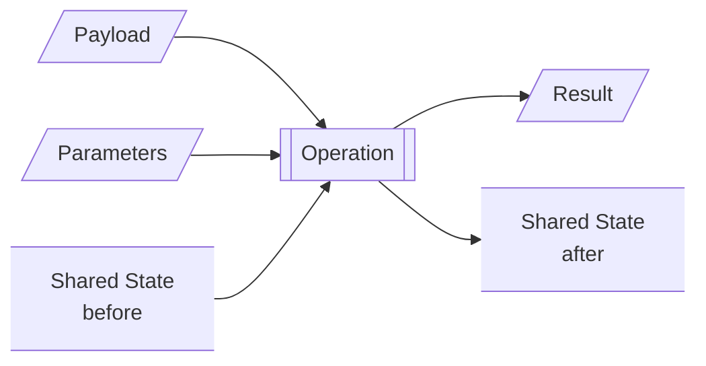

Whether a service supports the operation is a question for design. An operation exists because the actor takes
the step, not because something answers it — a judgement the actor makes unaided is an operation, and so is a
call to a system that does the work. What analysis owes either of them is the same: what must be true of the
result and the end state, for every state the operation may start in and every request it may be given.

Which operations are worth analysing to this depth, and which need only their state transition recorded, is
[Analysing A Use Case](analysing-a-use-case.md)'s question rather than this document's.


## Operations

An operation receives a `Payload`, with `Parameters`, and the shared state as it stands. It produces a
`Result`, and it leaves the shared state as it ends. That is all of it.

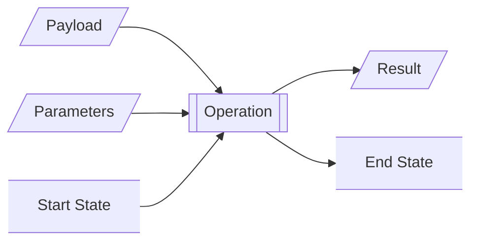

An operation that changes nothing leaves the end state equal to the start state, and **says so**. That is a
claim about the operation, not an absence of one, and it is worth being wrong about in public.

**There are no dependencies here, and no effects.** Everything the operation reads or writes is the shared
state — if its behaviour turns on the weather then the weather is in the state, and in the use case's data
model. What the state is made of, what sits behind it, and what has to be crossed to reach any of it are
questions for architecture (§Where Analysis Stops). An analysis that names a dependency has started designing.


The inputs to an operation are the payload, the parameters and the start state.
The outputs are the result and the end state.

An operation is deterministic: the condition of its inputs `Payload`, `Parameters`, `Start State` determines
its outputs, the `Result` and `End State`.
The inputs determine the condition space in which the operation executes.
We can analsye a condition space by knowing what its dimensions are and the ordinals of those dimensions.
Dimensions are orthogonal variations of the condition space and their ordinals are the complete and contiguous values 
that the dimension can take that affect the behaviour of the operation.

> "that affect the behaviour of the operation"

Are the operant words. Each of a dimensions ordinals imply a change to the behaviour of the operation.

## Dimensions and Ordinals
Dimensions and ordinal define the size and shape of the condition space. The condition space is the product of
all the dimensions the operation is expected to handle. The dimensions are defined by the fixture types that the
operations is expected to experience.

They are record with the following attributes

| Name        | Description                                                |
|-------------|------------------------------------------------------------|
| slug        | The identify of the dimension                              |
| description  | The description of the dimension and behaviour it controls |

The ordinals of each dimension are recorded with

| Name         | Description                                                   |
|--------------|---------------------------------------------------------------|
| id           | The numerical identify of this ordinal within its dimension   |
| slug         | The identifying name of the ordinal within its dimensions    |
| description  | The description of the ordinal and what behaviour it controls |

### The Both-Ends Check

A dimension and the aspect it varies must name each other, and the check runs in both directions:

* **Every dimension varies some aspect**, or it is not a dimension. A dimension that changes nothing about
  any fixture is a distinction the analysis invented.
* **Every aspect is varied by some dimension**, or a dimension is missing — unless the aspect is declared
  `INVARIANT`, which is the explicit way of saying it varies nothing here.

This is the cheapest check in the method and the highest-yield. It catches a dimension nothing supports and a
variation nobody modelled, and it catches them before any tree is drawn, which is where they become expensive.

### Naming A Dimension

**A binary dimension is named so that its name followed by `yes` reads as a true statement.** `cap-exceeded`
passes; `cap` does not. A dimension named this way needs no vocabulary for its ordinals — they are `yes` and
`no`, and the meaning is in the name — and a name that cannot be read this way is usually a dimension that has
not been decided yet.

**A dimension's description says what the operation does differently.** Not a restatement of its own ordinals,
and not what *caused* the dimension to take its value. "Whether more matched than the cap admits" describes
the ordinals; "whether the answer ends in a count of what it did not show" describes the behaviour. Only the
second tells a reader whether the dimension earns its place.

For a given execution of an operation the inputs and outputs are `Fixtures`.
* Given these input `Fixtures`
* When `Operation`
* Then these output `Fixtures`
defines the behaviour of the operation.

The full table of dimensions is repeated in the condition space where they gain their rank. Ranking dimensions in the
condition space allows the cells of the condition space to be identified in a dotted decimal format.

i.e. @`<rank_1.id>.<rank_2.id>.<rank_3.id>` e.g. @`1.2.1.1.3` uniquely naming the cells of the condition space allows
reconciliation of whether an operations document is complete.

The condition space defined by multiple dimensions and their ordinals can be pruned with various types of rule.
* **invalidity** rules - a sub-cube of the condition space that are invalid and therefore imply an invalid request 
  result.
* **not-applicable** rules - a sub-cube of the condition space that cannot happen, so no behaviour is owed by the 
  analysis.
* **invariant** rules - a sub-cube of the condition space that fixes the operations result.
* **orthogonality** rules - a set of dimension *groups* whose behaviours compose: the behaviour of a combination
  is the behaviour of each part and nothing arises from putting them together.

The first three prune *within* a region. The fourth says two regions do not interact, and it is the one that
keeps the space from exploding: groups that compose need **covering, not crossing**. Three groups carrying 2, 3
and 5 states cross into 30 cells and cover in 5 — every state of every group has to appear somewhere, and one
fixture carries several at once.

An orthogonality rule is falsifiable like the others: a combination that behaves differently from the
composition of its parts refutes it.

### Collapsing Dimensions

Any set of dimensions can be rewritten as one dimension whose ordinals are the surviving combinations. What
that costs is the orthogonality declaration, so:

* **Dimensions that compose must not be collapsed.** Collapsing spends the covering saving to say nothing new.
* **Dimensions that interact may as well be.** They are crossed anyway, and naming the product directly reads
  better than leaving the interaction to be inferred.

So collapsibility is a test for *non*-orthogonality, and it is the reason an architect should not fear starting
with too many dimensions. The obvious dimension is usually binary, a binary tree can model any condition, and
both the pruning rules and the collapse are available afterwards. Over-modelling is a draft; under-modelling is
a defect, because nothing adds a dimension for you.

**Collapse only after the rules are settled.** An ordinal cannot be pruned the way a dimension can, so
collapsing early bakes in a cross-product a later rule would have cut.

## Data Models
Operations receive data and produce data, and they read and write state. All of it is data.
Data has a model. A type, its attributes and their types and its validity rules.

The validity rules define how the attributes of instances of that model may legitimately vary. A validation failure
carries the rule causing it to fail. An aspect of a fixture whose only variance is driven by a validation failure rule 
is invariant to a validity check unless the operations behaviour also varies by the rule. Invalid is invalid, reporting
why is invariant unless other behaviour changes.

### The Model, Its Aspects And Its Rules

The data model, the aspects and the dimensions are three layers of one thing, and each pair owes a check that
can be run rather than argued:

* **Every aspect resolves to an attribute of the model.** An aspect with no attribute behind it means the model
  is missing one — an operation whose behaviour varies on a document's checksum must model a checksum, because
  the operation requires it.
* **Every attribute is an aspect or is declared `INVARIANT`.** An attribute that is neither has not been
  considered. This is the same both-ends check as dimension-to-aspect, one layer down, and it is what stops a
  model growing attributes nobody asked for and an analysis quietly ignoring ones that matter.
* **Every validity rule either produces an invalidity pruning rule or is invariant to the operation.** Invalid
  is invalid: where the operation does nothing but reject, the rule fixes a result and adds no dimension. Where
  the operation behaves differently for a particular failure — a different result shape, a different remedy —
  the rule earns a dimension.
* **Every invalidity pruning rule either traces to a validity rule or says why it does not.** Most come from
  the model, and those cite the rule they come from. Some are the analysis's own — a state the model permits
  and this piece of work will not accept — and those cite nothing and must give a reason instead. What is not
  allowed is a rule that does neither, because there is nothing to check it against.

  The distinction matters when the rule is questioned. A model rule is argued in the model; an analysis rule
  is argued where it stands.

Together these make the model load-bearing rather than a by-product: it is where an aspect proves it exists,
and where a pruning rule proves it is not invented.

An output of analysing an operation is a datamodel of all the data it receives, produces, reads and writes.
The use case records its datamodel as DATAMODEL.md in its own directory. If this document becomes unwieldy this 
document may evolve into a datamodel directory containing multiple files. Its entry point is a DATAMODEL.md

* datamodel/
  * DATAMODEL.md
  * {sub-model-slug-1}.md
  * {sub-model-slug-2}.md

This datamodel is always owned by the use case. It defines the data the operations of **this** use case
receive, produce, read and write.


## Fixtures and Aspects
A Fixture is a concrete instance of an input or output of an operation. Fixtures are data, they have a data model.

Fixtures have aspects and aspects nest like XML tags. A fixtures aspects are the parts of the fixture that vary 
independently of each other. For example a document may have a header, body and footer. The header might contain
the author and their organisation. The body its title and prose. The footer its audit info. Its aspects could be
* document
  * header
    * author
    * organisation
  * body
    * title
    * prose
  * footer
    * audit
      * create-date
      * last-edit-date

A fixtures aspects vary the behaviour of the operation or are varied by it. For example if the author and organisation 
play no part in the operation then those parts of the fixture are not aspects in the context of the operation they are 
invariants. 
* document
  * `INVARIANT` - header
  * body
    * title

etc.

In this example the entire heading is an invariant of the document (the fixture). 

If the organisation plays a role but the author does not then
* document
  * header
    * `INVARIANT` - author
    * organisation
  * body
    * title

etc.

Invariants are like XML CData.

Aspects derive data on input fixtures or are derived by data on output fixtures. Where the fixture itself is data e.g.
a JSON document or other form of serialized data, the fixture's aspects are the embedded attributes of the fixtures 
data *that vary the operation* or are varied by it. 

If the fixture itself is data, e.g. JSON data then attributes of the data model are very likely aspects of the feature.
```json
{
  "id": 1,
  "title": "JSON Fixture",
  "members": [
    {
      "name": "John",
      "sex": "male"
    },
    {
      "name": "Jane",
      "sex": "female"
    },
    {
      "name": "Fred",
      "sex": "male"
    }
  ]
}
```
has aspects
* *id*
* *title*
* *members*
  * *name*
  * *sex*
* *members.length*

if `member.length` plays a part in the operation and if not then
* *id*
* *title*
* *members*
  * *name*
  * *sex*

if the members themselves play no part then
* *id*
* *title*
* `INVARIANT` - members

If the operation only varies on the id and title attributes of an object then
* *id*
* *title*
* `INVARIANT` - all the rest

Fixtures have types. If a fixture shares no aspects with another fixture of the same kind they are different types.
For example an operation could receive `Payload`s with totally different aspects, or produce `Results` with different 
aspects. 
These would be different types of `Payload` or `Results` fixtures. 
An operation that receives multiple types of payload should have a **payload-type** dimension with ordinals of each 
type the operation is expected to survive.

**Sharing no aspect is what makes two types. Losing a branch makes one type and a dimension.** The two are
easily confused, and the difference decides whether a failure case is a new fixture type or an ordinal:

* A result that keeps *nothing* of the successful one — no rows, no counts, no ancestry — is a different type.
* A result that keeps the whole shape and loses one branch of it is the same type with an aspect absent, which
  is a not-applicable rule and not a type at all.

Without the second half, every failure case becomes a new type and the fixture set fragments.

**Sketch a fixture beside the aspect list taken from it.** An aspect list read against an example is checked
every time someone reads it; one read against a description of an example is checked never. Counting errors and
missing aspects both survive an appendix and neither survives being next to the thing.

**Aspects may recurse, and whether they do is the operation's choice.** A `ul` behaves the same wherever it
appears; an `li` only means anything inside one. A filesystem is a flat list of paths to an operation that
only cares what each path points at, and a nest of directories to one that walks a tree. Two operations may
demand different aspects of the same data model, and both are right.

Input **fixtures types** add dimensions and ordinals to the condition space.
Input **fixtures**, through the data defined by their aspects, collapse the condition space by fixing one or more 
dimensions to a single ordinal value. When a fixture is defined it records the dimensions and ordinals it constrains

The input fixture set are the set of fixtures constraining the input condition. 
They aggregate the dimensions and ordinals of their fixtures. Therefore, the set of input fixtures must collapse the 
condition space such that there are no unconstrained dimensions remaining in it.

Once fixture types have been identified the data types implied by them should be recorded in the use case's 
DATAMODEL.md.

### Fixture Kinds

* `Payload` - A concrete example of the data the operation is given.
* `Parameters` - A concrete example of the parameter values that accompany it.
* `State` - A corpus of Entities describing the shared state the operation acts against, at its start and at
its end. The attributes of the data entities need only prescribe the values which affect the behaviour of the
operation.
* `Results` - The concrete example that the operation **MUST** produce

### Payload Fixture
A `Payload` fixture is the data the operation is given. All payloads are data. It has a data model. Documents 
and images carry data. Where that data is relevant to the operation it must be in the data model implied by the 
document. For example an operation whose behaviour varies on the checksum of the document must model the data of the 
document with a checksum attribute, the operation requires it

Analysing how the behaviour of the operation changes by the aspects of the fixture informs the dimensions and ordinals
the fixture that add to the condition space of the operation. For example there may be 3 categories of order, small, 
medium and large and 4 payment states, purchase-order-pending, purchase-order-approved, paid-in-full, payment-failed. 
This would be 2 dimensions with 3 and 4 ordinal values respectively. 

#### Dimensions

If the `Payload` can vary in ways which affect the behaviour of the operation then the `Payload` has at least 1
dimension in the condition space of the operation. If the payload can vary in multiple *orthogonal* ways which affect
the operations behaviour then each of these `orthogonal` variations is its own dimension in the operations condition
space.

A `Payload` has dimensions and ordinals, (the payload space). This space can also be pruned by invalidity rules.
Given a set of dimensions and ordinals then other dimensions or dimensions and ordinals are not valid.

The payload dimensions are recorded with the Fixture type that carries their value.

#### Pruning Rules
In the example above if purchase orders are only applicable for large
orders then we need a rule to prune them out of the space.

e.g.

Given

| Dimension | Ordinals  |
|-----------|-----------|
| category  | * *large* |

Then

| Dimension     | Ordinals                                               |
|---------------|--------------------------------------------------------|
| payment-state | * *purchase-order-pending* * *purchase-order-approved* |

Are **not-applicable** - The data state cannot happen, no behaviour is required of the operation.

or

Are **not-valid** - the operations rejects the request. ==> the result shape `InvalidRequest`

The full suite of Payload fixture types may define pruning rules which collapse the condition space to 
**not-applicable** - In input condition cannot exist, the operation is not expected to handle it.
**invalid** - The Payload data is in and of itself invalid.


### Parameter Fixtures
Parameter fixtures are the concrete representation of the parameters and values passed to the operation with the
payload. Parameters have the following attributes

| Name        | Description                                                                             |
|-------------|-----------------------------------------------------------------------------------------|
| name        | The name of the parameter                                                               |
| data type   | one of enum, integer, double, boolean, string, <modeled data type> or an array there of |
| required    | Whether the parameter is required                                                       |
| default     | What the default value is if there is one                                               |
| description | The description of this parameter and what it controls                                  |

The aspects of the Parameter fixture is the parameters passed with the operations invocation, 

A parameter fixture is no more than a list of the parameters and their values passed.

#### Dimensions
Parameter dimensions are the parameters that vary the behaviour of an operation.

An enumerated parameter has ordinals for each enumeration that changes the operations behaviour.
In integer parameter has ordinals of whichever number ranges affect the behaviour of the operation.
A string parameter has ordinals of whichever string formats or characteristics change the behavoiur of the operation.
A parameter could be a more complex type, a JWT, a JSON string. In each case its ordinals are the complete and
contiguous values that the parameter can take which affect the behaviour of the operation.

e.g. a cap parameter is an integer parameter. The complete range of an integer parameter is -∞ -> parameter -> ∞.
So the ordinal ranges of the cap parameter which affect the behaviour of the operation are
1. not given (if the parameter is optional)
2. `<` 1 - zero or negative values are invalid for a cap
3. `<=` capped length
4. `>` capped length
5. `>` 100 - the maximum cap value supported by the operation

typically each parameter is a dimension and its discrete value ranges that affect the behaviour are it ordinals

The Parameter Fixture types record the dimensions and their ordinals with their numerical ids.

The Parameter dimensions expand the condition space like all other dimensions.

#### Pruning Rules
Like all dimensions pruning rules can be defined for parameter dimensions. Unlike Payload dimensions combinations of
payload dimensions and ordinals cannot be **not-applicable** an actor could pass any combination of parameter. The
behaviours of the operation must be defined for each combination.

However, parameters are often mutually exclusive. In such cases invalidity rules should be defined to prune the 
condition space by identifying the invalid request invariant result.

e.g.

Given

| Dimension | Ordinals |
|-----------|----------|
| Mode      | * *List* |

Then

| Dimension   | Ordinals |
|-------------|----------|
| PreviewCap  | -        |

Is **invalid** ==> result shape - `InvalidRequest`

The Parameter pruning rule can include Payload dimensions, so certain combinations of payload and parameter are
always invalid

e.g.

Given

| Dimension     | Ordinals             |
|---------------|----------------------|
| order-size    | * *small* * *medium* |
| customer-type | * *regular*          |
| actor-type    | * *unpriviledged*    |

Then

| Dimension      | Ordinals       |
|----------------|----------------|
| payment-method | purchase-order |

Is **invalid** ==> result shape - `InvalidPurchaseOrderRequest`

and

Given

| Dimension      | Ordinals     |
|----------------|--------------|
| order-size     | * *small*    |
| customer-type  | * *enhanced* |

Then

| Dimension      | Ordinals       |
|----------------|----------------|
| payment-method | purchase-order |

Is **invalid** ==> result shape - `InvalidPurchaseOrderRequest`

This example shows that invalidity does not necessarily result in the result shape `InvalidRequest`


### State Fixtures

State fixtures define the shared state the operation acts against. A state is a corpus of data. e.g. A cache state
are the keys and the data held by their values. A database state are the rows in its tables. An AWS - S3 state are the
buckets and prefixes and the objects they point at. The data in the fixture can be recorded as instances of their data
model. Only the attributes required to constrain the behaviour need be defined by the fixture. The fixture defines
what that state holds at the start of the operation.

The aspects of a state fixture are the groupings of data, e.g. buckets in S3, databases in a database service.
S3 prefixes, database tables, individual objects and rows, individual attributes of objects. Only where the value
carried by the aspect varies the behaviour.

#### Dimensions
Input state fixtures imply dimensions.

e.g. 
* widget-store-state
  * unavailable
  * widget-present-not-changed
  * widget-present-changed
  * widget-not-present

A state fixture may define multiple dimensions
e.g.
* widget-store-availability
  * available
  * timing-out
  * not-available
* widget-state
  * present-not-changed
  * present-changed
  * not-present
* oojar-state
  * present-not-changed
  * present-changed
  * not-present

Output state fixtures do not.

#### Pruning Rules
**not-applicable** state fixture rules can be defined that restrict which cells are added to the condition space.
Unlike `Payload` fixture rules a state *is valid* — it is whatever it is — so it is unlikely that the pruning
rules for state attributes would be **invalidity** rules.


### Results Fixtures
Results fixtures are very similar to Payload fixtures in their aspects. However, they do not imply dimensions.
Results fixtures are data, they have a data model.
Unlike payloads whose aspects carry the data, Results aspects are driven by the data.

## The Condition Space

The condition space is the product of all the dimensions defined by the operations document. Every **applicable**
cell in the condition space is owed a determined result. Many of these are invariant results defined by the pruning 
rules for each Fixture kind. What remains are the behaviours that must be defined by fixtures. Input fixtures 
constraining an operation and output fixtures defining its behaviour.

The dimensions of the operation are repeated in the condition space section of the operation document where they gain
their rank. Dimensions are ranked in the order by dimensions that end the operations soonest e.g. invalid request or 
split the behaviour of the operation cleanest, e.g. `payload-type`. Some dimensions are fully orthogonal to the rest
e.g. **output-mode** - *human* or *machine*. The behaviour of the operation is identical except that the formatted 
result is different. In such cases the fixture-set can carry both variations of the `Results` fixture.

Ranking the dimensions in the condition space allow individual cells to be uniquely named in a dotted decimal format

i.e. @`<rank_1.id>.<rank_2.id>.<rank_3.id>` e.g. @`1.2.1.1.3` uniquely naming the cells of the condition space allows
reconciliation of whether an operations document is complete.
A cell name that does not fix all the dimension value names the remaining tree of the condition space

### Reconciliation

The reconciliation is the point of naming the cells, and it is arithmetic rather than judgement:

1. **Expand** the full cross product of the ranked dimensions and their ordinals.
2. **Apply** every pruning rule, in rank order, to get the cells the analysis owes a behaviour.
3. **Apply** the orthogonality rules to get the cells the document must draw.
4. **Compare** that against the cells it does draw, and against the result shapes those cells name.

Every one of the four numbers belongs in the document, because a reader can check them and an author can be
wrong about them. Three things must hold: every drawn cell is reachable, every reachable cell is drawn or
covered, and every cell names exactly one result shape with no shape left unreached.

**Where it does not reconcile, say so in the document rather than adjusting the tree to fit.** A tree quietly
redrawn to match the rules has stopped testing them. A stated mismatch is the analysis telling you which of
the two is wrong, which is the whole value of having both.

### Sub-Cubes in the Condition Space
Subsets of dimensions and ordinals are a space of their own and things can be invariably true across that space.
e.g. 
* Given this sub-cube these dimensions or dimensions and ordinals are invalid
* Given this sub-cube this is invariant

This can be recorded as

Given

| Dimension | Ordinals |
|-----------|----------|
| Mode      | * *List* |

Then

| Dimension | Ordinals |
|---|---|
| PreviewCap | - |

Is **invalid**

## Locking An Analysis

Each phase of the workflow below ends in a lock. A lock records **agreement at a stage**, not tamper-detection,
and a stage is agreed when its content is sound *and* its effect on everything downstream has been seen. So a
lock follows a review and never an edit: recomputing one because a table changed asserts an approval that did
not happen.

**The stages do not lock in a line, they lock in a graph.** Invariants rest on fixture types and their aspects,
not on dimensions; dimensions rest on aspects too; the condition space rests on all of them. A stage whose own
content is untouched may still be standing on ground that moved, and that is the state worth detecting — it is
the usual state after an aspect is added, and a single digest per stage cannot show it.

So each stage carries two digests, and they answer two different questions:

* **own** — over the stage's own content. *Has what this stage says changed?*
* **composite** — over its own content together with each dependency's **`own`** digest. *Has this stage been
  agreed against what it currently rests on?*

And a third thing, which is not a digest: **a stage cannot be agreed while a stage it depends on is not**,
whatever its own digests say. That is what stops an unreviewed change being masked from the stages below it.

| own | composite | ground agreed | means |
|---|---|---|---|
| ✓ | ✓ | ✓ | agreed, nothing to do |
| ✗ | ✗ | — | edited since agreement — re-review it |
| ✓ | ✗ | — | untouched, but what it rests on moved — re-read it in the new context |
| ✓ | ✓ | ✗ | blocked behind a stage that is not agreed yet |

**A stage re-reviewed as sound with no edits leaves everything below it alone.** Its `own` digest never moved,
so no dependant's composite moves either; what it gains is its own composite being brought up to date against
the new ground. That is the whole reason for asking — a chain that re-opened every stage below every change
would be a chain nobody used.

Composites absorbing their dependencies' *composites* rather than their `own` digests would break exactly
that: re-approving a stage would move its composite, and every stage below it would re-open despite having
just been told it was unaffected.

The document should also be ordered so that it can be read in the order it locks: a section that refers forward
to a stage resting on it cannot be agreed on its own terms.

## The Minimum Required Operation

> Noted rather than worked through. The mechanics below hold up; how the document carries them does not yet.

**An operation does not have to be analysed all at once.** Search with no scope, in its default mode, capped
at its default, is the whole of what the operation must do to be worth having. That is the **minimum required
operation**, and it is what to analyse first. Previews, caps the caller chooses, machine rendering — each is
a capability attached afterwards as an **extended behaviour**.

**A dimension may be added later only if it has a default ordinal, and only if that default is the one the MVO
already assumed.** Then the analysis already done is exactly the slice of the new space where the new
dimension takes its default: everything agreed stays agreed, and the new work is the other ordinals. Without
such a default the existing analysis is not a slice of the larger space, it is a different space, and adding
the dimension invalidates all of it.

This is also why a parameter with no default cannot be deferred, and why *"a default must exist, and design
owes a number"* is a requirement of the analysis rather than a courtesy to the caller.

**An extension is cheap where it varies only its own dimension**, and costs whatever it touches where it does
not. The dimensions an extension's behaviour varies on are its **extended condition space** — the sub-cube
where its own dimension is non-default, crossed with the existing dimensions it actually reaches. An extension
that reaches nothing is free; one that reaches four existing dimensions has bought a tree.

**Extensions nest, and each rests on the ones beneath it.** Add previews; then add a cap on the preview. The
cap exists only where previews do, so its analysis rests on previews' and inherits whatever previews decided.
**If a parent's behaviour changes, its children are unverified** — not necessarily wrong, but no longer shown
to be right, which is the same reading the analysis lock gives a stage standing on ground that moved.

**What the MVO may not defer is failure.** Every way *its own* required behaviour can go wrong belongs in the
minimum. Those are not capabilities anyone opts into, and deferring one does not make a smaller operation — it
makes an unsound one. The test is whether a caller chose it.

**An extension brings its own failures, and may reuse the ones already defined.** A new ordinal that lands on
a result shape the MVO already specified — an invalid request, an exceptional response — is handled by that
shape and owes nothing further. What an extension may not do is introduce a way to go wrong and leave it
unanswered. So an extension's failure work is only the shapes that are genuinely new.

**A bound and the behaviour at its edge belong together, and the minimum may keep both or neither.** Either
the minimum sets the default and defines what happens when something exceeds it, or it sets no bound at all
and the extension brings the bound and the overflow behaviour as one piece of work. Both preserve the slice:
in the second, the extension's default ordinal is *unbounded*, which is precisely what the minimum did.

What is not available is the middle — a minimum that bounds without saying what happens at the edge, or an
extension that introduces a bound and leaves overflow to whoever meets it first.

**A use case names a failure only where it opens an alternative next step**; otherwise it cannot complete
while the failure is extant, and says nothing about it. So the spine is untouched by most of an operation's
failure work — **an extension that adds only failure modes disturbs the spine only if one of them sends the
actor somewhere new**, however much work it is at operation level. That is what makes extensions cheap to the
use case even when they are expensive to the operation.

### Worked: Which Part Of Search Is The Minimum

Searching the registry the Agent is standing in, in the default mode, capped at the default. That is the whole
of what the operation must do to be worth having.

**Naming a scope is an extension**, not part of the minimum. `scope` has a default ordinal — naming none — and
the minimum is exactly the slice where it takes it. Which settles where the failures belong:

| | Belongs to |
|---|---|
| no searchable registry where the Agent is standing | the **minimum** — it is how the minimum's own behaviour goes wrong |
| a named scope that cannot be reached | the **scope extension** — it cannot arise until a scope can be named |

The minimum still handles every way *it* can fail. It simply cannot fail in a way that requires a capability
it does not have.

Previews, caller-chosen caps and machine rendering are extensions on the same terms, each with a default
ordinal the minimum already assumes. What is left when all of them are pinned to their defaults is a much
smaller space and a much shorter document — and it is the one that has to be right before any of the rest
matters.

**The cap is the case worth deciding rather than assuming.** If the minimum carries a default cap then it also
carries truncation: more may answer than the default admits, so a truncated answer and the count of what it
withheld are both in the minimum. If the minimum carries no cap then it returns everything that answered, and
the cap extension brings bounding, truncation and the count together. The first is a larger minimum; the
second is a smaller one that returns unbounded answers until the extension lands. Neither is wrong and the
choice is the analysis's to make — what would be wrong is bounding without saying what happens at the
edge.

**Still open**, and why this is a note:

* How the document carries an extension — a section of its own, a document of its own, or marked cells in one
  space.
* Whether an extension is a lockable stage in its own right, which it probably is, given it has parents and
  can be left standing on moved ground.
* Whether Coverage is claimed per stage or once over the whole, and what an MVO's coverage claim means when
  extensions are outstanding.

## The Operation Document

One document per operation, in the order it locks, so that nothing refers forward to a stage resting on it.

```
# {n} — {Operation Name}
## 1 The State                     what the operation starts in and what it must leave
### 1.1 `{Type}` Fixture              the state, expressed as records
#### 1.1.1 `{Type}` Aspects
### 1.2 State Dimensions              what may vary within the start state
#### 1.2.1 `{dimension}` Ordinals
### 1.3 Pruning Rules
## 2 The Payload                   what the operation is given
### 2.1 `{Type}` Fixture
#### 2.1.1 `{Type}` Aspects
### 2.2 Payload Dimensions
#### 2.2.1 `{dimension}` Ordinals
### 2.3 Pruning Rules
## 3 The Parameters                what may be set alongside it
### 3.1 `{parameter}` Values          each parameter is a dimension, each value an ordinal
### 3.2 Pruning Rules
## 4 The Condition Space           the pruned product
### 4.1 Dimension Rank
### 4.2 Held Rather Than Drawn
### 4.3 The Space                     each leaf naming its result shape and end state
### 4.4 Reconciliation
## 5 The Results                   every result shape, with its fixture and aspects
### 5.1 `{shape}` Fixture
#### 5.1.1 `{shape}` Aspects
## 6 Invariants                    grouped by fixture type, each naming the aspect it features
## 7 Coverage
```

**The state comes first** because it comes first: the spine already fixed the start and end state before the
operation was opened, and everything else is what may vary within them.

**Every leaf of the condition space names two things** — the result shape and the end state. An operation
whose end state never varies says so once, at the head of §1, and its leaves name only the result.

## Where Analysis Stops

Analysis says what must be true: given this start state and this request, this result and this end state.
It names no boundary, no dependency, no service and no call.

**Architecture is what joins the input state to the output state.** It models the data flowing between
boundaries, where a boundary may transform data, may depend on other boundaries, and may hold state of its
own. That is what determines what is required of each boundary — and what is required of a boundary is where
design begins.

So the sequence is:

| | Answers | Produces |
|---|---|---|
| **Analysis** | what must be true | the spine, and an operation document per operation worth one |
| **Architecture** | what must exist for it to be true | boundaries, their dependencies, and what is required of each |
| **Design** | how each of those is built | the boundary's own specification |

An analysis document that names a boundary has jumped a step, and will usually be wrong about it — the
boundaries an actor perceives are rarely the ones a solution needs.

## Operation Analysis Workflow

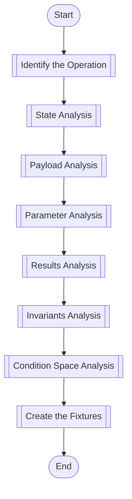

### Identify The Operation
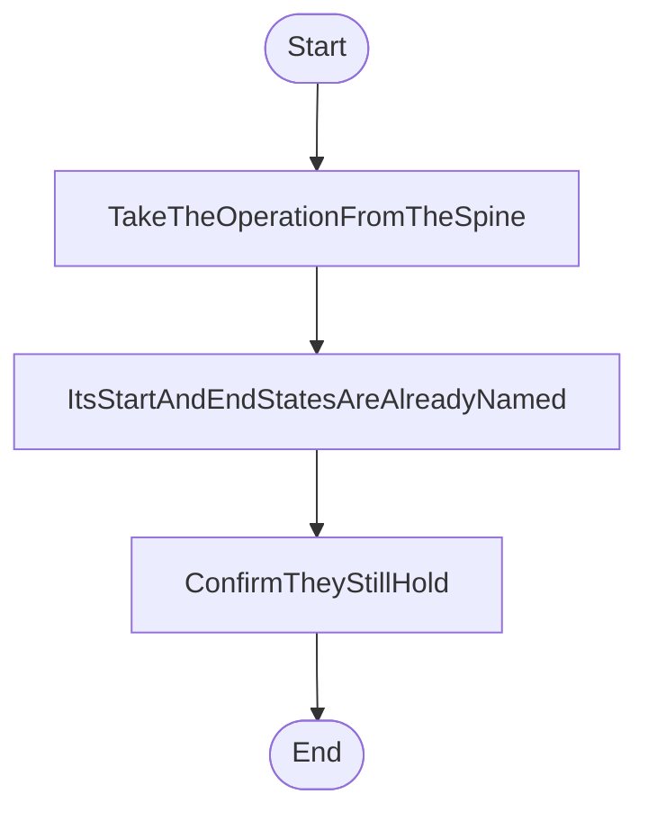

### Payload Analysis
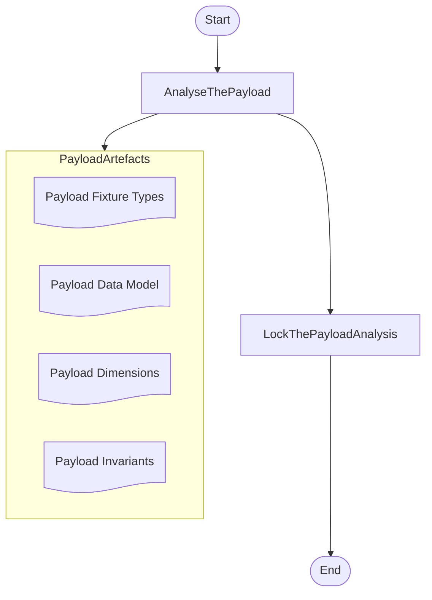

### Parameter Analysis
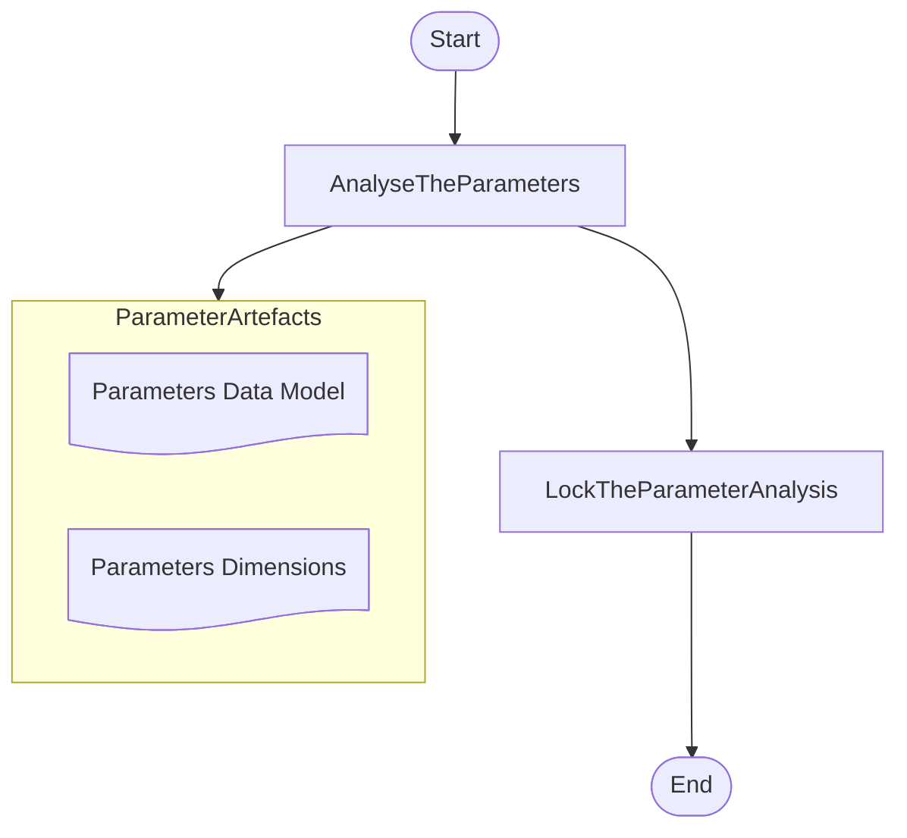

### Results Analysis

This phase identifies the result **types** and their aspects — what a result is made of. Which result
**shapes** exist is a condition space output and belongs to that phase, not this one.

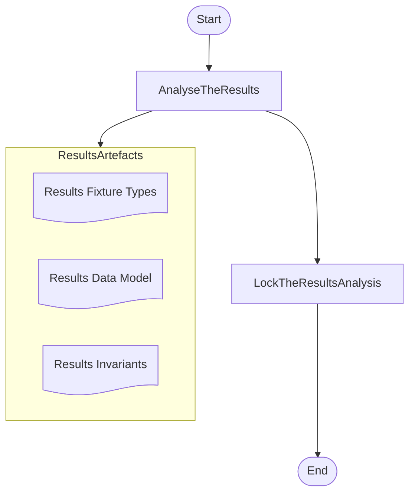
### State Analysis

The start and end states come from the use case's spine, which already names them. What this phase adds is
what may vary *within* the start state, and what the end state must be for each of those variations.

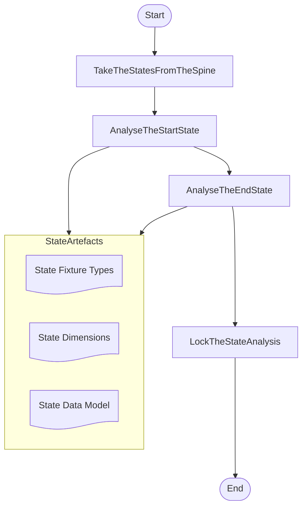

### Invariants Analysis

**An invariant is a feature of an aspect** — the CData inside the tag — so it names the aspect it belongs to,
and it belongs to exactly one fixture type, because fixture types share no aspects.

**An invariant is asserted, not witnessed once.** The two are different jobs and only one of them constrains
anything:

* The **assertion region** is every cell where the aspect is present. Every fixture carrying that aspect checks
  the invariant, and that is what makes the behaviour invariant.
* The **witness** is one cell, chosen because it is where the claim is hardest to satisfy. It proves the claim
  is reachable, and it is for the reviewer.

A single witness licenses exactly one cell's worth of behaviour. An implementation handed a fixture set makes
the fixture set pass, so an invariant checked in one place is an invariant a correct implementation may
special-case. The region is what closes that.

**Invariants are conditional.** An invariant holds regardless of anything varying *inside* its region, not
regardless of everything — and its region is named in aspects rather than dimensions, so the invariants can be
agreed before any dimension is ranked or any cell is drawn.

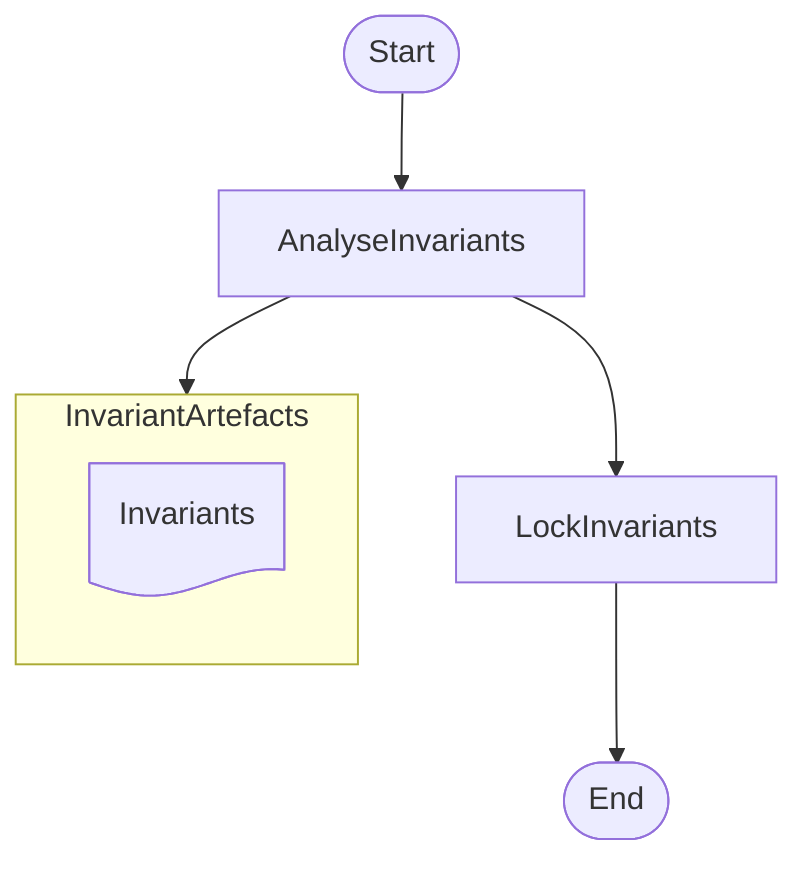

### Condition Space Analysis

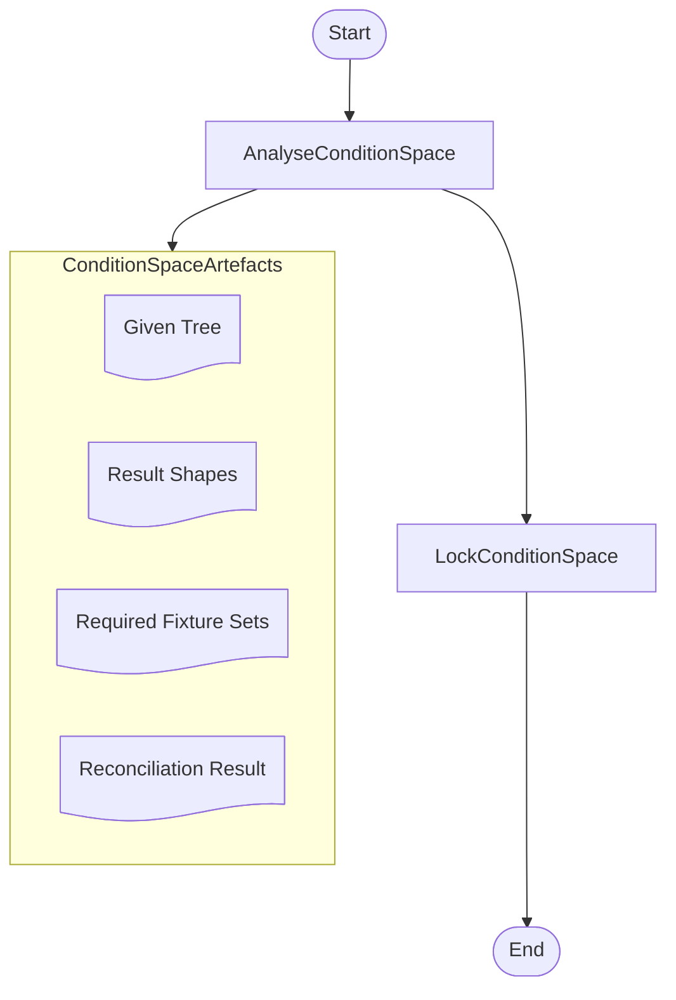

### Create The Fixtures

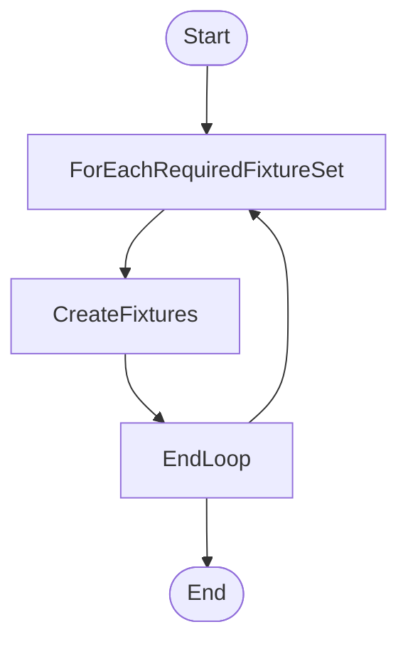